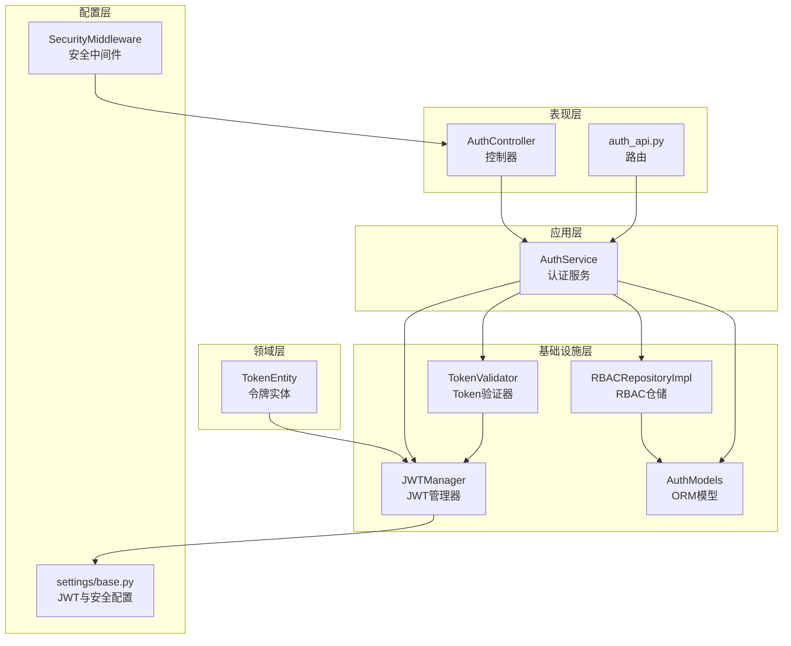
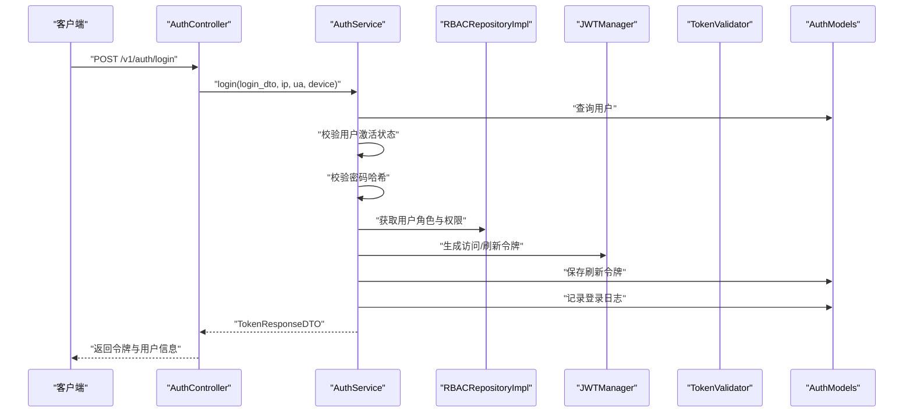
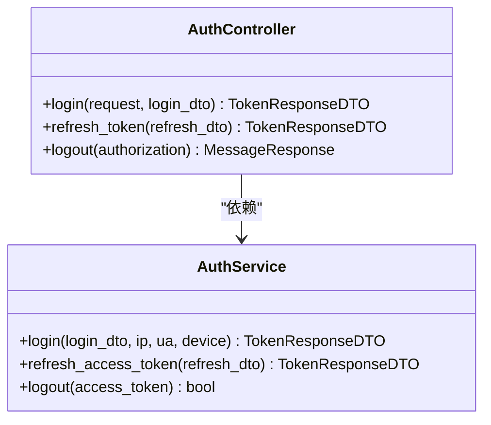
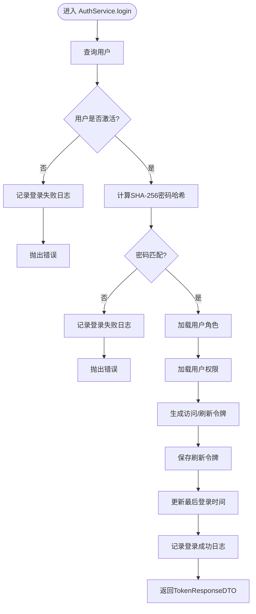
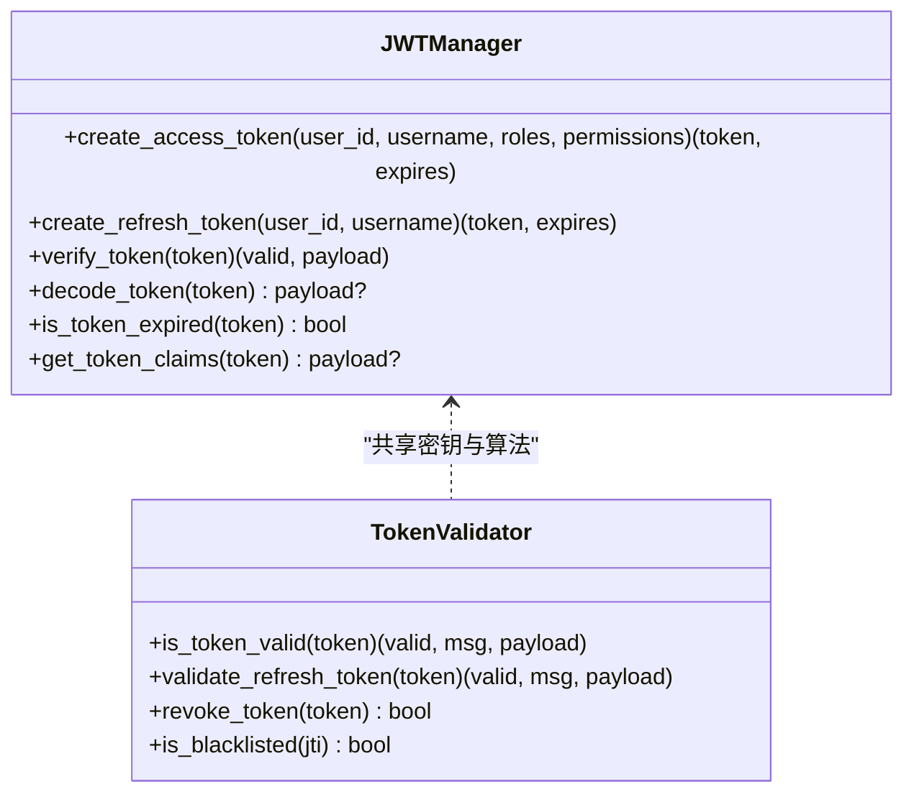
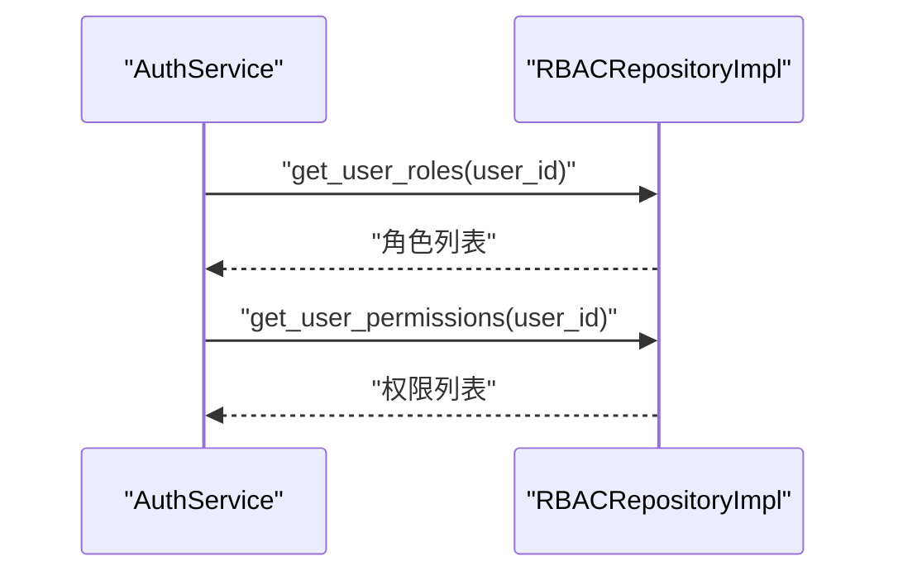
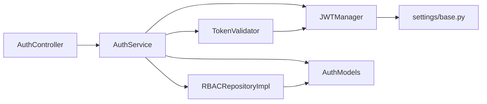

# 用户认证流程

<cite>
**本文档引用的文件**
- [src/api/v1/controllers/auth_controller.py](file://src/api/v1/controllers/auth_controller.py)
- [src/api/v1/auth_api.py](file://src/api/v1/auth_api.py)
- [src/application/services/auth_service.py](file://src/application/services/auth_service.py)
- [src/application/dto/user/user_login_dto.py](file://src/application/dto/user/user_login_dto.py)
- [src/application/dto/auth/token_response_dto.py](file://src/application/dto/auth/token_response_dto.py)
- [src/application/dto/auth/refresh_token_dto.py](file://src/application/dto/auth/refresh_token_dto.py)
- [src/application/dto/auth/login_log_dto.py](file://src/application/dto/auth/login_log_dto.py)
- [src/infrastructure/auth_jwt/jwt_manager.py](file://src/infrastructure/auth_jwt/jwt_manager.py)
- [src/infrastructure/auth_jwt/token_validator.py](file://src/infrastructure/auth_jwt/token_validator.py)
- [src/infrastructure/persistence/models/auth_models.py](file://src/infrastructure/persistence/models/auth_models.py)
- [src/infrastructure/repositories/rbac_repo_impl.py](file://src/infrastructure/repositories/rbac_repo_impl.py)
- [src/domain/auth/entities/token_entity.py](file://src/domain/auth/entities/token_entity.py)
- [src/core/middlewares/security_middleware.py](file://src/core/middlewares/security_middleware.py)
- [config/settings/base.py](file://config/settings/base.py)
</cite>

## 目录
1. [简介](#简介)
2. [项目结构](#项目结构)
3. [核心组件](#核心组件)
4. [架构总览](#架构总览)
5. [详细组件分析](#详细组件分析)
6. [依赖关系分析](#依赖关系分析)
7. [性能考虑](#性能考虑)
8. [故障排除指南](#故障排除指南)
9. [结论](#结论)

## 简介
本文件系统性梳理用户认证流程，覆盖从请求接收、参数校验、身份验证、令牌生成到登录日志记录的完整链路；详解认证控制器与认证服务层的实现要点；说明用户登录 DTO 与登录日志 DTO 的设计；给出认证流程与关键时序图；并总结错误处理策略与安全防护措施。

## 项目结构
认证相关代码采用分层架构组织：
- 表现层：控制器与路由，负责接收请求、解析头部与Body、调用服务层并返回响应
- 应用层：认证服务，封装业务逻辑（密码校验、角色权限加载、令牌生成与刷新、登出）
- 基础设施层：JWT管理器与验证器、RBAC仓储、持久化模型
- 领域层：令牌实体与黑名单实体
- 配置层：Django与JWT配置、安全中间件

图表来源
- [src/api/v1/controllers/auth_controller.py:16-133](file://src/api/v1/controllers/auth_controller.py#L16-L133)
- [src/api/v1/auth_api.py:13-74](file://src/api/v1/auth_api.py#L13-L74)
- [src/application/services/auth_service.py:20-233](file://src/application/services/auth_service.py#L20-L233)
- [src/infrastructure/auth_jwt/jwt_manager.py:13-147](file://src/infrastructure/auth_jwt/jwt_manager.py#L13-L147)
- [src/infrastructure/auth_jwt/token_validator.py:11-108](file://src/infrastructure/auth_jwt/token_validator.py#L11-L108)
- [src/infrastructure/repositories/rbac_repo_impl.py:15-253](file://src/infrastructure/repositories/rbac_repo_impl.py#L15-L253)
- [src/infrastructure/persistence/models/auth_models.py:12-114](file://src/infrastructure/persistence/models/auth_models.py#L12-L114)
- [src/domain/auth/entities/token_entity.py:11-105](file://src/domain/auth/entities/token_entity.py#L11-L105)
- [config/settings/base.py:137-151](file://config/settings/base.py#L137-L151)
- [src/core/middlewares/security_middleware.py:14-54](file://src/core/middlewares/security_middleware.py#L14-L54)

章节来源
- [src/api/v1/controllers/auth_controller.py:16-133](file://src/api/v1/controllers/auth_controller.py#L16-L133)
- [src/api/v1/auth_api.py:13-74](file://src/api/v1/auth_api.py#L13-L74)
- [src/application/services/auth_service.py:20-233](file://src/application/services/auth_service.py#L20-L233)
- [config/settings/base.py:137-151](file://config/settings/base.py#L137-L151)

## 核心组件
- 认证控制器：提供登录、刷新令牌、登出三个接口，负责提取客户端IP、User-Agent、设备信息，调用认证服务并返回响应
- 认证服务：实现登录验证（用户存在性、激活状态、密码哈希校验）、加载角色与权限、生成访问/刷新令牌、持久化刷新令牌、记录登录日志、登出撤销与缓存清理
- DTO层：用户登录DTO（用户名、密码、设备信息）、刷新令牌DTO、令牌响应DTO、登录日志DTO
- JWT与验证：JWT管理器负责令牌生成与解析；Token验证器负责有效性、类型、黑名单与过期检查、撤销
- RBAC仓储：按用户查询角色与权限集合
- 持久化模型：刷新令牌、Token黑名单、登录日志
- 安全中间件：生产环境添加安全响应头

章节来源
- [src/api/v1/controllers/auth_controller.py:16-133](file://src/api/v1/controllers/auth_controller.py#L16-L133)
- [src/application/services/auth_service.py:20-233](file://src/application/services/auth_service.py#L20-L233)
- [src/application/dto/user/user_login_dto.py:9-28](file://src/application/dto/user/user_login_dto.py#L9-L28)
- [src/application/dto/auth/refresh_token_dto.py:9-22](file://src/application/dto/auth/refresh_token_dto.py#L9-L22)
- [src/application/dto/auth/token_response_dto.py:9-32](file://src/application/dto/auth/token_response_dto.py#L9-L32)
- [src/application/dto/auth/login_log_dto.py:11-26](file://src/application/dto/auth/login_log_dto.py#L11-L26)
- [src/infrastructure/auth_jwt/jwt_manager.py:13-147](file://src/infrastructure/auth_jwt/jwt_manager.py#L13-L147)
- [src/infrastructure/auth_jwt/token_validator.py:11-108](file://src/infrastructure/auth_jwt/token_validator.py#L11-L108)
- [src/infrastructure/repositories/rbac_repo_impl.py:201-228](file://src/infrastructure/repositories/rbac_repo_impl.py#L201-L228)
- [src/infrastructure/persistence/models/auth_models.py:12-114](file://src/infrastructure/persistence/models/auth_models.py#L12-L114)
- [src/core/middlewares/security_middleware.py:14-54](file://src/core/middlewares/security_middleware.py#L14-L54)

## 架构总览
认证系统遵循分层与依赖倒置原则：
- 控制器仅负责请求接入与响应封装，不直接处理业务细节
- 认证服务聚合领域与基础设施能力，对外暴露统一的业务方法
- JWT管理器与验证器提供底层令牌能力
- RBAC仓储与ORM模型提供权限与持久化支持
- 安全中间件在响应阶段统一增强安全头

图表来源
- [src/api/v1/controllers/auth_controller.py:36-78](file://src/api/v1/controllers/auth_controller.py#L36-L78)
- [src/application/services/auth_service.py:26-111](file://src/application/services/auth_service.py#L26-L111)
- [src/infrastructure/repositories/rbac_repo_impl.py:201-228](file://src/infrastructure/repositories/rbac_repo_impl.py#L201-L228)
- [src/infrastructure/auth_jwt/jwt_manager.py:25-80](file://src/infrastructure/auth_jwt/jwt_manager.py#L25-L80)
- [src/infrastructure/persistence/models/auth_models.py:12-45](file://src/infrastructure/persistence/models/auth_models.py#L12-L45)

## 详细组件分析

### 认证控制器（AuthController）
- 登录接口：解析Body中的UserLoginDTO，提取客户端IP与User-Agent，调用AuthService.login并返回TokenResponseDTO
- 刷新令牌接口：接收RefreshTokenDTO，调用AuthService.refresh_access_token并返回新令牌
- 登出接口：从Authorization头解析Bearer Token，调用AuthService.logout撤销令牌并清理缓存

图表来源
- [src/api/v1/controllers/auth_controller.py:16-133](file://src/api/v1/controllers/auth_controller.py#L16-L133)
- [src/application/services/auth_service.py:20-233](file://src/application/services/auth_service.py#L20-L233)

章节来源
- [src/api/v1/controllers/auth_controller.py:36-133](file://src/api/v1/controllers/auth_controller.py#L36-L133)

### 认证服务（AuthService）
- 登录流程要点：
  - 用户查询与激活状态检查
  - 密码使用SHA-256哈希比对
  - 加载用户角色与权限
  - 生成访问令牌与刷新令牌
  - 保存刷新令牌至数据库
  - 更新用户最后登录时间
  - 记录登录日志（成功/失败）
  - 返回TokenResponseDTO
- 刷新令牌流程要点：
  - 验证刷新令牌有效性与类型
  - 重新加载角色与权限
  - 生成新的访问令牌
  - 返回TokenResponseDTO（不含刷新令牌）
- 登出流程要点：
  - 撤销访问令牌（加入黑名单）
  - 清理用户相关缓存（角色、权限、用户信息）

图表来源
- [src/application/services/auth_service.py:26-111](file://src/application/services/auth_service.py#L26-L111)
- [src/infrastructure/auth_jwt/jwt_manager.py:25-80](file://src/infrastructure/auth_jwt/jwt_manager.py#L25-L80)
- [src/infrastructure/persistence/models/auth_models.py:12-45](file://src/infrastructure/persistence/models/auth_models.py#L12-L45)

章节来源
- [src/application/services/auth_service.py:26-180](file://src/application/services/auth_service.py#L26-L180)

### JWT管理器与验证器
- JWTManager：基于配置生成访问/刷新令牌，解析与验证令牌，判断过期，提取声明
- TokenValidator：验证访问令牌类型与有效性，检查黑名单，撤销令牌并写入黑名单缓存

图表来源
- [src/infrastructure/auth_jwt/jwt_manager.py:13-147](file://src/infrastructure/auth_jwt/jwt_manager.py#L13-L147)
- [src/infrastructure/auth_jwt/token_validator.py:11-108](file://src/infrastructure/auth_jwt/token_validator.py#L11-L108)

章节来源
- [src/infrastructure/auth_jwt/jwt_manager.py:19-143](file://src/infrastructure/auth_jwt/jwt_manager.py#L19-L143)
- [src/infrastructure/auth_jwt/token_validator.py:17-103](file://src/infrastructure/auth_jwt/token_validator.py#L17-L103)

### RBAC仓储与权限加载
- 按用户ID查询其所有角色与权限，构建权限码列表供令牌声明使用

图表来源
- [src/application/services/auth_service.py:58-63](file://src/application/services/auth_service.py#L58-L63)
- [src/infrastructure/repositories/rbac_repo_impl.py:201-228](file://src/infrastructure/repositories/rbac_repo_impl.py#L201-L228)

章节来源
- [src/infrastructure/repositories/rbac_repo_impl.py:201-228](file://src/infrastructure/repositories/rbac_repo_impl.py#L201-L228)

### DTO设计与数据转换
- 用户登录DTO：包含用户名、密码、设备信息，用于登录接口参数校验
- 刷新令牌DTO：包含刷新令牌字符串
- 令牌响应DTO：包含访问令牌、刷新令牌、令牌类型、过期时间、用户信息
- 登录日志DTO：包含日志ID、用户ID、用户名、IP、UA、设备信息、登录状态、失败原因、登录时间

章节来源
- [src/application/dto/user/user_login_dto.py:9-28](file://src/application/dto/user/user_login_dto.py#L9-L28)
- [src/application/dto/auth/refresh_token_dto.py:9-22](file://src/application/dto/auth/refresh_token_dto.py#L9-L22)
- [src/application/dto/auth/token_response_dto.py:9-32](file://src/application/dto/auth/token_response_dto.py#L9-L32)
- [src/application/dto/auth/login_log_dto.py:11-26](file://src/application/dto/auth/login_log_dto.py#L11-L26)

### 登录日志与持久化
- 登录日志模型：记录用户、IP、UA、设备信息、浏览器、操作系统、登录状态、失败原因、登录时间
- 刷新令牌模型：记录用户、刷新令牌值、JTI、设备信息、IP、过期时间、创建时间
- Token黑名单模型：记录撤销的JTI、用户、令牌类型、撤销时间、原过期时间

章节来源
- [src/infrastructure/persistence/models/auth_models.py:79-114](file://src/infrastructure/persistence/models/auth_models.py#L79-L114)

### 安全中间件与配置
- 安全中间件：生产环境设置X-Content-Type-Options、X-Frame-Options、X-XSS-Protection、HSTS等响应头
- JWT配置：访问/刷新令牌生命周期、算法、签名密钥、头类型等

章节来源
- [src/core/middlewares/security_middleware.py:14-54](file://src/core/middlewares/security_middleware.py#L14-L54)
- [config/settings/base.py:137-151](file://config/settings/base.py#L137-L151)

## 依赖关系分析
- 控制器依赖认证服务（依赖倒置）
- 认证服务依赖JWT管理器、Token验证器、RBAC仓储、ORM模型
- JWT管理器依赖Django配置（SECRET_KEY、SIMPLE_JWT）
- Token验证器依赖JWT管理器与缓存后端
- RBAC仓储依赖ORM模型与用户模型

图表来源
- [src/api/v1/controllers/auth_controller.py:16-34](file://src/api/v1/controllers/auth_controller.py#L16-L34)
- [src/application/services/auth_service.py:10-17](file://src/application/services/auth_service.py#L10-L17)
- [src/infrastructure/auth_jwt/jwt_manager.py:19-23](file://src/infrastructure/auth_jwt/jwt_manager.py#L19-L23)
- [src/infrastructure/auth_jwt/token_validator.py:17-18](file://src/infrastructure/auth_jwt/token_validator.py#L17-L18)
- [src/infrastructure/repositories/rbac_repo_impl.py:10-12](file://src/infrastructure/repositories/rbac_repo_impl.py#L10-L12)
- [src/infrastructure/persistence/models/auth_models.py:12-45](file://src/infrastructure/persistence/models/auth_models.py#L12-L45)
- [config/settings/base.py:137-151](file://config/settings/base.py#L137-L151)

章节来源
- [src/api/v1/controllers/auth_controller.py:16-34](file://src/api/v1/controllers/auth_controller.py#L16-L34)
- [src/application/services/auth_service.py:10-17](file://src/application/services/auth_service.py#L10-L17)

## 性能考虑
- 异步操作：用户查询、令牌保存、日志记录均使用异步ORM，提升并发性能
- 缓存利用：Token黑名单使用Redis缓存，避免频繁数据库查询
- 权限预取：RBAC仓储在查询用户权限时进行关联预取，减少N+1查询
- 令牌生命周期：合理设置访问/刷新令牌有效期，平衡安全性与用户体验

## 故障排除指南
- 登录失败
  - 用户未激活：检查用户状态，记录失败日志
  - 密码错误：确认SHA-256哈希一致性，记录失败日志
- 刷新令牌无效
  - 验证刷新令牌类型与有效性，检查黑名单
- 登出后仍可访问
  - 确认撤销流程已执行并将JTI加入黑名单
  - 检查缓存后端可用性与Key命名空间
- 安全头缺失
  - 生产环境需确保安全中间件生效

章节来源
- [src/application/services/auth_service.py:39-56](file://src/application/services/auth_service.py#L39-L56)
- [src/infrastructure/auth_jwt/token_validator.py:21-45](file://src/infrastructure/auth_jwt/token_validator.py#L21-L45)
- [src/core/middlewares/security_middleware.py:47-51](file://src/core/middlewares/security_middleware.py#L47-L51)

## 结论
该认证体系通过清晰的分层与职责划分，实现了从请求接入到令牌发放与日志记录的完整闭环。JWT管理器与验证器提供了可靠的令牌能力，RBAC仓储与ORM模型支撑了灵活的角色权限体系，安全中间件与配置增强了整体安全性。建议在生产环境中结合速率限制、IP白/黑名单与审计日志进一步强化安全防护。