# 认证安全机制

<cite>
**本文档引用的文件**
- [auth_controller.py](file://src/api/v1/controllers/auth_controller.py)
- [auth_service.py](file://src/application/services/auth_service.py)
- [security_middleware.py](file://src/core/middlewares/security_middleware.py)
- [rate_limit_middleware.py](file://src/core/middlewares/rate_limit_middleware.py)
- [ip_limit_middleware.py](file://src/core/middlewares/ip_limit_middleware.py)
- [jwt_manager.py](file://src/infrastructure/auth_jwt/jwt_manager.py)
- [token_validator.py](file://src/infrastructure/auth_jwt/token_validator.py)
- [cache_manager.py](file://src/infrastructure/cache/cache_manager.py)
- [auth_models.py](file://src/infrastructure/persistence/models/auth_models.py)
- [base.py](file://config/settings/base.py)
- [production.py](file://config/settings/production.py)
- [authentication_error.py](file://src/core/exceptions/authentication_error.py)
- [invalid_credentials_error.py](file://src/core/exceptions/invalid_credentials_error.py)
- [user_inactive_error.py](file://src/core/exceptions/user_inactive_error.py)
- [rate_limit_error.py](file://src/core/exceptions/rate_limit_error.py)
- [base_exception.py](file://src/core/exceptions/base.py)
</cite>

## 目录
1. [简介](#简介)
2. [项目结构](#项目结构)
3. [核心组件](#核心组件)
4. [架构总览](#架构总览)
5. [详细组件分析](#详细组件分析)
6. [依赖关系分析](#依赖关系分析)
7. [性能考虑](#性能考虑)
8. [故障排除指南](#故障排除指南)
9. [结论](#结论)
10. [附录](#附录)

## 简介
本文件系统性阐述本项目的认证安全机制，覆盖密码哈希策略、防暴力破解、账户锁定策略、安全中间件、异常处理、JWT令牌管理、缓存与黑名单、以及生产环境安全配置等。目标是帮助开发者与运维人员全面理解认证流程中的安全防护设计与最佳实践。

## 项目结构
项目采用分层架构，认证相关能力分布在API控制器、应用服务、基础设施与配置层：
- API层：对外暴露认证接口，负责请求参数接收与响应封装
- 应用层：实现认证业务逻辑，协调领域服务与基础设施
- 基础设施层：提供JWT管理、令牌验证、缓存、持久化等支撑能力
- 配置层：集中管理安全相关设置（JWT、限流、CORS、HSTS等）

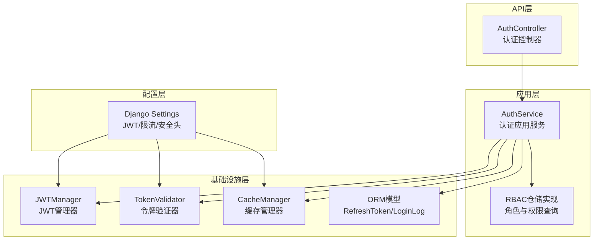

**图表来源**
- [auth_controller.py:16-133](file://src/api/v1/controllers/auth_controller.py#L16-L133)
- [auth_service.py:20-233](file://src/application/services/auth_service.py#L20-L233)
- [jwt_manager.py:13-147](file://src/infrastructure/auth_jwt/jwt_manager.py#L13-L147)
- [token_validator.py:11-108](file://src/infrastructure/auth_jwt/token_validator.py#L11-L108)
- [cache_manager.py:16-149](file://src/infrastructure/cache/cache_manager.py#L16-L149)
- [auth_models.py:12-114](file://src/infrastructure/persistence/models/auth_models.py#L12-L114)
- [base.py:39-52](file://config/settings/base.py#L39-L52)

**章节来源**
- [auth_controller.py:16-133](file://src/api/v1/controllers/auth_controller.py#L16-L133)
- [auth_service.py:20-233](file://src/application/services/auth_service.py#L20-L233)
- [base.py:39-52](file://config/settings/base.py#L39-L52)

## 核心组件
- 认证控制器：提供登录、刷新、登出接口，负责提取客户端IP、UA与设备信息，并调用认证服务
- 认证服务：执行凭据校验、用户状态检查、角色权限加载、JWT签发与刷新、登录日志记录、令牌撤销与缓存清理
- JWT管理器：基于Django配置生成访问/刷新令牌，维护生命周期与签名算法
- 令牌验证器：验证令牌有效性、类型、黑名单与过期状态，支持令牌撤销与加入黑名单
- 缓存管理器：统一缓存键空间与分组，提供用户、角色、权限缓存的读写与清理
- 安全中间件：在生产环境注入安全响应头，增强浏览器安全防护
- 限流中间件：基于Redis对IP维度进行请求频率限制
- IP黑白名单中间件：基于数据库条目实施白/黑名单控制
- ORM模型：持久化刷新令牌、黑名单与登录日志

**章节来源**
- [auth_controller.py:16-133](file://src/api/v1/controllers/auth_controller.py#L16-L133)
- [auth_service.py:20-233](file://src/application/services/auth_service.py#L20-L233)
- [jwt_manager.py:13-147](file://src/infrastructure/auth_jwt/jwt_manager.py#L13-L147)
- [token_validator.py:11-108](file://src/infrastructure/auth_jwt/token_validator.py#L11-L108)
- [cache_manager.py:16-149](file://src/infrastructure/cache/cache_manager.py#L16-L149)
- [security_middleware.py:14-54](file://src/core/middlewares/security_middleware.py#L14-L54)
- [rate_limit_middleware.py:15-112](file://src/core/middlewares/rate_limit_middleware.py#L15-L112)
- [ip_limit_middleware.py:15-130](file://src/core/middlewares/ip_limit_middleware.py#L15-L130)
- [auth_models.py:12-114](file://src/infrastructure/persistence/models/auth_models.py#L12-L114)

## 架构总览
下图展示认证流程的关键交互：控制器接收请求，服务层完成业务校验与令牌签发，JWT与验证器协同保证令牌安全，缓存与数据库支撑权限与日志，中间件提供安全与限流保障。

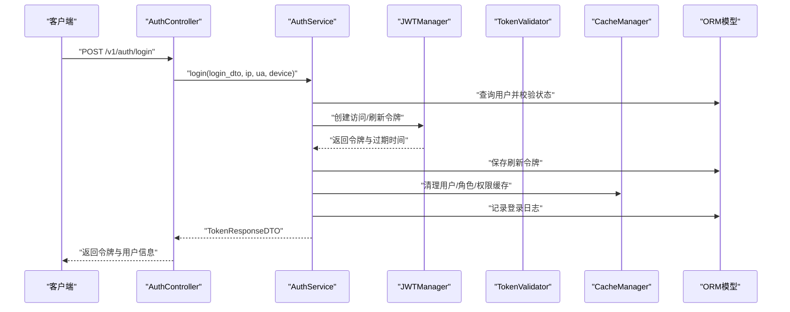

**图表来源**
- [auth_controller.py:42-78](file://src/api/v1/controllers/auth_controller.py#L42-L78)
- [auth_service.py:26-111](file://src/application/services/auth_service.py#L26-L111)
- [jwt_manager.py:25-80](file://src/infrastructure/auth_jwt/jwt_manager.py#L25-L80)
- [cache_manager.py:16-149](file://src/infrastructure/cache/cache_manager.py#L16-L149)
- [auth_models.py:12-44](file://src/infrastructure/persistence/models/auth_models.py#L12-L44)

## 详细组件分析

### 认证控制器（AuthController）
- 职责：接收登录、刷新、登出请求；提取客户端IP、UA与设备信息；调用认证服务并返回标准化响应
- 安全要点：登录时记录IP、UA与设备信息，便于审计与风控
- 异常处理：由认证服务抛出业务异常，控制器保持薄层封装

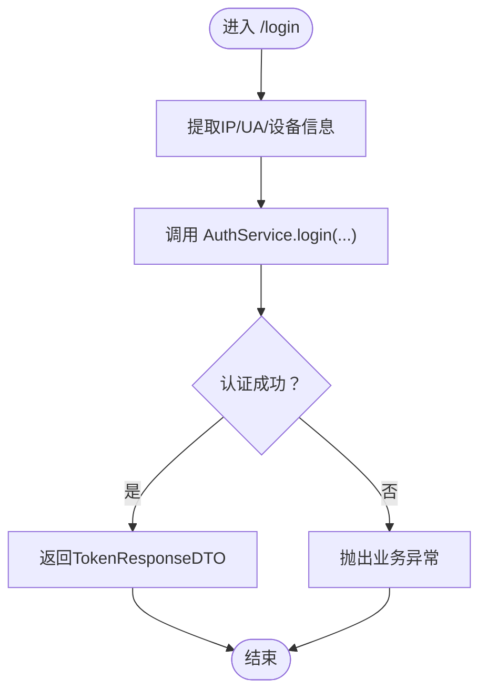

**图表来源**
- [auth_controller.py:42-78](file://src/api/v1/controllers/auth_controller.py#L42-L78)

**章节来源**
- [auth_controller.py:16-133](file://src/api/v1/controllers/auth_controller.py#L16-L133)

### 认证服务（AuthService）
- 凭据校验：按用户存在性与激活状态检查；使用SHA-256进行密码哈希比对
- 权限加载：通过RBAC仓储获取用户角色与权限列表
- 令牌签发：使用JWT管理器生成访问与刷新令牌，保存刷新令牌至数据库
- 登录日志：记录成功/失败状态与失败原因
- 令牌撤销：登出时通过令牌验证器撤销访问令牌并清理缓存
- 刷新流程：验证刷新令牌有效性，重新签发访问令牌

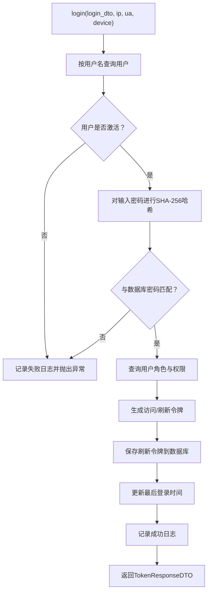

**图表来源**
- [auth_service.py:26-111](file://src/application/services/auth_service.py#L26-L111)
- [auth_models.py:12-44](file://src/infrastructure/persistence/models/auth_models.py#L12-L44)

**章节来源**
- [auth_service.py:20-233](file://src/application/services/auth_service.py#L20-L233)

### JWT管理器（JWTManager）
- 令牌生成：支持访问令牌与刷新令牌，设置iat/exp/jti等标准声明
- 算法与密钥：从Django配置读取算法与签名密钥，确保一致性
- 令牌验证：解码并验证过期时间，提供类型判断与用户信息提取

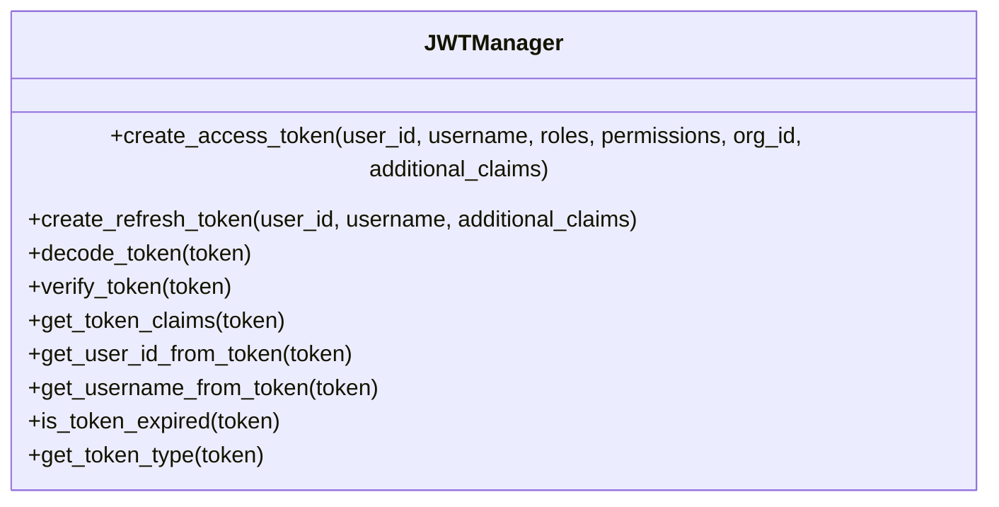

**图表来源**
- [jwt_manager.py:13-147](file://src/infrastructure/auth_jwt/jwt_manager.py#L13-L147)

**章节来源**
- [jwt_manager.py:13-147](file://src/infrastructure/auth_jwt/jwt_manager.py#L13-L147)

### 令牌验证器（TokenValidator）
- 令牌有效性：验证签名、类型、黑名单与过期状态
- 撤销机制：登出时根据jti与剩余有效期加入黑名单
- 刷新验证：专门验证刷新令牌的有效性与类型

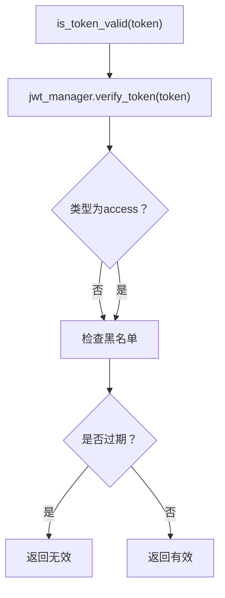

**图表来源**
- [token_validator.py:21-45](file://src/infrastructure/auth_jwt/token_validator.py#L21-L45)

**章节来源**
- [token_validator.py:11-108](file://src/infrastructure/auth_jwt/token_validator.py#L11-L108)

### 缓存管理器（CacheManager）
- 统一键空间：以“前缀:分组:键”组织缓存，便于清理与隔离
- 用户与权限缓存：提供用户、角色、权限的读写与批量删除
- JSON序列化：自动处理复杂对象的序列化与反序列化

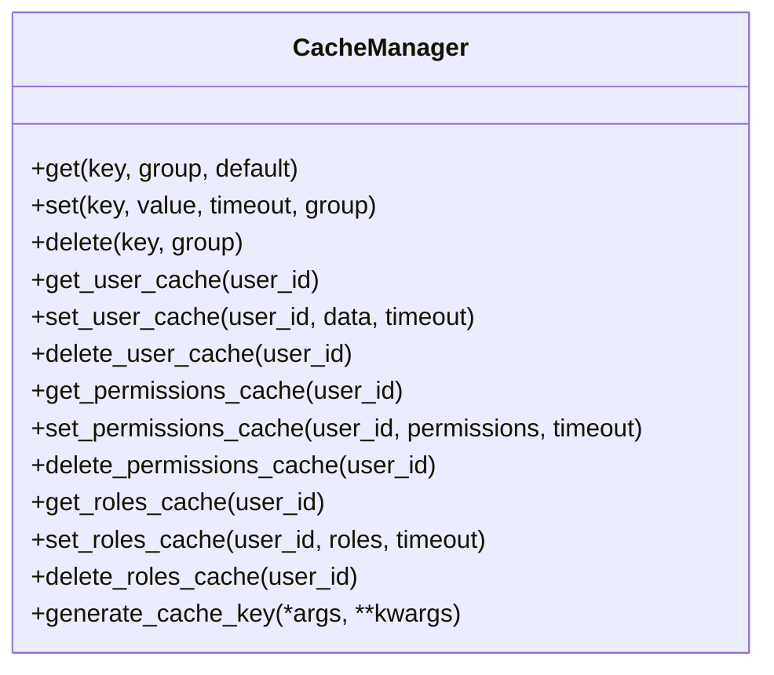

**图表来源**
- [cache_manager.py:16-149](file://src/infrastructure/cache/cache_manager.py#L16-L149)

**章节来源**
- [cache_manager.py:16-149](file://src/infrastructure/cache/cache_manager.py#L16-L149)

### 安全中间件（SecurityMiddleware）
- 生产环境注入安全响应头：X-Content-Type-Options、X-Frame-Options、X-XSS-Protection、Strict-Transport-Security
- 降低XSS、点击劫持与嗅探风险

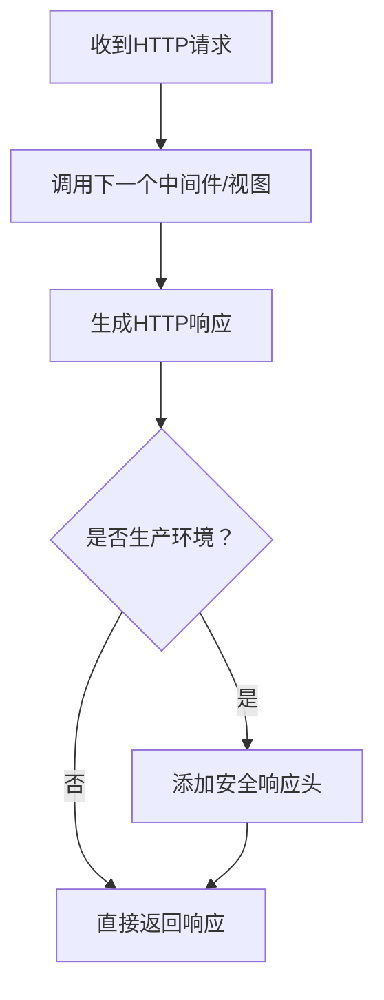

**图表来源**
- [security_middleware.py:33-53](file://src/core/middlewares/security_middleware.py#L33-L53)

**章节来源**
- [security_middleware.py:14-54](file://src/core/middlewares/security_middleware.py#L14-L54)
- [production.py:29-39](file://config/settings/production.py#L29-L39)

### 限流中间件（RateLimitMiddleware）
- 基于Redis的IP维度限流，默认每分钟100次
- 触发限流时返回429与统一错误码

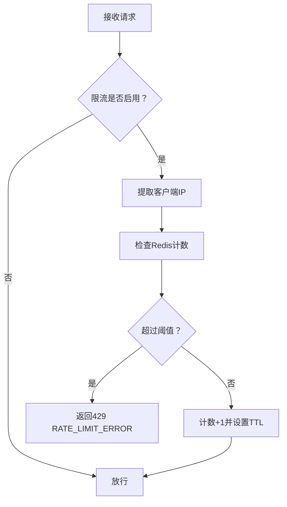

**图表来源**
- [rate_limit_middleware.py:41-112](file://src/core/middlewares/rate_limit_middleware.py#L41-L112)

**章节来源**
- [rate_limit_middleware.py:15-112](file://src/core/middlewares/rate_limit_middleware.py#L15-L112)
- [base.py:228-231](file://config/settings/base.py#L228-L231)

### IP黑白名单中间件（IPLimitMiddleware）
- 白名单：仅允许白名单内的IP访问
- 黑名单：永久或临时封禁黑名单IP
- 结合数据库实体进行动态控制

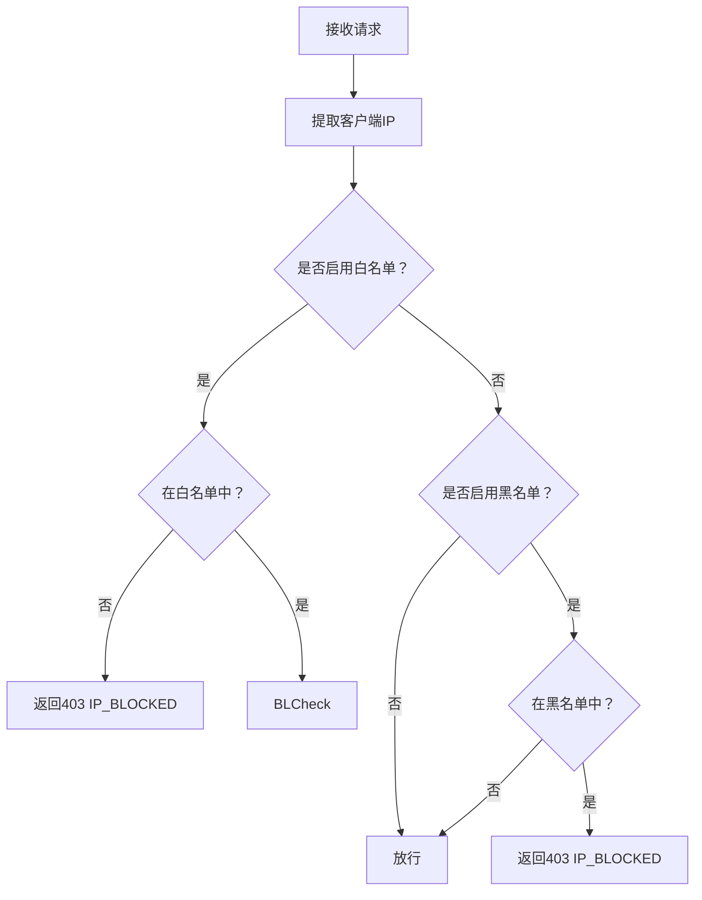

**图表来源**
- [ip_limit_middleware.py:41-76](file://src/core/middlewares/ip_limit_middleware.py#L41-L76)

**章节来源**
- [ip_limit_middleware.py:15-130](file://src/core/middlewares/ip_limit_middleware.py#L15-L130)
- [base.py:232-235](file://config/settings/base.py#L232-L235)

### 认证异常体系
- 基础异常：统一的错误消息与错误码结构
- 认证错误：认证失败的通用异常
- 凭据无效：用户名或密码错误
- 用户未激活：账户被停用
- 限流错误：请求过于频繁

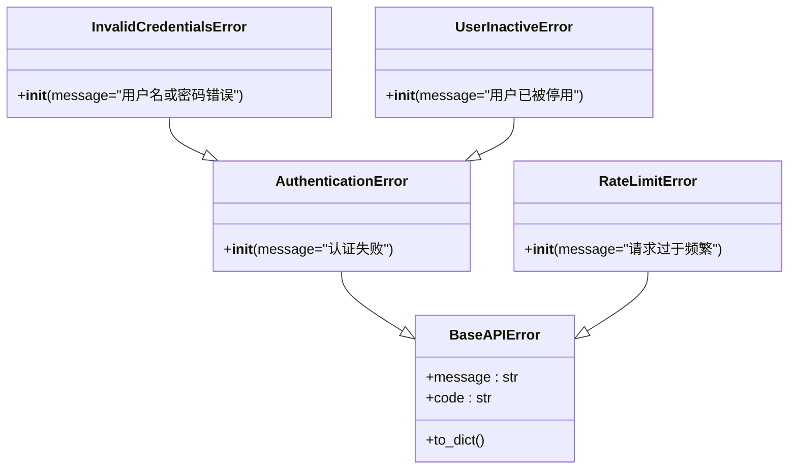

**图表来源**
- [base_exception.py:7-40](file://src/core/exceptions/base.py#L7-L40)
- [authentication_error.py:9-26](file://src/core/exceptions/authentication_error.py#L9-L26)
- [invalid_credentials_error.py:9-26](file://src/core/exceptions/invalid_credentials_error.py#L9-L26)
- [user_inactive_error.py:9-26](file://src/core/exceptions/user_inactive_error.py#L9-L26)
- [rate_limit_error.py:9-26](file://src/core/exceptions/rate_limit_error.py#L9-L26)

**章节来源**
- [base_exception.py:7-40](file://src/core/exceptions/base.py#L7-L40)
- [authentication_error.py:9-26](file://src/core/exceptions/authentication_error.py#L9-L26)
- [invalid_credentials_error.py:9-26](file://src/core/exceptions/invalid_credentials_error.py#L9-L26)
- [user_inactive_error.py:9-26](file://src/core/exceptions/user_inactive_error.py#L9-L26)
- [rate_limit_error.py:9-26](file://src/core/exceptions/rate_limit_error.py#L9-L26)

## 依赖关系分析
- 控制器依赖应用服务；应用服务依赖JWT管理器、令牌验证器、缓存管理器与ORM模型
- 中间件独立运行于Django中间件栈，分别提供安全头注入、限流与IP黑白名单控制
- 配置层决定JWT算法、生命周期、限流开关与安全头策略

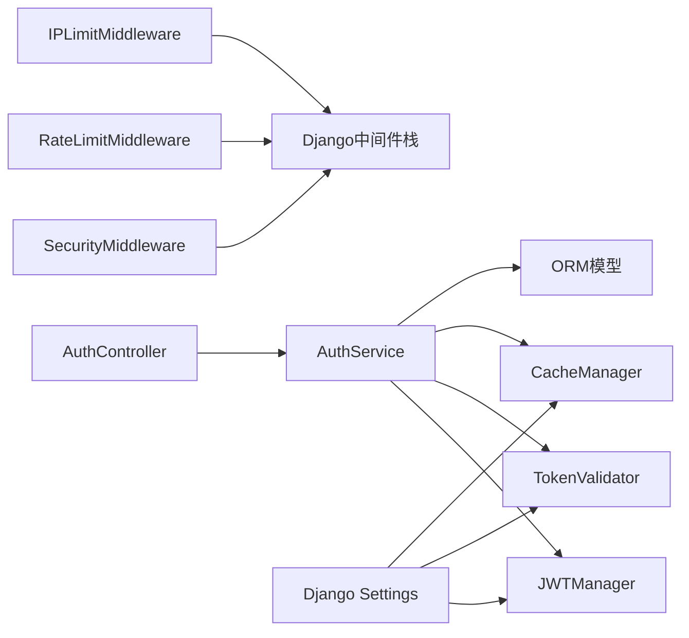

**图表来源**
- [auth_controller.py:16-133](file://src/api/v1/controllers/auth_controller.py#L16-L133)
- [auth_service.py:20-233](file://src/application/services/auth_service.py#L20-L233)
- [jwt_manager.py:13-147](file://src/infrastructure/auth_jwt/jwt_manager.py#L13-L147)
- [token_validator.py:11-108](file://src/infrastructure/auth_jwt/token_validator.py#L11-L108)
- [cache_manager.py:16-149](file://src/infrastructure/cache/cache_manager.py#L16-L149)
- [security_middleware.py:14-54](file://src/core/middlewares/security_middleware.py#L14-L54)
- [rate_limit_middleware.py:15-112](file://src/core/middlewares/rate_limit_middleware.py#L15-L112)
- [ip_limit_middleware.py:15-130](file://src/core/middlewares/ip_limit_middleware.py#L15-L130)
- [base.py:39-52](file://config/settings/base.py#L39-L52)

**章节来源**
- [base.py:39-52](file://config/settings/base.py#L39-L52)

## 性能考虑
- 令牌生命周期：访问令牌与刷新令牌的生命周期由配置决定，建议结合业务场景调整，避免过短影响用户体验，过长增加泄露风险
- 缓存策略：合理设置用户、角色、权限缓存的过期时间，减少数据库压力；登出与权限变更时及时清理缓存
- 限流策略：默认每分钟100次，可根据API特性与后端承载能力调整；注意区分不同端点的限流规则
- 加密算法：当前使用SHA-256进行密码哈希，建议评估使用更安全的密码哈希算法（如bcrypt/scrypt/argon2），并在配置中明确指定
- Redis性能：限流与黑名单依赖Redis，需确保Redis连接池与超时配置合理

[本节为通用性能建议，无需特定文件引用]

## 故障排除指南
- 登录失败
  - 用户未激活：检查用户状态，确认账户处于激活状态
  - 凭据无效：核对用户名与密码，确认大小写与特殊字符
  - 登录日志：查看登录日志表，定位失败原因与IP/UA信息
- 令牌相关
  - 令牌无效或过期：确认令牌类型与过期时间，必要时使用刷新令牌
  - 令牌撤销：登出后令牌应加入黑名单，检查黑名单键空间与剩余有效期
- 限流触发
  - 检查限流开关与默认规则，确认是否为误伤
  - 查看Redis中对应键的计数与TTL
- 安全头问题
  - 生产环境未生效：确认非DEBUG模式且中间件已正确注册
- IP黑白名单
  - 白名单/黑名单未生效：确认配置开关与数据库条目状态

**章节来源**
- [auth_service.py:26-111](file://src/application/services/auth_service.py#L26-L111)
- [auth_models.py:79-114](file://src/infrastructure/persistence/models/auth_models.py#L79-L114)
- [token_validator.py:47-103](file://src/infrastructure/auth_jwt/token_validator.py#L47-L103)
- [rate_limit_middleware.py:51-68](file://src/core/middlewares/rate_limit_middleware.py#L51-L68)
- [security_middleware.py:47-51](file://src/core/middlewares/security_middleware.py#L47-L51)
- [ip_limit_middleware.py:54-76](file://src/core/middlewares/ip_limit_middleware.py#L54-L76)

## 结论
本项目在认证安全方面构建了较为完整的防护体系：严格的令牌生命周期管理、基于Redis的限流与IP黑白名单、生产环境安全头注入、完善的异常与日志体系。建议在后续迭代中引入更强的密码哈希算法、细化限流规则与风控策略，并持续监控与优化缓存与数据库性能。

[本节为总结性内容，无需特定文件引用]

## 附录

### 密码哈希策略与实现
- 当前实现：使用SHA-256对明文密码进行哈希比对
- 建议改进：迁移到专用密码哈希算法（如bcrypt），并引入随机盐值；在配置中明确算法与成本因子
- 性能优化：在高并发场景下，优先使用异步ORM与Redis缓存减少阻塞

**章节来源**
- [auth_service.py:47-56](file://src/application/services/auth_service.py#L47-L56)

### 防暴力破解与账户锁定策略
- 限流：基于IP的请求频率限制，默认每分钟100次
- IP黑白名单：支持白名单与黑名单，可配置永久或临时封禁
- 登录日志：记录失败原因，便于审计与风控联动

**章节来源**
- [rate_limit_middleware.py:87-112](file://src/core/middlewares/rate_limit_middleware.py#L87-L112)
- [ip_limit_middleware.py:109-130](file://src/core/middlewares/ip_limit_middleware.py#L109-L130)
- [auth_models.py:79-114](file://src/infrastructure/persistence/models/auth_models.py#L79-L114)

### 安全中间件功能清单
- 安全响应头：X-Content-Type-Options、X-Frame-Options、X-XSS-Protection、Strict-Transport-Security
- 生产环境启用：非DEBUG模式自动注入

**章节来源**
- [security_middleware.py:47-51](file://src/core/middlewares/security_middleware.py#L47-L51)
- [production.py:29-39](file://config/settings/production.py#L29-L39)

### 认证异常处理机制
- 统一异常基类：提供message与code字段
- 认证失败：通用认证错误
- 凭据无效：用户名或密码错误
- 用户未激活：账户被停用
- 限流错误：请求过于频繁

**章节来源**
- [base_exception.py:17-39](file://src/core/exceptions/base.py#L17-L39)
- [authentication_error.py:18-25](file://src/core/exceptions/authentication_error.py#L18-L25)
- [invalid_credentials_error.py:18-25](file://src/core/exceptions/invalid_credentials_error.py#L18-L25)
- [user_inactive_error.py:18-25](file://src/core/exceptions/user_inactive_error.py#L18-L25)
- [rate_limit_error.py:18-25](file://src/core/exceptions/rate_limit_error.py#L18-L25)

### 安全配置最佳实践
- 密码强度：启用Django内置密码验证器，建议结合业务需求增加复杂度要求
- 会话与令牌：合理设置JWT访问/刷新令牌生命周期，开启刷新令牌轮换与黑名单
- 安全头部：生产环境务必启用HTTPS重定向、HSTS、X-Frame-Options等
- 限流与风控：根据API特性制定差异化限流策略，结合IP黑白名单与登录日志

**章节来源**
- [base.py:90-96](file://config/settings/base.py#L90-L96)
- [base.py:137-151](file://config/settings/base.py#L137-L151)
- [base.py:165-173](file://config/settings/base.py#L165-L173)
- [base.py:228-235](file://config/settings/base.py#L228-L235)
- [production.py:29-39](file://config/settings/production.py#L29-L39)