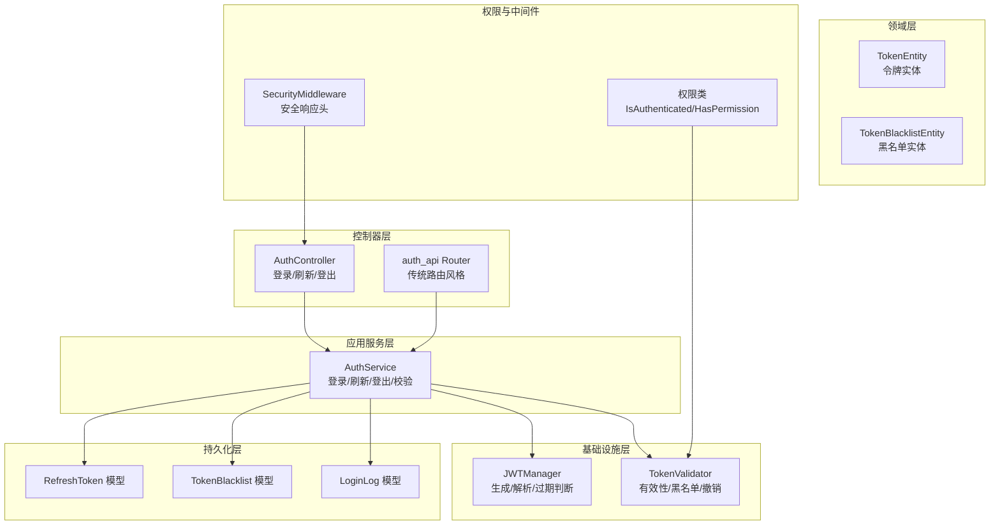
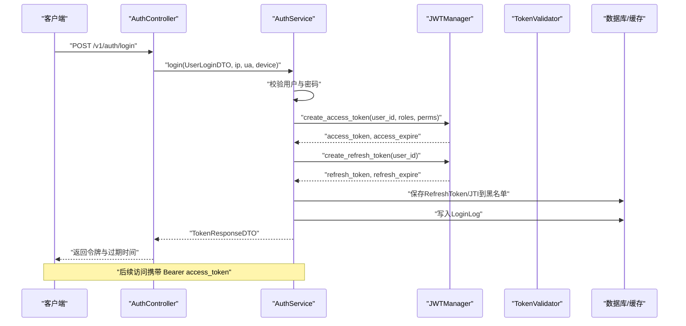
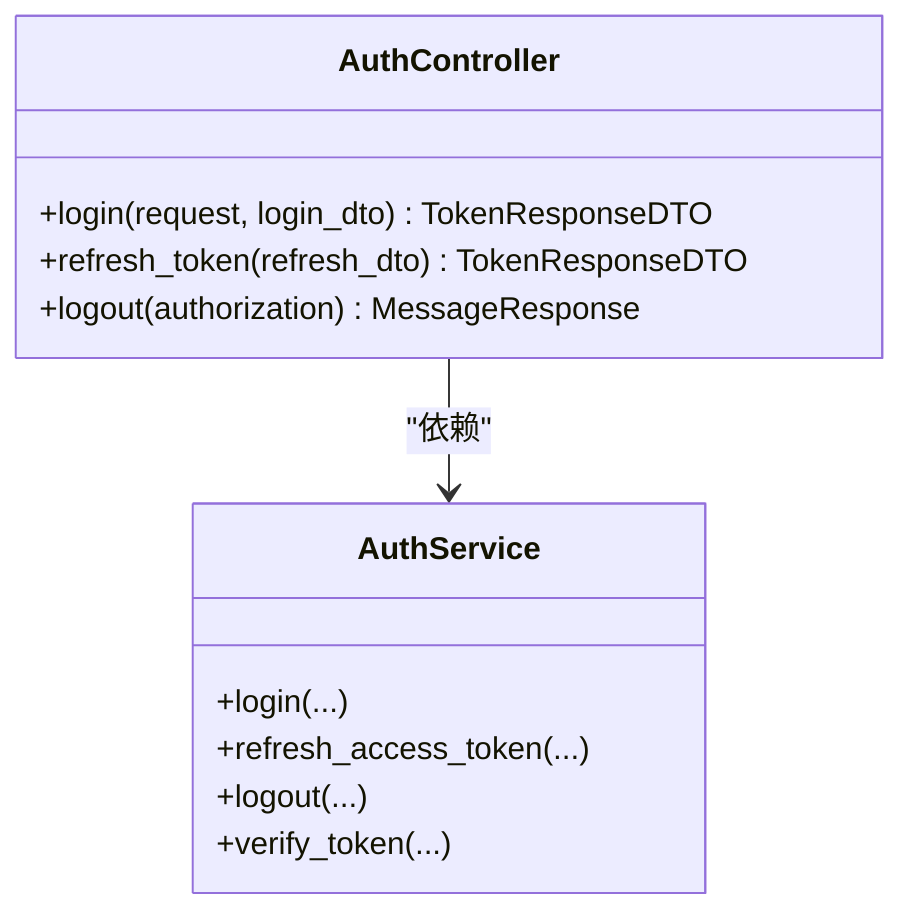
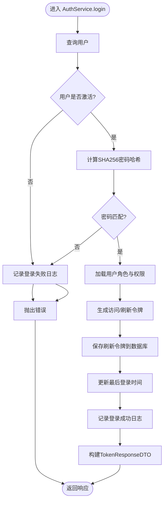
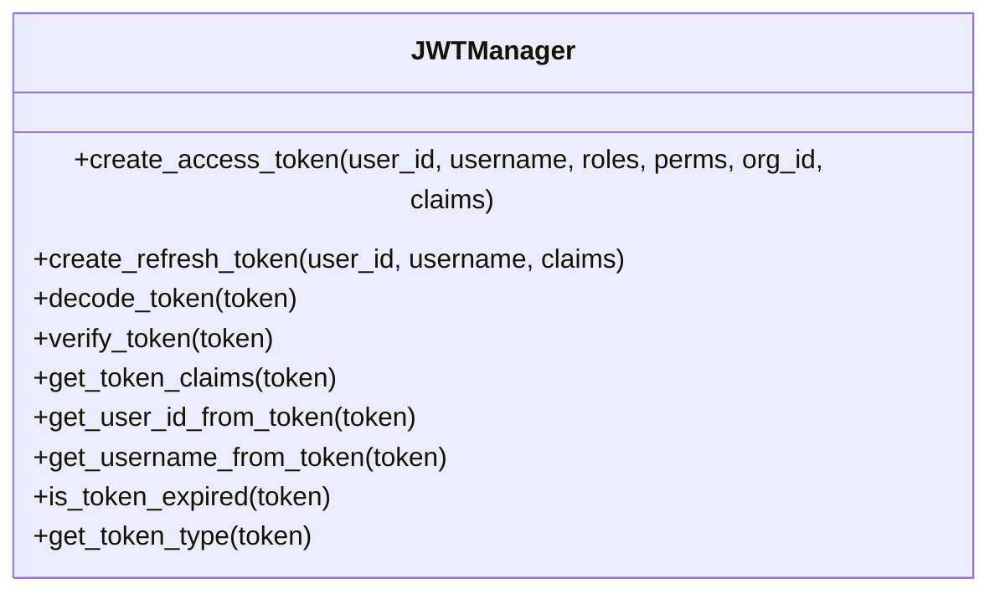
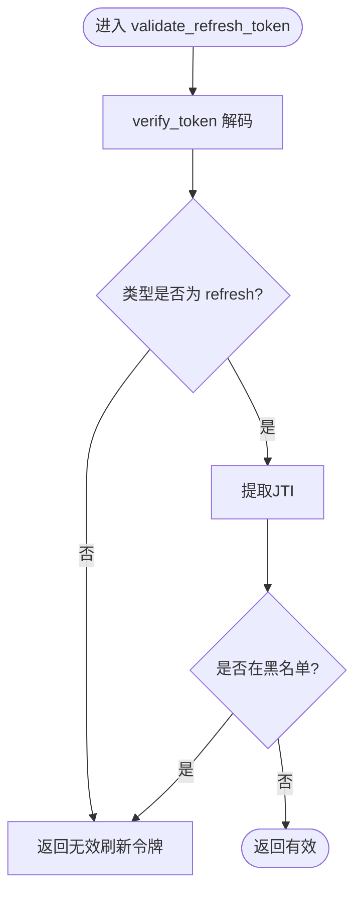
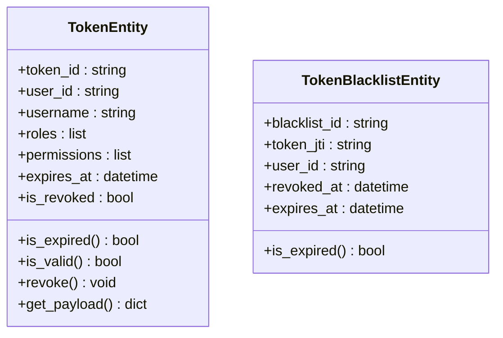
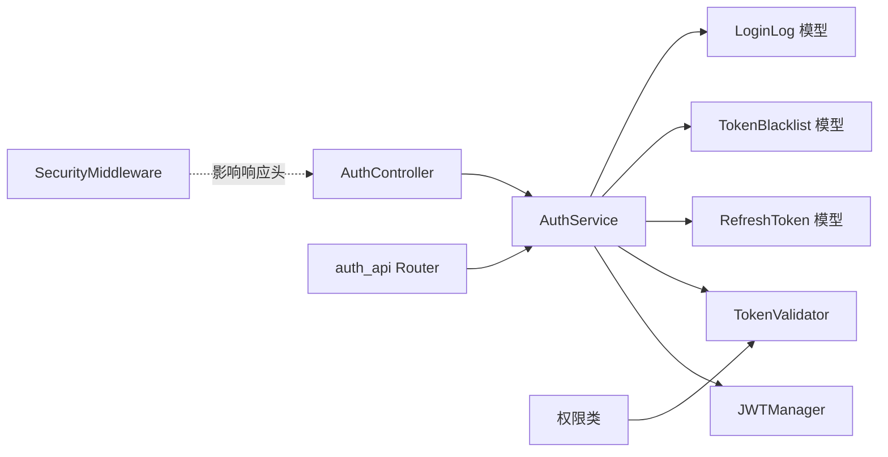

# 认证授权系统

<cite>
**本文档引用的文件**
- [src/api/v1/controllers/auth_controller.py](file://src/api/v1/controllers/auth_controller.py)
- [src/api/v1/auth_api.py](file://src/api/v1/auth_api.py)
- [src/application/services/auth_service.py](file://src/application/services/auth_service.py)
- [src/application/dto/auth/token_response_dto.py](file://src/application/dto/auth/token_response_dto.py)
- [src/application/dto/auth/refresh_token_dto.py](file://src/application/dto/auth/refresh_token_dto.py)
- [src/application/dto/user/user_login_dto.py](file://src/application/dto/user/user_login_dto.py)
- [src/infrastructure/auth_jwt/jwt_manager.py](file://src/infrastructure/auth_jwt/jwt_manager.py)
- [src/infrastructure/auth_jwt/token_validator.py](file://src/infrastructure/auth_jwt/token_validator.py)
- [src/domain/auth/entities/token_entity.py](file://src/domain/auth/entities/token_entity.py)
- [src/infrastructure/persistence/models/auth_models.py](file://src/infrastructure/persistence/models/auth_models.py)
- [src/api/common/permissions.py](file://src/api/common/permissions.py)
- [src/core/middlewares/security_middleware.py](file://src/core/middlewares/security_middleware.py)
- [config/settings/base.py](file://config/settings/base.py)
- [tests/test_services/test_auth_service.py](file://tests/test_services/test_auth_service.py)
- [src/core/exceptions/authentication_error.py](file://src/core/exceptions/authentication_error.py)
</cite>

## 目录
1. [简介](#简介)
2. [项目结构](#项目结构)
3. [核心组件](#核心组件)
4. [架构总览](#架构总览)
5. [详细组件分析](#详细组件分析)
6. [依赖分析](#依赖分析)
7. [性能考虑](#性能考虑)
8. [故障排查指南](#故障排查指南)
9. [结论](#结论)
10. [附录](#附录)

## 简介
本文件面向开发者与运维人员，系统化阐述本项目的认证授权体系，重点覆盖以下方面：
- JWT 认证机制：令牌生成、验证、刷新的完整流程
- 用户认证控制器：登录、登出、令牌刷新等接口处理逻辑
- 认证服务层：密码验证、令牌管理、会话控制等核心业务
- JWT 管理器设计：签名算法、过期时间、令牌存储策略
- 令牌验证器：令牌解析、权限检查、有效期与黑名单校验
- 完整流程图与时序图：帮助快速理解认证过程
- 安全最佳实践：密码哈希策略、令牌安全存储、防重放攻击
- API 使用示例与错误处理方案

## 项目结构
认证授权系统采用分层架构，围绕“控制器-服务-基础设施-领域-持久化”分层组织，核心模块如下：
- 控制器层：暴露认证相关 API，负责请求参数接收与响应封装
- 应用服务层：编排业务流程，协调 JWT 管理器、验证器、缓存与持久化
- 基础设施层：JWT 管理器与令牌验证器，提供令牌生成、解析与黑名单管理
- 领域层：令牌实体与黑名单实体，抽象令牌状态与撤销机制
- 持久化层：刷新令牌、黑名单、登录日志等模型
- 权限与中间件：基于 JWT 的认证与权限检查，以及安全响应头

图表来源
- [src/api/v1/controllers/auth_controller.py:16-133](file://src/api/v1/controllers/auth_controller.py#L16-L133)
- [src/api/v1/auth_api.py:13-74](file://src/api/v1/auth_api.py#L13-L74)
- [src/application/services/auth_service.py:20-233](file://src/application/services/auth_service.py#L20-L233)
- [src/infrastructure/auth_jwt/jwt_manager.py:13-147](file://src/infrastructure/auth_jwt/jwt_manager.py#L13-L147)
- [src/infrastructure/auth_jwt/token_validator.py:11-108](file://src/infrastructure/auth_jwt/token_validator.py#L11-L108)
- [src/domain/auth/entities/token_entity.py:11-105](file://src/domain/auth/entities/token_entity.py#L11-L105)
- [src/infrastructure/persistence/models/auth_models.py:12-114](file://src/infrastructure/persistence/models/auth_models.py#L12-L114)
- [src/api/common/permissions.py:14-245](file://src/api/common/permissions.py#L14-L245)
- [src/core/middlewares/security_middleware.py:14-54](file://src/core/middlewares/security_middleware.py#L14-L54)

章节来源
- [src/api/v1/controllers/auth_controller.py:16-133](file://src/api/v1/controllers/auth_controller.py#L16-L133)
- [src/api/v1/auth_api.py:13-74](file://src/api/v1/auth_api.py#L13-L74)
- [src/application/services/auth_service.py:20-233](file://src/application/services/auth_service.py#L20-L233)
- [src/infrastructure/auth_jwt/jwt_manager.py:13-147](file://src/infrastructure/auth_jwt/jwt_manager.py#L13-L147)
- [src/infrastructure/auth_jwt/token_validator.py:11-108](file://src/infrastructure/auth_jwt/token_validator.py#L11-L108)
- [src/domain/auth/entities/token_entity.py:11-105](file://src/domain/auth/entities/token_entity.py#L11-L105)
- [src/infrastructure/persistence/models/auth_models.py:12-114](file://src/infrastructure/persistence/models/auth_models.py#L12-L114)
- [src/api/common/permissions.py:14-245](file://src/api/common/permissions.py#L14-L245)
- [src/core/middlewares/security_middleware.py:14-54](file://src/core/middlewares/security_middleware.py#L14-L54)

## 核心组件
- 认证控制器：提供登录、刷新、登出三个核心接口，负责提取客户端信息并调用应用服务
- 认证服务：实现登录、刷新、登出、令牌校验等业务逻辑，协调 JWT 管理器与验证器
- JWT 管理器：负责访问令牌与刷新令牌的生成、解析、过期判断与声明提取
- 令牌验证器：负责访问令牌有效性校验、类型检查、黑名单检查与撤销
- DTO 与模型：登录 DTO、令牌响应 DTO、刷新 DTO，以及刷新令牌、黑名单、登录日志模型
- 权限与中间件：基于 JWT 的认证与权限检查，以及安全响应头中间件

章节来源
- [src/api/v1/controllers/auth_controller.py:16-133](file://src/api/v1/controllers/auth_controller.py#L16-L133)
- [src/application/services/auth_service.py:20-233](file://src/application/services/auth_service.py#L20-L233)
- [src/infrastructure/auth_jwt/jwt_manager.py:13-147](file://src/infrastructure/auth_jwt/jwt_manager.py#L13-L147)
- [src/infrastructure/auth_jwt/token_validator.py:11-108](file://src/infrastructure/auth_jwt/token_validator.py#L11-L108)
- [src/application/dto/auth/token_response_dto.py:9-32](file://src/application/dto/auth/token_response_dto.py#L9-L32)
- [src/application/dto/auth/refresh_token_dto.py:9-22](file://src/application/dto/auth/refresh_token_dto.py#L9-L22)
- [src/application/dto/user/user_login_dto.py:9-28](file://src/application/dto/user/user_login_dto.py#L9-L28)
- [src/infrastructure/persistence/models/auth_models.py:12-114](file://src/infrastructure/persistence/models/auth_models.py#L12-L114)
- [src/api/common/permissions.py:14-245](file://src/api/common/permissions.py#L14-L245)

## 架构总览
下图展示认证系统整体交互：控制器接收请求，调用应用服务；应用服务使用 JWT 管理器生成令牌，使用验证器校验令牌；令牌被写入数据库与缓存，同时记录登录日志。

图表来源
- [src/api/v1/controllers/auth_controller.py:36-78](file://src/api/v1/controllers/auth_controller.py#L36-L78)
- [src/application/services/auth_service.py:26-111](file://src/application/services/auth_service.py#L26-L111)
- [src/infrastructure/auth_jwt/jwt_manager.py:25-80](file://src/infrastructure/auth_jwt/jwt_manager.py#L25-L80)
- [src/infrastructure/persistence/models/auth_models.py:12-44](file://src/infrastructure/persistence/models/auth_models.py#L12-L44)

## 详细组件分析

### 认证控制器（AuthController）
- 职责：接收登录、刷新、登出请求，提取客户端信息（IP、UA、设备），调用应用服务并返回标准化响应
- 关键点：
  - 登录接口：解析 UserLoginDTO，调用 AuthService.login 并返回 TokenResponseDTO
  - 刷新接口：接收 RefreshTokenDTO，调用 AuthService.refresh_access_token
  - 登出接口：从 Authorization 头解析 Bearer 令牌，调用 AuthService.logout
- 设计原则：单一职责、依赖倒置（通过构造函数注入 AuthService）

图表来源
- [src/api/v1/controllers/auth_controller.py:16-133](file://src/api/v1/controllers/auth_controller.py#L16-L133)
- [src/application/services/auth_service.py:20-233](file://src/application/services/auth_service.py#L20-L233)

章节来源
- [src/api/v1/controllers/auth_controller.py:16-133](file://src/api/v1/controllers/auth_controller.py#L16-L133)

### 认证服务（AuthService）
- 职责：编排认证业务流程，包括用户凭据校验、角色与权限加载、令牌生成与保存、登录日志记录、令牌撤销与缓存清理
- 关键流程：
  - 登录：查询用户、校验激活状态、密码哈希比对、生成访问/刷新令牌、保存刷新令牌、更新最后登录时间、记录登录日志
  - 刷新：验证刷新令牌、重新加载角色与权限、生成新访问令牌
  - 登出：撤销访问令牌（加入黑名单）、清理用户相关缓存
  - 校验：委托验证器检查令牌有效性
- 数据持久化：使用 RefreshToken、TokenBlacklist、LoginLog 模型
- 缓存：使用 Django 缓存后端（Redis）维护黑名单

图表来源
- [src/application/services/auth_service.py:26-111](file://src/application/services/auth_service.py#L26-L111)
- [src/infrastructure/persistence/models/auth_models.py:12-44](file://src/infrastructure/persistence/models/auth_models.py#L12-L44)

章节来源
- [src/application/services/auth_service.py:20-233](file://src/application/services/auth_service.py#L20-L233)

### JWT 管理器（JWTManager）
- 职责：统一管理 JWT 的生成、解析、过期判断与声明提取
- 关键能力：
  - create_access_token：生成访问令牌，包含用户ID、用户名、角色、权限、机构ID、类型、签发/过期时间、唯一JTI
  - create_refresh_token：生成刷新令牌，包含用户ID、用户名、类型、签发/过期时间、唯一JTI
  - decode_token/verify_token：解码与验证令牌，支持过期校验
  - get_token_claims/get_user_id_from_token/get_username_from_token：提取声明与用户信息
  - is_token_expired：判断令牌是否过期
  - get_token_type：识别令牌类型（access/refresh）
- 配置来源：从 Django 设置读取签名密钥、算法、访问/刷新令牌生命周期

图表来源
- [src/infrastructure/auth_jwt/jwt_manager.py:13-147](file://src/infrastructure/auth_jwt/jwt_manager.py#L13-L147)
- [config/settings/base.py:137-151](file://config/settings/base.py#L137-L151)

章节来源
- [src/infrastructure/auth_jwt/jwt_manager.py:13-147](file://src/infrastructure/auth_jwt/jwt_manager.py#L13-L147)
- [config/settings/base.py:137-151](file://config/settings/base.py#L137-L151)

### 令牌验证器（TokenValidator）
- 职责：验证访问令牌与刷新令牌的有效性，检查黑名单与过期状态
- 关键能力：
  - is_token_valid：验证访问令牌，检查格式、类型、黑名单、过期
  - validate_refresh_token：验证刷新令牌，检查格式、类型、黑名单
  - revoke_token：撤销访问令牌，将JTI加入黑名单，保留剩余有效期
  - is_blacklisted/add_to_blacklist：基于缓存的黑名单管理
- 与 JWT 管理器协作：通过 decode/verify 获取载荷，再进行类型与黑名单检查

图表来源
- [src/infrastructure/auth_jwt/token_validator.py:62-79](file://src/infrastructure/auth_jwt/token_validator.py#L62-L79)

章节来源
- [src/infrastructure/auth_jwt/token_validator.py:11-108](file://src/infrastructure/auth_jwt/token_validator.py#L11-L108)

### 令牌实体与黑名单实体（领域层）
- TokenEntity：抽象令牌状态，包含令牌ID、用户信息、角色权限、过期/签发时间、设备与IP、撤销标记，提供有效性判断与载荷导出
- TokenBlacklistEntity：抽象黑名单项，包含JTI、用户ID、撤销时间、原过期时间，提供过期判断

图表来源
- [src/domain/auth/entities/token_entity.py:11-105](file://src/domain/auth/entities/token_entity.py#L11-L105)

章节来源
- [src/domain/auth/entities/token_entity.py:11-105](file://src/domain/auth/entities/token_entity.py#L11-L105)

### DTO 与模型（数据传输与持久化）
- DTO：
  - TokenResponseDTO：访问令牌、刷新令牌、令牌类型、过期时间、用户信息
  - RefreshTokenDTO：刷新令牌输入
  - UserLoginDTO：用户名、密码、设备信息
- 模型：
  - RefreshToken：用户、令牌值、JTI、设备与IP、过期时间、创建时间
  - TokenBlacklist：JTI、用户、令牌类型、撤销时间、原过期时间
  - LoginLog：用户、用户名、IP、UA、设备、浏览器、系统、登录状态、失败原因、登录时间

章节来源
- [src/application/dto/auth/token_response_dto.py:9-32](file://src/application/dto/auth/token_response_dto.py#L9-L32)
- [src/application/dto/auth/refresh_token_dto.py:9-22](file://src/application/dto/auth/refresh_token_dto.py#L9-L22)
- [src/application/dto/user/user_login_dto.py:9-28](file://src/application/dto/user/user_login_dto.py#L9-L28)
- [src/infrastructure/persistence/models/auth_models.py:12-114](file://src/infrastructure/persistence/models/auth_models.py#L12-L114)

### 权限与中间件（认证与安全）
- 权限类：
  - IsAuthenticated：校验 Bearer 令牌有效性并将用户信息注入请求
  - HasPermission/HasAnyPermission：异步检查用户是否拥有指定权限
  - IsAdminUser：检查用户是否拥有 admin 角色
- 安全中间件：生产环境自动添加安全响应头（X-Content-Type-Options、X-Frame-Options、Strict-Transport-Security 等）

章节来源
- [src/api/common/permissions.py:14-245](file://src/api/common/permissions.py#L14-L245)
- [src/core/middlewares/security_middleware.py:14-54](file://src/core/middlewares/security_middleware.py#L14-L54)

## 依赖分析
- 控制器依赖应用服务；应用服务依赖 JWT 管理器、令牌验证器、RBAC 仓库、缓存与持久化模型
- 权限类依赖令牌验证器；安全中间件独立于认证流程但影响响应安全属性
- 配置来自 Django settings，JWT 生命周期与算法由 SIMPLE_JWT 控制

图表来源
- [src/api/v1/controllers/auth_controller.py:16-133](file://src/api/v1/controllers/auth_controller.py#L16-L133)
- [src/api/v1/auth_api.py:13-74](file://src/api/v1/auth_api.py#L13-L74)
- [src/application/services/auth_service.py:20-233](file://src/application/services/auth_service.py#L20-L233)
- [src/infrastructure/auth_jwt/jwt_manager.py:13-147](file://src/infrastructure/auth_jwt/jwt_manager.py#L13-L147)
- [src/infrastructure/auth_jwt/token_validator.py:11-108](file://src/infrastructure/auth_jwt/token_validator.py#L11-L108)
- [src/infrastructure/persistence/models/auth_models.py:12-114](file://src/infrastructure/persistence/models/auth_models.py#L12-L114)
- [src/api/common/permissions.py:14-245](file://src/api/common/permissions.py#L14-L245)
- [src/core/middlewares/security_middleware.py:14-54](file://src/core/middlewares/security_middleware.py#L14-L54)

章节来源
- [src/api/v1/controllers/auth_controller.py:16-133](file://src/api/v1/controllers/auth_controller.py#L16-L133)
- [src/api/v1/auth_api.py:13-74](file://src/api/v1/auth_api.py#L13-L74)
- [src/application/services/auth_service.py:20-233](file://src/application/services/auth_service.py#L20-L233)
- [src/infrastructure/auth_jwt/jwt_manager.py:13-147](file://src/infrastructure/auth_jwt/jwt_manager.py#L13-L147)
- [src/infrastructure/auth_jwt/token_validator.py:11-108](file://src/infrastructure/auth_jwt/token_validator.py#L11-L108)
- [src/infrastructure/persistence/models/auth_models.py:12-114](file://src/infrastructure/persistence/models/auth_models.py#L12-L114)
- [src/api/common/permissions.py:14-245](file://src/api/common/permissions.py#L14-L245)
- [src/core/middlewares/security_middleware.py:14-54](file://src/core/middlewares/security_middleware.py#L14-L54)

## 性能考虑
- 缓存策略：使用 Redis 缓存黑名单条目，避免频繁数据库查询；令牌撤销时按剩余有效期设置缓存过期
- 异步操作：用户查询、角色与权限加载、登录日志写入均采用异步 ORM 接口，降低延迟
- 令牌生命周期：通过 SIMPLE_JWT 配置访问/刷新令牌生命周期，平衡安全性与用户体验
- 数据库索引：RefreshToken 模型对 user 与 jti 建有索引，提升查询效率

章节来源
- [src/infrastructure/auth_jwt/token_validator.py:54-60](file://src/infrastructure/auth_jwt/token_validator.py#L54-L60)
- [src/infrastructure/persistence/models/auth_models.py:38-41](file://src/infrastructure/persistence/models/auth_models.py#L38-L41)
- [config/settings/base.py:137-151](file://config/settings/base.py#L137-L151)

## 故障排查指南
- 登录失败
  - 用户未激活：检查用户 is_active 字段
  - 密码错误：确认密码经 SHA256 哈希后再与数据库存储比较
  - 登录日志：查看 LoginLog 模型定位失败原因
- 刷新令牌无效
  - 验证刷新令牌格式与类型
  - 检查是否已在黑名单（JTI）
  - 确认 SIMPLE_JWT 配置中的 ALGORITHM、ACCESS_TOKEN_LIFETIME、REFRESH_TOKEN_LIFETIME
- 令牌撤销后仍可用
  - 确认 revoke_token 已将 JTI 写入黑名单且缓存未过期
  - 检查缓存后端连接与配置
- 权限拒绝
  - 确认请求头携带正确的 Bearer 令牌
  - 检查用户角色与权限是否正确加载
  - 使用 HasPermission/HasAnyPermission 进行细粒度校验

章节来源
- [src/application/services/auth_service.py:40-56](file://src/application/services/auth_service.py#L40-L56)
- [src/infrastructure/auth_jwt/token_validator.py:47-79](file://src/infrastructure/auth_jwt/token_validator.py#L47-L79)
- [src/api/common/permissions.py:47-121](file://src/api/common/permissions.py#L47-L121)
- [config/settings/base.py:137-151](file://config/settings/base.py#L137-L151)

## 结论
本认证授权系统以清晰的分层架构实现了完整的 JWT 认证闭环：控制器负责接口与参数处理，应用服务编排业务流程，JWT 管理器与验证器提供令牌生成与校验能力，持久化与缓存保障令牌状态与黑名单管理，权限类与中间件强化了访问控制与安全响应头。通过合理的生命周期配置与黑名单策略，系统在保证安全性的同时兼顾了性能与可维护性。

## 附录

### API 使用示例与错误处理
- 登录
  - 请求：POST /v1/auth/login
  - 输入：UserLoginDTO（用户名、密码、设备信息）
  - 输出：TokenResponseDTO（access_token、refresh_token、token_type、expires_in、user）
  - 错误：用户名或密码错误、用户未激活、登录失败日志记录
- 刷新
  - 请求：POST /v1/auth/refresh
  - 输入：RefreshTokenDTO（刷新令牌）
  - 输出：TokenResponseDTO（仅 access_token 与过期时间）
  - 错误：刷新令牌无效或已过期
- 登出
  - 请求：POST /v1/auth/logout（Authorization: Bearer ...）
  - 行为：撤销访问令牌并清理用户缓存
  - 输出：MessageResponse（登出成功）

章节来源
- [src/api/v1/controllers/auth_controller.py:36-133](file://src/api/v1/controllers/auth_controller.py#L36-L133)
- [src/api/v1/auth_api.py:22-74](file://src/api/v1/auth_api.py#L22-L74)
- [src/application/dto/auth/token_response_dto.py:9-32](file://src/application/dto/auth/token_response_dto.py#L9-L32)
- [src/application/dto/auth/refresh_token_dto.py:9-22](file://src/application/dto/auth/refresh_token_dto.py#L9-L22)
- [src/application/dto/user/user_login_dto.py:9-28](file://src/application/dto/user/user_login_dto.py#L9-L28)

### 安全最佳实践
- 密码哈希策略：使用 SHA256 对明文密码进行哈希存储，建议升级为更强的密码哈希算法（如 PBKDF2、bcrypt）
- 令牌安全存储：使用 HTTPS 传输，避免在日志中打印令牌；刷新令牌与访问令牌分别存储，刷新令牌具备更长生命周期
- 防重放攻击：启用 JTI（JWT ID）并在缓存中维护黑名单；令牌撤销后立即加入黑名单并设置剩余有效期
- 配置管理：通过环境变量控制 SECRET_KEY、JWT 生命周期与算法；生产环境开启严格安全响应头

章节来源
- [src/application/services/auth_service.py:48-56](file://src/application/services/auth_service.py#L48-L56)
- [src/infrastructure/auth_jwt/jwt_manager.py:19-24](file://src/infrastructure/auth_jwt/jwt_manager.py#L19-L24)
- [src/infrastructure/auth_jwt/token_validator.py:54-60](file://src/infrastructure/auth_jwt/token_validator.py#L54-L60)
- [src/core/middlewares/security_middleware.py:47-51](file://src/core/middlewares/security_middleware.py#L47-L51)
- [config/settings/base.py:137-151](file://config/settings/base.py#L137-L151)