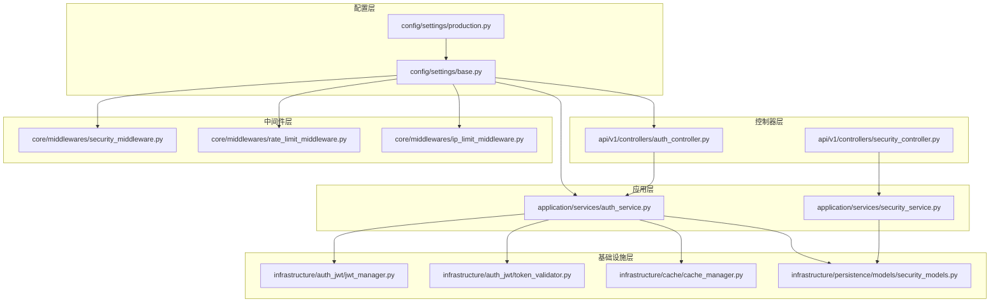
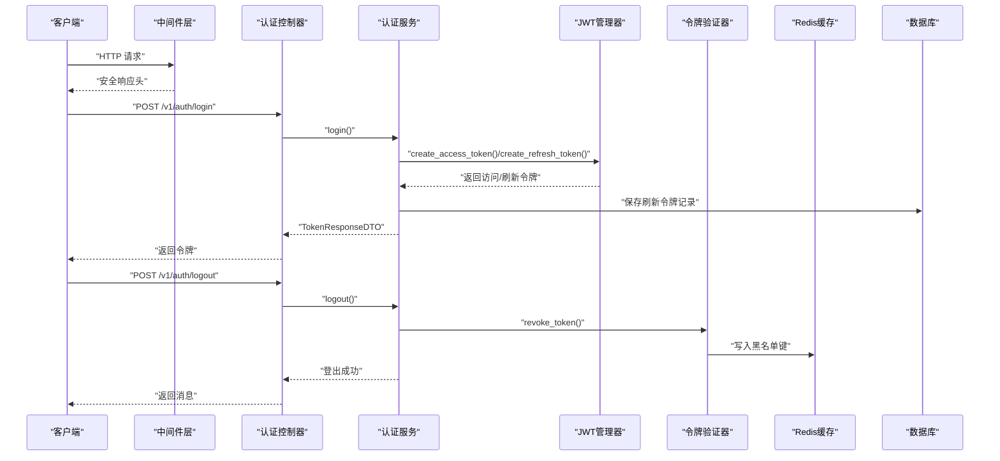
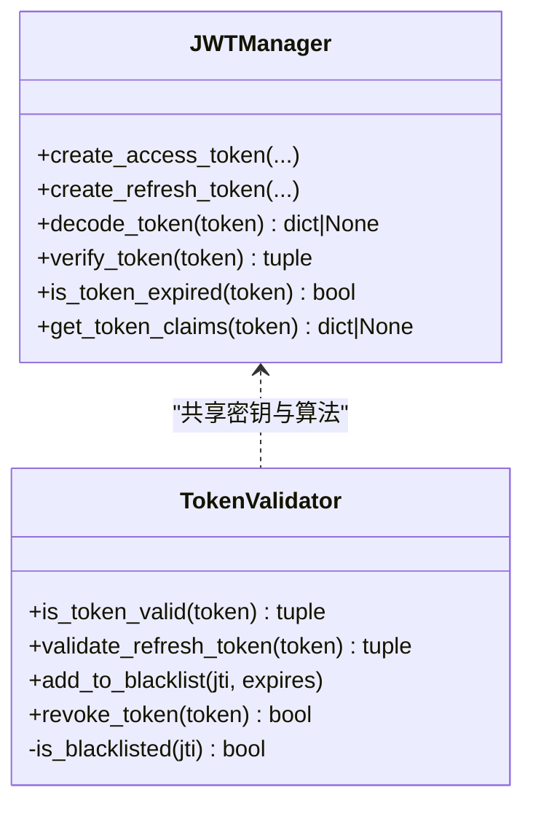
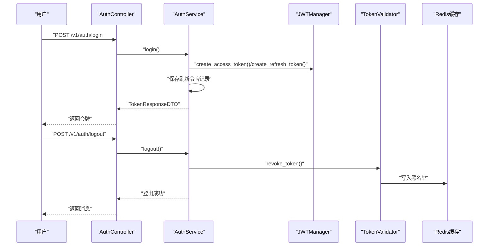
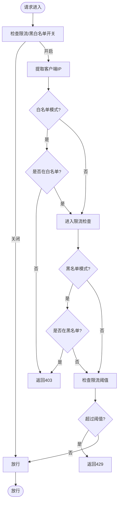
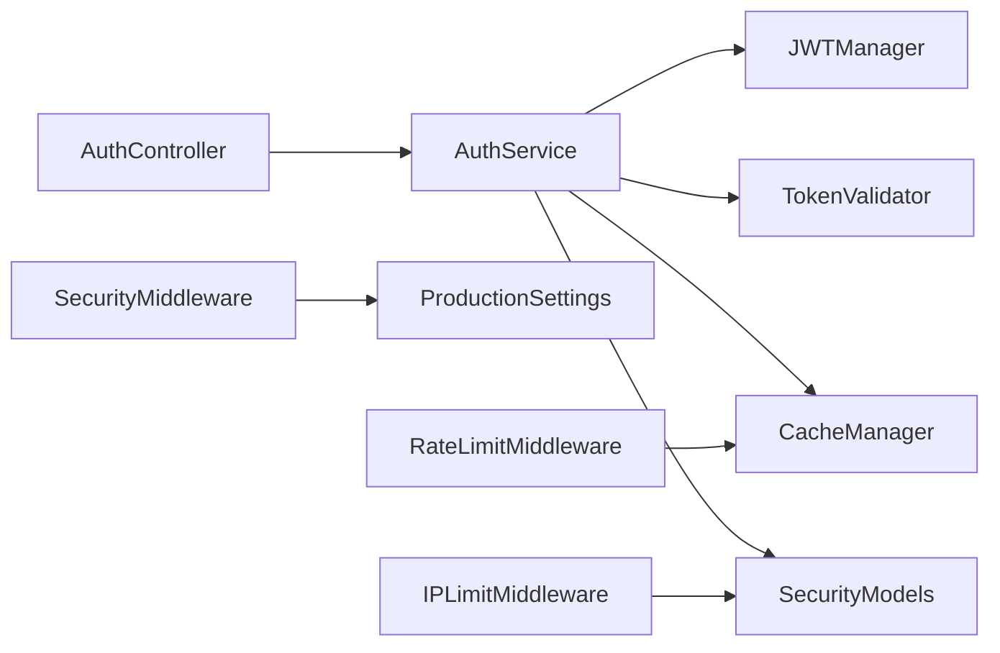

# 安全加固

<cite>
**本文引用的文件**
- [config/settings/base.py](file://config/settings/base.py)
- [config/settings/production.py](file://config/settings/production.py)
- [src/infrastructure/auth_jwt/jwt_manager.py](file://src/infrastructure/auth_jwt/jwt_manager.py)
- [src/infrastructure/auth_jwt/token_validator.py](file://src/infrastructure/auth_jwt/token_validator.py)
- [src/application/services/auth_service.py](file://src/application/services/auth_service.py)
- [src/api/v1/controllers/auth_controller.py](file://src/api/v1/controllers/auth_controller.py)
- [src/core/middlewares/security_middleware.py](file://src/core/middlewares/security_middleware.py)
- [src/core/middlewares/rate_limit_middleware.py](file://src/core/middlewares/rate_limit_middleware.py)
- [src/core/middlewares/ip_limit_middleware.py](file://src/core/middlewares/ip_limit_middleware.py)
- [src/infrastructure/persistence/models/security_models.py](file://src/infrastructure/persistence/models/security_models.py)
- [src/infrastructure/cache/cache_manager.py](file://src/infrastructure/cache/cache_manager.py)
- [requirements.txt](file://requirements.txt)
- [docker/docker-compose.yml](file://docker/docker-compose.yml)
</cite>

## 目录
1. [引言](#引言)
2. [项目结构](#项目结构)
3. [核心组件](#核心组件)
4. [架构总览](#架构总览)
5. [详细组件分析](#详细组件分析)
6. [依赖分析](#依赖分析)
7. [性能考虑](#性能考虑)
8. [故障排查指南](#故障排查指南)
9. [结论](#结论)
10. [附录](#附录)

## 引言
本文件面向生产环境的安全加固，围绕 Django 安全设置、HTTPS 与 HSTS、CORS 策略、JWT 安全配置（密钥、过期、刷新）、限流与 IP 黑白名单、缓存与令牌撤销、日志与监控、容器化部署与外部依赖等方面进行系统化梳理，并给出可操作的配置建议与最佳实践。目标是帮助运维与开发团队在不牺牲可用性的前提下，显著提升系统的抗攻击能力与合规水平。

## 项目结构
本项目采用分层架构与领域驱动设计（DDD）风格，安全相关能力分布在以下层次：
- 配置层：Django 基础与生产安全配置
- 应用层：认证与安全服务编排
- 领域层：安全实体与规则
- 基础设施层：JWT 管理、缓存、持久化模型
- 控制器层：对外暴露认证与安全 API
- 中间件层：全局安全响应头、限流、IP 过滤

**图表来源**
- [config/settings/base.py:16-52](file://config/settings/base.py#L16-L52)
- [config/settings/production.py:9-38](file://config/settings/production.py#L9-L38)
- [src/api/v1/controllers/auth_controller.py:16-35](file://src/api/v1/controllers/auth_controller.py#L16-L35)
- [src/application/services/auth_service.py:20-32](file://src/application/services/auth_service.py#L20-L32)
- [src/infrastructure/auth_jwt/jwt_manager.py:13-24](file://src/infrastructure/auth_jwt/jwt_manager.py#L13-L24)
- [src/infrastructure/auth_jwt/token_validator.py:11-19](file://src/infrastructure/auth_jwt/token_validator.py#L11-L19)
- [src/core/middlewares/security_middleware.py:14-53](file://src/core/middlewares/security_middleware.py#L14-L53)
- [src/core/middlewares/rate_limit_middleware.py:15-40](file://src/core/middlewares/rate_limit_middleware.py#L15-L40)
- [src/core/middlewares/ip_limit_middleware.py:15-40](file://src/core/middlewares/ip_limit_middleware.py#L15-L40)
- [src/infrastructure/persistence/models/security_models.py:13-50](file://src/infrastructure/persistence/models/security_models.py#L13-L50)

**章节来源**
- [config/settings/base.py:16-52](file://config/settings/base.py#L16-L52)
- [config/settings/production.py:9-38](file://config/settings/production.py#L9-L38)
- [src/api/v1/controllers/auth_controller.py:16-35](file://src/api/v1/controllers/auth_controller.py#L16-L35)
- [src/application/services/auth_service.py:20-32](file://src/application/services/auth_service.py#L20-L32)

## 核心组件
- Django 安全设置与生产配置
  - 基础配置中定义了安全相关开关与默认值；生产配置覆盖调试、主机白名单、数据库、日志级别以及 HTTPS/HSTS/安全 Cookie 等。
- JWT 管理与验证
  - JWTManager 负责令牌生成、解码、校验与过期判断；TokenValidator 负责访问令牌有效性、类型校验、黑名单检查与撤销。
- 认证服务与控制器
  - AuthService 实现登录、刷新、登出与令牌验证；AuthController 对外暴露登录、刷新、登出接口。
- 中间件
  - SecurityMiddleware 注入安全响应头；RateLimitMiddleware 基于 Redis 的简单限流；IPLimitMiddleware 支持白名单/黑名单。
- 安全模型与缓存
  - security_models 定义 IP 黑/白名单与限流规则模型；CacheManager 提供统一缓存接口，TokenValidator 使用 Redis 黑名单键空间。

**章节来源**
- [config/settings/base.py:165-173](file://config/settings/base.py#L165-L173)
- [config/settings/production.py:29-38](file://config/settings/production.py#L29-L38)
- [src/infrastructure/auth_jwt/jwt_manager.py:13-24](file://src/infrastructure/auth_jwt/jwt_manager.py#L13-L24)
- [src/infrastructure/auth_jwt/token_validator.py:11-19](file://src/infrastructure/auth_jwt/token_validator.py#L11-L19)
- [src/application/services/auth_service.py:20-32](file://src/application/services/auth_service.py#L20-L32)
- [src/api/v1/controllers/auth_controller.py:16-35](file://src/api/v1/controllers/auth_controller.py#L16-L35)
- [src/core/middlewares/security_middleware.py:46-52](file://src/core/middlewares/security_middleware.py#L46-L52)
- [src/core/middlewares/rate_limit_middleware.py:15-40](file://src/core/middlewares/rate_limit_middleware.py#L15-L40)
- [src/core/middlewares/ip_limit_middleware.py:15-40](file://src/core/middlewares/ip_limit_middleware.py#L15-L40)
- [src/infrastructure/persistence/models/security_models.py:13-50](file://src/infrastructure/persistence/models/security_models.py#L13-L50)
- [src/infrastructure/cache/cache_manager.py:16-32](file://src/infrastructure/cache/cache_manager.py#L16-L32)

## 架构总览
下图展示生产环境中的安全控制链路：客户端请求经由中间件与控制器进入应用层，应用层调用 JWT 管理与验证模块完成认证与授权，同时结合缓存与数据库实现令牌撤销与限流策略。

**图表来源**
- [src/api/v1/controllers/auth_controller.py:42-78](file://src/api/v1/controllers/auth_controller.py#L42-L78)
- [src/application/services/auth_service.py:26-112](file://src/application/services/auth_service.py#L26-L112)
- [src/infrastructure/auth_jwt/jwt_manager.py:25-80](file://src/infrastructure/auth_jwt/jwt_manager.py#L25-L80)
- [src/infrastructure/auth_jwt/token_validator.py:81-103](file://src/infrastructure/auth_jwt/token_validator.py#L81-L103)
- [src/core/middlewares/security_middleware.py:46-52](file://src/core/middlewares/security_middleware.py#L46-L52)

## 详细组件分析

### Django 安全设置与生产配置
- 关键要点
  - 生产关闭调试，限定 ALLOWED_HOSTS，使用 PostgreSQL 并设置连接复用。
  - 启用浏览器 XSS 过滤、内容类型嗅探防护、点击劫持防护、强制 HTTPS 重定向、安全 Cookie、HSTS（含子域名与预加载）。
  - CORS 在开发环境允许全部来源，生产环境需明确来源并谨慎开启凭据。
- 建议
  - 明确生产环境的 ALLOWED_HOSTS 与站点域名，避免泛域名导致的安全风险。
  - HSTS 时间应按需调整，确保浏览器预加载清单的维护成本可控。
  - 若前端与后端分离部署，CORS 需要精确配置来源、头部与凭据策略。

**章节来源**
- [config/settings/production.py:9-38](file://config/settings/production.py#L9-L38)
- [config/settings/base.py:165-173](file://config/settings/base.py#L165-L173)
- [config/settings/base.py:118-135](file://config/settings/base.py#L118-L135)

### HTTPS 与 TLS 配置
- 当前实现
  - 生产配置启用 HTTPS 重定向与 HSTS，但未在仓库中看到 Nginx/Apache 或反向代理的 TLS 终止配置示例。
- 建议
  - 在反向代理层（如 Nginx）终止 TLS，使用 Let’s Encrypt 自动签发与续期。
  - 配置强密码套件与协议版本，启用 OCSP Stapling，合理设置证书链长度。
  - 将 HSTS 预加载纳入浏览器清单管理，避免误配导致不可逆影响。

**章节来源**
- [config/settings/production.py:33-38](file://config/settings/production.py#L33-L38)
- [docker/docker-compose.yml:1-47](file://docker/docker-compose.yml#L1-L47)

### CORS 策略
- 当前实现
  - 基础配置在开发环境允许全部来源，生产环境默认关闭全部来源且允许凭据。
- 建议
  - 生产环境仅允许受信来源，避免通配符来源引发跨站脚本与敏感数据泄露。
  - 凭据允许需与来源白名单配合，防止 CSRF 与跨域滥用。

**章节来源**
- [config/settings/base.py:118-121](file://config/settings/base.py#L118-L121)

### JWT 安全配置
- 密钥管理
  - SECRET_KEY 来源于环境变量，JWT 的签名密钥直接使用 SECRET_KEY，存在密钥泄露即整体失效的风险。
- 过期时间
  - ACCESS_TOKEN_LIFETIME 与 REFRESH_TOKEN_LIFETIME 通过环境变量配置，默认分别为 1 小时与 1 天。
- 刷新机制
  - 刷新令牌支持轮换与黑名单，配合 Redis 黑名单键空间实现撤销。
- 建议
  - 使用独立的 JWT 签名密钥，定期轮换；对刷新令牌启用更严格的存储与传输保护。
  - 降低 ACCESS_TOKEN_LIFETIME，提高刷新频率以降低泄露窗口；对高敏操作增加二次校验。
  - 在 TokenValidator 中引入“撤销阈值”与“剩余有效期”策略，避免短生命周期令牌频繁刷新带来的性能压力。

**图表来源**
- [src/infrastructure/auth_jwt/jwt_manager.py:13-24](file://src/infrastructure/auth_jwt/jwt_manager.py#L13-L24)
- [src/infrastructure/auth_jwt/token_validator.py:11-19](file://src/infrastructure/auth_jwt/token_validator.py#L11-L19)

**章节来源**
- [config/settings/base.py:137-151](file://config/settings/base.py#L137-L151)
- [src/infrastructure/auth_jwt/jwt_manager.py:25-80](file://src/infrastructure/auth_jwt/jwt_manager.py#L25-L80)
- [src/infrastructure/auth_jwt/token_validator.py:21-45](file://src/infrastructure/auth_jwt/token_validator.py#L21-L45)

### 认证流程与令牌撤销
- 登录
  - 用户凭据校验通过后生成访问令牌与刷新令牌，保存刷新令牌记录，更新最后登录时间并记录登录日志。
- 刷新
  - 使用刷新令牌换取新的访问令牌，保持会话连续性。
- 登出
  - 撤销当前访问令牌（写入黑名单），清理用户相关缓存键。
- 建议
  - 登录失败与异常场景需记录详细上下文（IP、UA、设备信息），便于审计与溯源。
  - 登出后应同步清理前端本地存储的令牌，避免复用。

**图表来源**
- [src/api/v1/controllers/auth_controller.py:42-78](file://src/api/v1/controllers/auth_controller.py#L42-L78)
- [src/application/services/auth_service.py:26-112](file://src/application/services/auth_service.py#L26-L112)
- [src/infrastructure/auth_jwt/token_validator.py:81-103](file://src/infrastructure/auth_jwt/token_validator.py#L81-L103)

**章节来源**
- [src/api/v1/controllers/auth_controller.py:42-78](file://src/api/v1/controllers/auth_controller.py#L42-L78)
- [src/application/services/auth_service.py:26-112](file://src/application/services/auth_service.py#L26-L112)
- [src/infrastructure/auth_jwt/token_validator.py:81-103](file://src/infrastructure/auth_jwt/token_validator.py#L81-L103)

### 限流与 IP 黑白名单
- 限流中间件
  - 基于 Redis 的简单限流，按 IP+方法+路径聚合计数，超限返回 429。
- IP 黑白名单中间件
  - 支持白名单与黑名单模式，动态查询数据库中的 IP 黑/白名单条目，支持永久与临时封禁。
- 安全模型
  - IPBlacklist/IPWhitelist/RateLimitRule/RateLimitRecord 模型支撑管理端与运行时策略。
- 建议
  - 结合业务场景细化限流规则（按用户、按 API 维度），并为管理端接口单独设置更高阈值。
  - 黑/白名单变更应具备审计日志与回滚机制。

**图表来源**
- [src/core/middlewares/rate_limit_middleware.py:70-111](file://src/core/middlewares/rate_limit_middleware.py#L70-L111)
- [src/core/middlewares/ip_limit_middleware.py:78-129](file://src/core/middlewares/ip_limit_middleware.py#L78-L129)
- [src/infrastructure/persistence/models/security_models.py:13-50](file://src/infrastructure/persistence/models/security_models.py#L13-L50)

**章节来源**
- [src/core/middlewares/rate_limit_middleware.py:15-40](file://src/core/middlewares/rate_limit_middleware.py#L15-L40)
- [src/core/middlewares/ip_limit_middleware.py:15-40](file://src/core/middlewares/ip_limit_middleware.py#L15-L40)
- [src/infrastructure/persistence/models/security_models.py:82-136](file://src/infrastructure/persistence/models/security_models.py#L82-L136)

### 缓存与令牌撤销
- CacheManager 提供统一键空间与分组，TokenValidator 使用黑名单键空间实现撤销。
- 建议
  - 黑名单键的过期时间与令牌剩余有效期保持一致，避免悬挂键。
  - 对高频撤销场景，评估 Redis 内存占用与过期策略。

**章节来源**
- [src/infrastructure/cache/cache_manager.py:16-32](file://src/infrastructure/cache/cache_manager.py#L16-L32)
- [src/infrastructure/auth_jwt/token_validator.py:47-61](file://src/infrastructure/auth_jwt/token_validator.py#L47-L61)

### 日志与监控
- 基础配置提供文件与控制台处理器，生产环境建议提升根日志级别并接入集中式日志系统。
- 建议
  - 对认证失败、令牌撤销、限流触发、IP 黑名单命中等事件进行结构化日志输出。
  - 集成告警通道，对异常峰值与批量封禁事件及时通知。

**章节来源**
- [config/settings/base.py:174-226](file://config/settings/base.py#L174-L226)
- [config/settings/production.py:25-27](file://config/settings/production.py#L25-L27)

### 容器化与外部依赖
- docker-compose 提供 web、db、redis 服务编排，生产部署建议使用反向代理与独立 TLS 层。
- 外部依赖包含 CORS、JWT、Redis、日志等，均与安全相关，需关注版本与补丁更新。

**章节来源**
- [docker/docker-compose.yml:1-47](file://docker/docker-compose.yml#L1-L47)
- [requirements.txt:21-26](file://requirements.txt#L21-L26)

## 依赖分析
- 组件耦合
  - 认证服务依赖 JWT 管理与验证、缓存与数据库模型；控制器依赖认证服务。
  - 中间件层与配置层共同决定全局安全行为。
- 外部依赖
  - CORS、JWT、Redis、日志、数据库驱动等均为安全相关的关键依赖。

**图表来源**
- [src/api/v1/controllers/auth_controller.py:27-34](file://src/api/v1/controllers/auth_controller.py#L27-L34)
- [src/application/services/auth_service.py:12-17](file://src/application/services/auth_service.py#L12-L17)
- [src/infrastructure/auth_jwt/jwt_manager.py:20-23](file://src/infrastructure/auth_jwt/jwt_manager.py#L20-L23)
- [src/infrastructure/auth_jwt/token_validator.py:17-19](file://src/infrastructure/auth_jwt/token_validator.py#L17-L19)
- [src/core/middlewares/security_middleware.py:46-52](file://src/core/middlewares/security_middleware.py#L46-L52)
- [src/core/middlewares/rate_limit_middleware.py:37-39](file://src/core/middlewares/rate_limit_middleware.py#L37-L39)
- [src/core/middlewares/ip_limit_middleware.py:37-39](file://src/core/middlewares/ip_limit_middleware.py#L37-L39)

**章节来源**
- [src/api/v1/controllers/auth_controller.py:27-34](file://src/api/v1/controllers/auth_controller.py#L27-L34)
- [src/application/services/auth_service.py:12-17](file://src/application/services/auth_service.py#L12-L17)
- [src/infrastructure/auth_jwt/jwt_manager.py:20-23](file://src/infrastructure/auth_jwt/jwt_manager.py#L20-L23)
- [src/infrastructure/auth_jwt/token_validator.py:17-19](file://src/infrastructure/auth_jwt/token_validator.py#L17-L19)
- [src/core/middlewares/security_middleware.py:46-52](file://src/core/middlewares/security_middleware.py#L46-L52)
- [src/core/middlewares/rate_limit_middleware.py:37-39](file://src/core/middlewares/rate_limit_middleware.py#L37-L39)
- [src/core/middlewares/ip_limit_middleware.py:37-39](file://src/core/middlewares/ip_limit_middleware.py#L37-L39)

## 性能考虑
- 限流与黑名单检查为 O(1) 操作，Redis 读写延迟应纳入 SLA 考量。
- JWT 解码与黑名单查询为热点路径，建议优化键命名与过期策略，避免内存膨胀。
- 登录与刷新接口应避免重复计算用户角色/权限，利用缓存与 DTO 降低序列化开销。

## 故障排查指南
- 认证失败
  - 检查用户状态、密码哈希一致性与登录日志。
- 令牌无效/过期
  - 确认 SECRET_KEY 一致性、JWT 算法与签名密钥、令牌剩余有效期。
- 无法登出
  - 检查 Redis 黑名单键是否存在、过期时间是否正确。
- 限流频繁
  - 调整默认阈值或针对特定端点配置更细粒度规则。
- IP 被封禁
  - 核对数据库中的封禁记录与到期时间，确认是否误封。

**章节来源**
- [src/application/services/auth_service.py:40-56](file://src/application/services/auth_service.py#L40-L56)
- [src/infrastructure/auth_jwt/token_validator.py:47-61](file://src/infrastructure/auth_jwt/token_validator.py#L47-L61)
- [src/core/middlewares/rate_limit_middleware.py:105-106](file://src/core/middlewares/rate_limit_middleware.py#L105-L106)
- [src/core/middlewares/ip_limit_middleware.py:119-129](file://src/core/middlewares/ip_limit_middleware.py#L119-L129)

## 结论
本项目在安全方面已具备基础防护能力：生产安全开关、HSTS、CORS 策略、JWT 令牌管理、限流与 IP 黑白名单。建议进一步完善密钥管理、TLS 终止、CORS 精准配置、令牌撤销策略与集中化日志监控，以满足生产级安全与合规要求。

## 附录

### 生产环境安全配置清单
- 环境变量
  - SECRET_KEY、ALLOWED_HOSTS、DB_*、REDIS_*、JWT_ACCESS_TOKEN_LIFETIME、JWT_REFRESH_TOKEN_LIFETIME、RATE_LIMIT_ENABLED、RATE_LIMIT_DEFAULT、IP_BLACKLIST_ENABLED、IP_WHITELIST_ENABLED
- 安全开关
  - DEBUG=false、SECURE_SSL_REDIRECT=true、SESSION_COOKIE_SECURE=true、CSRF_COOKIE_SECURE=true、SECURE_HSTS_SECONDS、CORS_ALLOW_CREDENTIALS=false（生产建议关闭）
- 依赖版本
  - 关注 django-cors-headers、djangorestframework-simplejwt、django-redis 等包的安全公告与升级路径

**章节来源**
- [config/settings/production.py:9-38](file://config/settings/production.py#L9-L38)
- [config/settings/base.py:137-151](file://config/settings/base.py#L137-L151)
- [requirements.txt:21-26](file://requirements.txt#L21-L26)