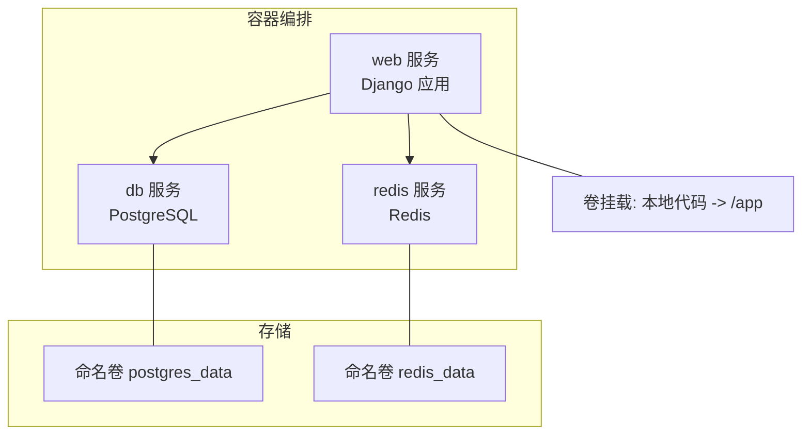
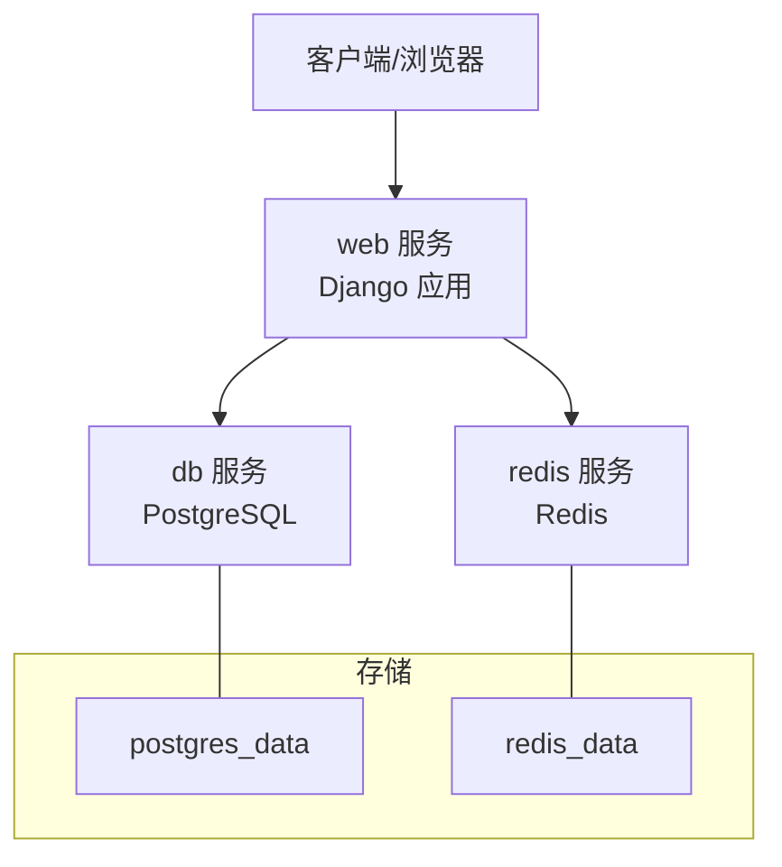
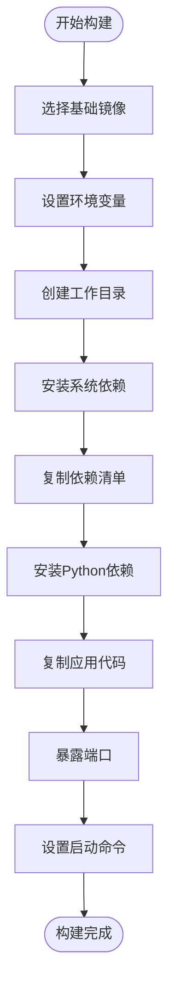
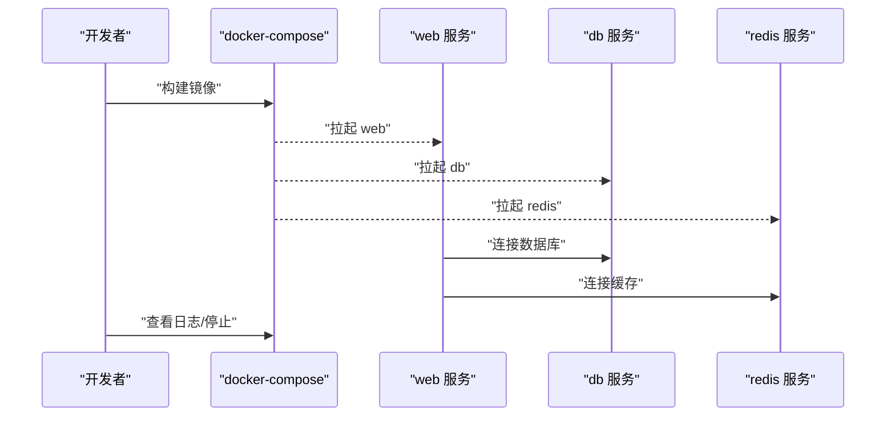
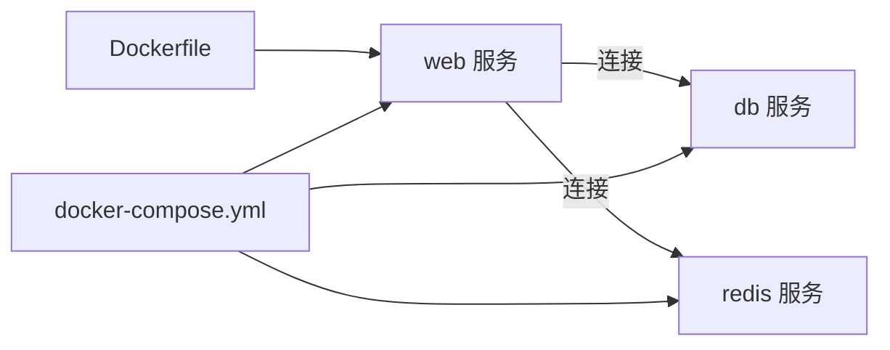

# 容器化部署

<cite>
**本文引用的文件**
- [docker/Dockerfile](file://docker/Dockerfile)
- [docker/docker-compose.yml](file://docker/docker-compose.yml)
- [requirements.txt](file://requirements.txt)
- [config/settings/base.py](file://config/settings/base.py)
- [config/settings/development.py](file://config/settings/development.py)
- [config/settings/production.py](file://config/settings/production.py)
- [config/settings/testing.py](file://config/settings/testing.py)
- [config/wsgi.py](file://config/wsgi.py)
- [config/asgi.py](file://config/asgi.py)
- [scripts/migrate.sh](file://scripts/migrate.sh)
- [docs/DEVELOPMENT.md](file://docs/DEVELOPMENT.md)
</cite>

## 目录
1. [简介](#简介)
2. [项目结构](#项目结构)
3. [核心组件](#核心组件)
4. [架构总览](#架构总览)
5. [详细组件分析](#详细组件分析)
6. [依赖关系分析](#依赖关系分析)
7. [性能考虑](#性能考虑)
8. [故障排查指南](#故障排查指南)
9. [结论](#结论)
10. [附录](#附录)

## 简介
本文件面向需要将项目进行容器化部署的读者，系统性说明 Dockerfile 的构建流程与要点、docker-compose.yml 的服务编排结构与配置项、从镜像构建到服务启动的完整部署流程、开发与生产环境的容器配置差异、容器间通信与数据持久化策略、容器监控与日志收集方法，以及常见问题排查与性能优化建议。内容严格基于仓库中的实际配置文件整理而成，便于不同技术背景的读者理解与落地。

## 项目结构
与容器化部署直接相关的关键文件与目录如下：
- docker/Dockerfile：定义容器镜像构建步骤，含基础镜像、环境变量、系统依赖、Python 依赖、应用代码复制与启动命令。
- docker/docker-compose.yml：定义 web、db、redis 三类服务，包含构建上下文、端口映射、环境变量、依赖关系、卷挂载与命名卷。
- config/settings/*.py：Django 设置在不同环境下的差异，决定容器内运行时行为（数据库、缓存、安全、日志等）。
- requirements.txt：Python 依赖清单，供镜像构建阶段安装。
- scripts/migrate.sh：数据库迁移与初始化脚本，可用于容器启动后的初始化流程。
- docs/DEVELOPMENT.md：包含容器化部署的命令示例与常用操作。

图表来源
- [docker/docker-compose.yml:3-47](file://docker/docker-compose.yml#L3-L47)

章节来源
- [docker/docker-compose.yml:1-47](file://docker/docker-compose.yml#L1-L47)
- [docker/Dockerfile:1-33](file://docker/Dockerfile#L1-L33)
- [requirements.txt:1-38](file://requirements.txt#L1-L38)

## 核心组件
- Web 服务（Django 应用）
  - 基于 Python 3.10 slim 镜像，设置必要的环境变量，安装系统依赖（如编译器、PostgreSQL 客户端、libpq），复制并安装 Python 依赖，复制应用代码，暴露 8000 端口，通过 Django 管理命令启动开发服务器。
  - 在 compose 中映射 8000:8000，挂载本地代码到容器 /app，设置数据库与 Redis 环境变量，声明对 db 与 redis 的依赖。
- 数据库服务（PostgreSQL）
  - 使用官方 postgres:15-alpine 镜像，设置数据库名、用户名、密码，映射 5432:5432，使用命名卷持久化数据。
- 缓存服务（Redis）
  - 使用官方 redis:7-alpine 镜像，映射 6379:6379，使用命名卷持久化数据。

章节来源
- [docker/Dockerfile:1-33](file://docker/Dockerfile#L1-L33)
- [docker/docker-compose.yml:3-47](file://docker/docker-compose.yml#L3-L47)
- [requirements.txt:1-38](file://requirements.txt#L1-L38)

## 架构总览
下图展示容器化部署的整体架构：web 服务依赖 db 与 redis；web 通过环境变量连接数据库与缓存；数据通过命名卷持久化。

图表来源
- [docker/docker-compose.yml:3-47](file://docker/docker-compose.yml#L3-L47)

## 详细组件分析

### Dockerfile 构建流程
- 基础镜像与环境变量
  - 选择轻量级 Python 3.10 slim 镜像，设置若干 Python/Docker 相关环境变量以提升稳定性与可预测性。
- 工作目录与系统依赖
  - 设置工作目录为 /app，安装编译器与 PostgreSQL 客户端及头文件，便于后续 Python 包编译与数据库连接。
- 依赖安装
  - 复制 requirements.txt 并一次性安装，避免缓存干扰。
- 应用代码与启动
  - 复制全部源码至 /app，暴露 8000 端口，使用 Django 管理命令启动开发服务器。
- 体积优化建议
  - 可将 requirements.txt 与源码复制顺序调整为先复制依赖再复制源码，利用 Docker 缓存；或拆分多阶段构建减少最终镜像大小。

图表来源
- [docker/Dockerfile:1-33](file://docker/Dockerfile#L1-L33)

章节来源
- [docker/Dockerfile:1-33](file://docker/Dockerfile#L1-L33)
- [requirements.txt:1-38](file://requirements.txt#L1-L38)

### docker-compose.yml 配置解析
- 服务定义
  - web：使用本地上下文与 Dockerfile 构建；映射 8000:8000；设置 DEBUG、数据库与 Redis 环境变量；声明依赖 db 与 redis；挂载本地代码到 /app。
  - db：使用 postgres:15-alpine；设置数据库名、用户、密码；映射 5432:5432；使用命名卷 postgres_data。
  - redis：使用 redis:7-alpine；映射 6379:6379；使用命名卷 redis_data。
- 网络与卷
  - 默认网络由 Compose 管理；web 通过服务名访问 db 与 redis；命名卷用于持久化数据库与缓存数据。
- 环境变量
  - web 侧设置 DEBUG、数据库引擎、主机、端口、名称、凭据，以及 REDIS_HOST/PORT；db 侧设置 POSTGRES_DB/USER/PASSWORD；redis 侧默认无需额外配置。

图表来源
- [docker/docker-compose.yml:3-47](file://docker/docker-compose.yml#L3-L47)

章节来源
- [docker/docker-compose.yml:1-47](file://docker/docker-compose.yml#L1-L47)

### 开发与生产环境差异
- Django 设置差异
  - base.py：从环境变量读取 SECRET_KEY、DEBUG、ALLOWED_HOSTS、数据库 ENGINE/HOST/PORT/NAME/USER/PASSWORD、Redis HOST/PORT/DB、JWT 参数、CORS、缓存、日志、限流与 IP 黑白名单等。
  - development.py：开启 DEBUG，使用 SQLite，提高日志级别，允许跨域。
  - production.py：关闭 DEBUG，使用 PostgreSQL，收紧安全设置（如 HTTPS、HSTS、Cookie 安全标志），降低日志级别。
  - testing.py：使用内存 SQLite，禁用缓存，使用快速哈希器，关闭限流，便于测试。
- 容器内运行时差异
  - 开发：web 服务通过环境变量连接本地 db 与 redis；compose 将本地代码挂载到 /app，便于热更新。
  - 生产：建议使用独立的生产配置文件或外部环境变量注入，避免将源码挂载到容器内；数据库与缓存应指向生产实例或专用容器。

章节来源
- [config/settings/base.py:10-235](file://config/settings/base.py#L10-L235)
- [config/settings/development.py:1-24](file://config/settings/development.py#L1-L24)
- [config/settings/production.py:1-39](file://config/settings/production.py#L1-L39)
- [config/settings/testing.py:1-32](file://config/settings/testing.py#L1-L32)

### 容器间通信与数据持久化
- 通信
  - web 通过服务名访问 db 与 redis（例如 db、redis），compose 默认网络使服务可互相解析。
- 数据持久化
  - db 使用命名卷 postgres_data 持久化 PostgreSQL 数据目录。
  - redis 使用命名卷 redis_data 持久化 Redis 数据目录。
- 代码挂载
  - 开发模式下将本地代码挂载到 web 容器的 /app，便于修改即生效；生产不建议挂载源码，而应使用构建好的镜像。

章节来源
- [docker/docker-compose.yml:23-47](file://docker/docker-compose.yml#L23-L47)

### 容器监控与日志收集
- 日志
  - Django 日志配置包含文件处理器与控制台处理器，输出到应用根目录 logs 子目录；容器内可通过 docker logs 或 docker-compose logs 查看。
- 监控
  - 可在 compose 中增加健康检查（healthcheck）与资源限制（deploy.resources），结合外部监控系统采集指标与日志。

章节来源
- [config/settings/base.py:174-226](file://config/settings/base.py#L174-L226)
- [docs/DEVELOPMENT.md:172-186](file://docs/DEVELOPMENT.md#L172-L186)

### 完整部署流程（从构建到启动）
- 构建镜像
  - 使用 docker-compose build 或 docker build（指定 Dockerfile）。
- 启动服务
  - 使用 docker-compose up -d 后台启动，随后可用 docker-compose ps 查看状态。
- 初始化数据库
  - 可执行 scripts/migrate.sh 或在 web 容器中运行 Django 管理命令进行迁移与初始化。
- 查看日志
  - 使用 docker-compose logs -f 实时查看日志。
- 停止与清理
  - 使用 docker-compose down 停止并移除容器；保留命名卷以持久化数据；如需清理卷，使用 docker-compose down -v。

章节来源
- [docs/DEVELOPMENT.md:172-186](file://docs/DEVELOPMENT.md#L172-L186)
- [scripts/migrate.sh:1-12](file://scripts/migrate.sh#L1-L12)

## 依赖关系分析
- 组件耦合
  - web 对 db 与 redis 存在强依赖（数据库与缓存），compose 的 depends_on 保证启动顺序。
- 外部依赖
  - PostgreSQL 客户端与编译器在镜像构建期安装，确保 psycopg2-binary 等包正确编译。
- 环境变量契约
  - web 服务通过环境变量读取数据库与缓存配置，compose 中集中管理，便于切换开发/生产。

图表来源
- [docker/docker-compose.yml:3-47](file://docker/docker-compose.yml#L3-L47)
- [docker/Dockerfile:1-33](file://docker/Dockerfile#L1-L33)

章节来源
- [docker/docker-compose.yml:1-47](file://docker/docker-compose.yml#L1-L47)
- [docker/Dockerfile:1-33](file://docker/Dockerfile#L1-L33)
- [requirements.txt:1-38](file://requirements.txt#L1-L38)

## 性能考虑
- 镜像体积与构建时间
  - 将 requirements.txt 与源码复制顺序优化，避免频繁重建；必要时采用多阶段构建。
- 运行时性能
  - 生产环境建议使用 WSGI/ASGI 服务器替代开发服务器；合理设置数据库连接池与缓存命中率。
- 资源限制
  - 在 compose 中为服务设置 CPU/内存限制，防止资源争用。
- 日志与存储
  - 控制日志级别与轮转，避免磁盘打满；对持久化卷定期备份。

## 故障排查指南
- 数据库连接失败
  - 检查 web 服务的数据库环境变量是否正确；确认 db 服务已就绪且端口映射正常；查看数据库日志。
- Redis 连接失败
  - 检查 REDIS_HOST/PORT；确认 redis 服务已就绪；查看 redis 日志。
- 端口冲突
  - 修改 docker-compose.yml 中的 hostPort 映射或调整宿主机端口。
- 数据库迁移问题
  - 在 web 容器中执行迁移脚本或命令；若迁移异常，按开发文档建议清理迁移文件后重试。
- 日志无法查看
  - 使用 docker-compose logs -f 查看实时日志；检查 Django 日志配置与容器内日志目录权限。

章节来源
- [docs/DEVELOPMENT.md:188-219](file://docs/DEVELOPMENT.md#L188-L219)
- [scripts/migrate.sh:1-12](file://scripts/migrate.sh#L1-L12)

## 结论
本容器化方案以最小改动适配了 Django 的运行需求：通过 Dockerfile 明确构建步骤，通过 docker-compose.yml 实现服务编排与数据持久化。开发与生产环境通过 Django 设置文件实现差异化配置，容器内通过环境变量统一管理数据库与缓存连接。配合日志与迁移脚本，可快速完成从构建到上线的全流程。建议在生产环境中进一步完善健康检查、资源限制与监控体系，并采用更稳健的 WSGI/ASGI 服务器与镜像优化策略。

## 附录
- 关键入口与运行时配置
  - WSGI/ASGI 默认加载 development 设置，容器内可通过环境变量覆盖。
- 常用命令参考
  - 构建：docker-compose build
  - 启动：docker-compose up -d
  - 日志：docker-compose logs -f
  - 停止：docker-compose down

章节来源
- [config/wsgi.py:1-12](file://config/wsgi.py#L1-L12)
- [config/asgi.py:1-12](file://config/asgi.py#L1-L12)
- [docs/DEVELOPMENT.md:172-186](file://docs/DEVELOPMENT.md#L172-L186)