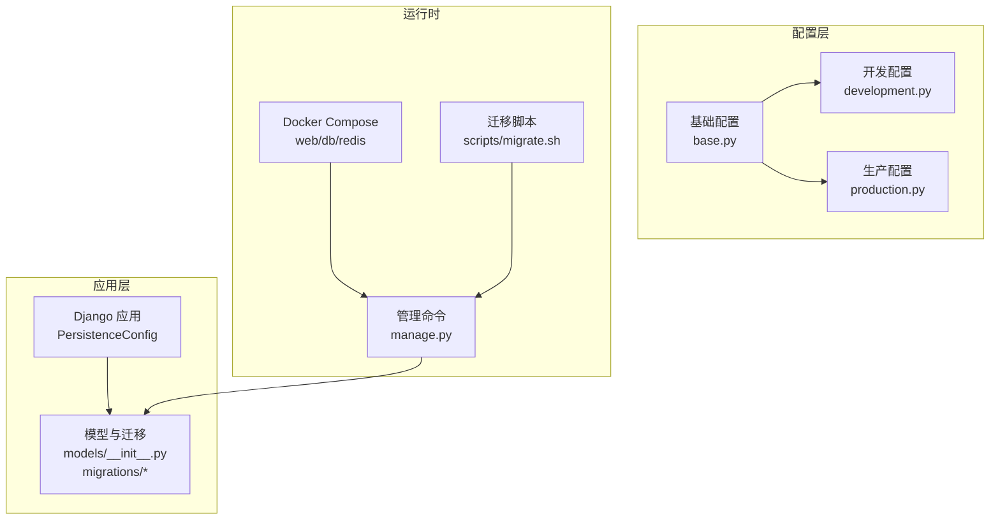
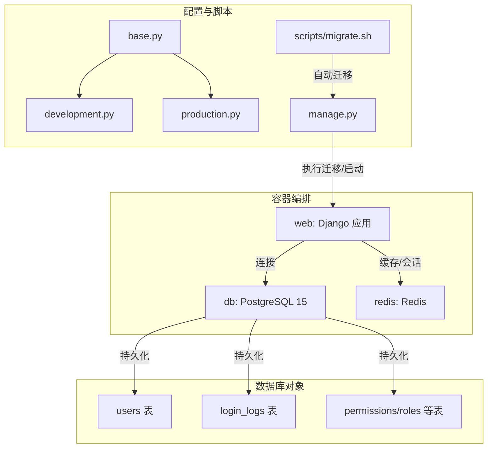
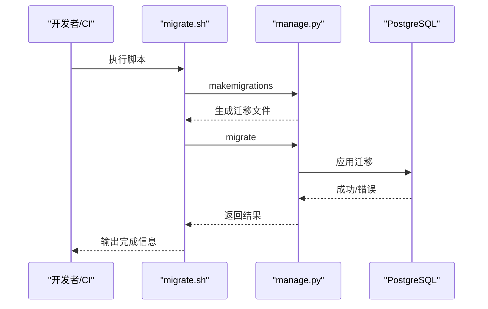
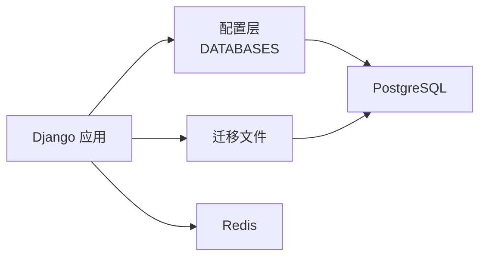

# 数据库部署

<cite>
**本文引用的文件**
- [config/settings/base.py](file://config/settings/base.py)
- [config/settings/development.py](file://config/settings/development.py)
- [config/settings/production.py](file://config/settings/production.py)
- [docker/docker-compose.yml](file://docker/docker-compose.yml)
- [docker/Dockerfile](file://docker/Dockerfile)
- [manage.py](file://manage.py)
- [scripts/migrate.sh](file://scripts/migrate.sh)
- [requirements.txt](file://requirements.txt)
- [pyproject.toml](file://pyproject.toml)
- [src/infrastructure/persistence/apps.py](file://src/infrastructure/persistence/apps.py)
- [src/infrastructure/persistence/models/__init__.py](file://src/infrastructure/persistence/models/__init__.py)
- [src/infrastructure/persistence/migrations/0001_initial.py](file://src/infrastructure/persistence/migrations/0001_initial.py)
- [src/infrastructure/persistence/migrations/0002_auto_20260314_0921.py](file://src/infrastructure/persistence/migrations/0002_auto_20260314_0921.py)
- [sql/rbac.sql](file://sql/rbac.sql)
</cite>

## 目录
1. [简介](#简介)
2. [项目结构](#项目结构)
3. [核心组件](#核心组件)
4. [架构总览](#架构总览)
5. [详细组件分析](#详细组件分析)
6. [依赖分析](#依赖分析)
7. [性能考虑](#性能考虑)
8. [故障排查指南](#故障排查指南)
9. [结论](#结论)
10. [附录](#附录)

## 简介
本文件面向数据库部署与运维，围绕 PostgreSQL 在本项目的安装、配置、迁移、备份恢复、性能监控与优化、高可用与安全配置，以及日常维护与自动化脚本进行系统化说明。项目默认在开发环境使用 SQLite，生产环境使用 PostgreSQL，并通过 Docker Compose 提供一键部署示例。

## 项目结构
- 配置层：通过环境变量驱动数据库连接（开发/生产），并在 Docker 中统一注入。
- 应用层：Django 应用注册持久化模块，迁移文件定义数据库表结构与索引。
- 运维层：Docker Compose 提供 Postgres 与 Redis 的容器化服务；迁移脚本负责初始化与升级。

图表来源
- [docker/docker-compose.yml:1-47](file://docker/docker-compose.yml#L1-L47)
- [manage.py:1-23](file://manage.py#L1-L23)
- [scripts/migrate.sh:1-12](file://scripts/migrate.sh#L1-L12)
- [src/infrastructure/persistence/apps.py:1-14](file://src/infrastructure/persistence/apps.py#L1-L14)
- [src/infrastructure/persistence/models/__init__.py:1-23](file://src/infrastructure/persistence/models/__init__.py#L1-L23)

章节来源
- [config/settings/base.py:77-88](file://config/settings/base.py#L77-L88)
- [config/settings/development.py:10-16](file://config/settings/development.py#L10-L16)
- [config/settings/production.py:12-23](file://config/settings/production.py#L12-L23)
- [docker/docker-compose.yml:1-47](file://docker/docker-compose.yml#L1-L47)
- [docker/Dockerfile:1-32](file://docker/Dockerfile#L1-L32)
- [manage.py:1-23](file://manage.py#L1-L23)
- [scripts/migrate.sh:1-12](file://scripts/migrate.sh#L1-L12)

## 核心组件
- 数据库引擎与连接
  - 开发环境：SQLite（便于本地快速启动）
  - 生产环境：PostgreSQL（通过环境变量配置）
  - 连接复用：CONN_MAX_AGE 参数启用长连接复用
- Docker 部署
  - Postgres 15（alpine）镜像，持久化卷映射
  - Redis 作为缓存与会话存储
- 迁移与模型
  - 初始迁移定义用户、权限、角色、限流、登录日志等表及索引
  - 迁移脚本自动执行 makemigrations 与 migrate
- 安全与性能
  - 生产环境强制 HTTPS、HSTS、安全 Cookie
  - Redis 缓存用于限流与会话

章节来源
- [config/settings/base.py:77-88](file://config/settings/base.py#L77-L88)
- [config/settings/development.py:10-16](file://config/settings/development.py#L10-L16)
- [config/settings/production.py:12-23](file://config/settings/production.py#L12-L23)
- [docker/docker-compose.yml:26-42](file://docker/docker-compose.yml#L26-L42)
- [docker/Dockerfile:13-17](file://docker/Dockerfile#L13-L17)
- [requirements.txt:14-15](file://requirements.txt#L14-L15)
- [src/infrastructure/persistence/migrations/0001_initial.py:1-973](file://src/infrastructure/persistence/migrations/0001_initial.py#L1-L973)
- [scripts/migrate.sh:1-12](file://scripts/migrate.sh#L1-L12)

## 架构总览
下图展示应用、配置、容器与数据库之间的交互关系，以及迁移与运维脚本的作用位置。

图表来源
- [docker/docker-compose.yml:1-47](file://docker/docker-compose.yml#L1-L47)
- [config/settings/base.py:77-88](file://config/settings/base.py#L77-L88)
- [config/settings/production.py:12-23](file://config/settings/production.py#L12-L23)
- [manage.py:1-23](file://manage.py#L1-L23)
- [scripts/migrate.sh:1-12](file://scripts/migrate.sh#L1-L12)
- [src/infrastructure/persistence/migrations/0001_initial.py:1-973](file://src/infrastructure/persistence/migrations/0001_initial.py#L1-L973)

## 详细组件分析

### PostgreSQL 安装与配置
- 版本选择
  - 示例使用 Postgres 15（alpine），适合轻量化与稳定兼容
- 连接参数
  - 通过环境变量注入 ENGINE、NAME、USER、PASSWORD、HOST、PORT
  - 生产环境建议使用独立数据库实例，避免共享或内嵌数据库
- 连接池设置
  - Django 层通过 CONN_MAX_AGE 实现连接复用（长连接）
  - 如需更细粒度连接池控制，可在应用外层（如 gunicorn/uwsgi + pgBouncer）配置
- 安全加固
  - 强制 SSL 连接（生产环境已开启 HSTS 与安全 Cookie）
  - 使用专用数据库用户与最小权限原则

章节来源
- [docker/docker-compose.yml:26-35](file://docker/docker-compose.yml#L26-L35)
- [config/settings/production.py:12-23](file://config/settings/production.py#L12-L23)
- [config/settings/base.py:77-88](file://config/settings/base.py#L77-L88)
- [config/settings/production.py:29-38](file://config/settings/production.py#L29-L38)

### 数据库迁移流程
- 迁移文件生成
  - 通过管理命令生成迁移文件，随后应用到数据库
- 迁移应用与回滚
  - 应用：执行 migrate
  - 回滚：可使用迁移历史中的上一步迁移（当前第二步迁移为空）
- 自动化脚本
  - 脚本中包含 makemigrations 与 migrate 的顺序执行

图表来源
- [scripts/migrate.sh:1-12](file://scripts/migrate.sh#L1-L12)
- [manage.py:1-23](file://manage.py#L1-L23)
- [src/infrastructure/persistence/migrations/0001_initial.py:1-973](file://src/infrastructure/persistence/migrations/0001_initial.py#L1-L973)
- [src/infrastructure/persistence/migrations/0002_auto_20260314_0921.py:1-13](file://src/infrastructure/persistence/migrations/0002_auto_20260314_0921.py#L1-L13)

章节来源
- [scripts/migrate.sh:1-12](file://scripts/migrate.sh#L1-L12)
- [src/infrastructure/persistence/migrations/0001_initial.py:1-973](file://src/infrastructure/persistence/migrations/0001_initial.py#L1-L973)
- [src/infrastructure/persistence/migrations/0002_auto_20260314_0921.py:1-13](file://src/infrastructure/persistence/migrations/0002_auto_20260314_0921.py#L1-L13)

### 备份与恢复策略
- 全量备份
  - 使用容器卷持久化数据目录，结合数据库导出工具进行逻辑备份
- 增量备份
  - 可结合 WAL 归档与时间点恢复（RPO/RTO 视归档策略而定）
- 时间点恢复（PITR）
  - 需要开启 WAL 归档与恢复目标配置（在生产数据库中按需启用）

说明：本仓库未提供具体备份/恢复脚本，上述为通用实践建议。

### 性能监控与优化
- 查询优化
  - 关注迁移文件中定义的索引（如唯一/复合索引），确保热点查询命中索引
- 索引策略
  - 对高频过滤/排序字段建立合适索引，定期评估冗余索引
- 统计信息更新
  - 定期更新表统计信息以提升计划器准确性
- 连接与并发
  - 合理设置连接池大小与超时，避免连接泄漏
- 缓存与会话
  - 使用 Redis 缓存热点数据与会话，降低数据库压力

章节来源
- [src/infrastructure/persistence/migrations/0001_initial.py:393-397](file://src/infrastructure/persistence/migrations/0001_initial.py#L393-L397)
- [src/infrastructure/persistence/migrations/0001_initial.py:434-440](file://src/infrastructure/persistence/migrations/0001_initial.py#L434-L440)
- [docker/docker-compose.yml:37-42](file://docker/docker-compose.yml#L37-L42)
- [config/settings/base.py:158-163](file://config/settings/base.py#L158-L163)

### 高可用部署方案
- 主从复制
  - 通过流复制实现读写分离与故障切换
- 集群配置
  - 使用托管数据库（如云数据库高可用版）或第三方集群方案
- 容灾与副本
  - 结合备份与跨区部署，确保 RTO/RPO 满足业务要求

说明：本仓库未包含高可用拓扑配置，上述为通用建议。

### 安全配置
- 访问控制
  - 限制数据库主机访问、使用专用账号与最小权限
- 审计日志
  - 启用数据库审计与慢查询日志，定期巡检
- 数据加密
  - 启用传输层加密（SSL/TLS）与静态数据加密（视平台支持）
- 应用侧安全
  - 生产环境已启用 HSTS、安全 Cookie、HTTPS 强制跳转

章节来源
- [config/settings/production.py:29-38](file://config/settings/production.py#L29-L38)
- [config/settings/base.py:165-173](file://config/settings/base.py#L165-L173)

### 维护任务与自动化脚本
- 初始化与升级
  - 使用迁移脚本统一执行 makemigrations 与 migrate
- 日常维护
  - 定期备份、索引维护、统计信息更新、连接池健康检查
- 自动化
  - 将迁移脚本集成至 CI/CD 流水线，实现“零失误”发布

章节来源
- [scripts/migrate.sh:1-12](file://scripts/migrate.sh#L1-L12)

## 依赖分析
- 应用对数据库的依赖
  - Django ORM 通过配置层的 DATABASES 注入连接参数
  - 迁移文件定义表结构与索引，决定查询性能与扩展性
- 容器对数据库的依赖
  - Docker Compose 将数据库与应用解耦，便于横向扩展与替换
- 外部依赖
  - psycopg2-binary 用于 PostgreSQL 连接
  - Redis 用于缓存与会话，间接减轻数据库压力

图表来源
- [config/settings/base.py:77-88](file://config/settings/base.py#L77-L88)
- [requirements.txt:14-15](file://requirements.txt#L14-L15)
- [docker/docker-compose.yml:37-42](file://docker/docker-compose.yml#L37-L42)

章节来源
- [config/settings/base.py:77-88](file://config/settings/base.py#L77-L88)
- [requirements.txt:14-15](file://requirements.txt#L14-L15)
- [docker/docker-compose.yml:37-42](file://docker/docker-compose.yml#L37-L42)

## 性能考虑
- 连接复用：通过 CONN_MAX_AGE 减少连接开销
- 索引设计：遵循迁移文件中的索引策略，避免全表扫描
- 缓存策略：利用 Redis 缓存热点数据与会话，降低数据库负载
- 并发与锁：合理设置事务隔离级别与锁策略，避免死锁与长事务

## 故障排查指南
- 连接失败
  - 检查环境变量与容器网络（DB_HOST/PORT 是否可达）
  - 确认数据库凭据与用户权限
- 迁移异常
  - 查看迁移文件与应用日志，确认依赖链与冲突
  - 必要时回退至上一版本迁移
- 性能问题
  - 分析慢查询日志，评估索引命中率与执行计划
  - 检查连接池占用与超时配置

章节来源
- [docker/docker-compose.yml:10-22](file://docker/docker-compose.yml#L10-L22)
- [scripts/migrate.sh:1-12](file://scripts/migrate.sh#L1-L12)
- [src/infrastructure/persistence/migrations/0001_initial.py:1-973](file://src/infrastructure/persistence/migrations/0001_initial.py#L1-L973)

## 结论
本项目提供了从开发到生产的数据库部署路径：开发使用 SQLite，生产使用 PostgreSQL，并通过 Docker Compose 与迁移脚本实现快速落地。建议在生产环境中进一步完善连接池、备份恢复、高可用与安全加固策略，以满足企业级稳定性与合规要求。

## 附录
- 环境变量清单（示例）
  - DB_ENGINE、DB_NAME、DB_USER、DB_PASSWORD、DB_HOST、DB_PORT
  - REDIS_HOST、REDIS_PORT、REDIS_DB
- 迁移文件参考
  - 初始迁移定义了用户、权限、角色、限流、登录日志等核心表
- SQL 资源
  - rbac.sql 为历史 RBAC 设计的 MySQL 结构，可用于理解业务模型

章节来源
- [docker/docker-compose.yml:10-22](file://docker/docker-compose.yml#L10-L22)
- [src/infrastructure/persistence/migrations/0001_initial.py:1-973](file://src/infrastructure/persistence/migrations/0001_initial.py#L1-L973)
- [sql/rbac.sql:1-232](file://sql/rbac.sql#L1-L232)