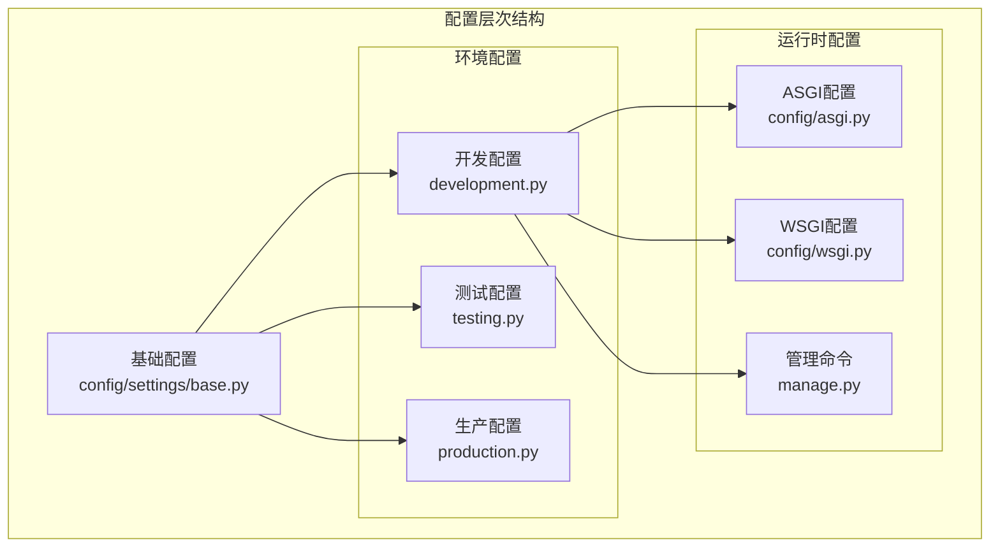
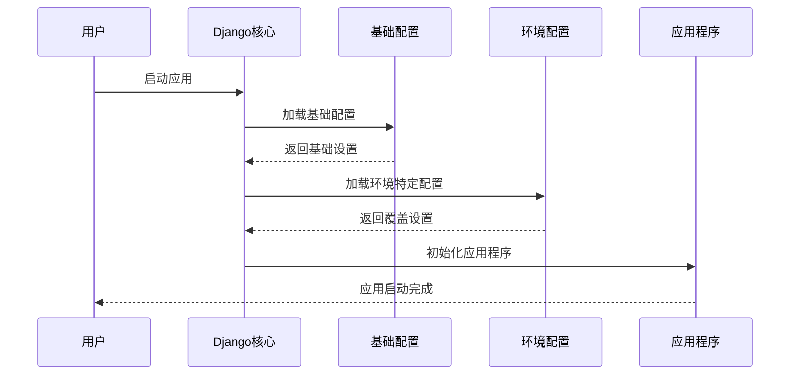
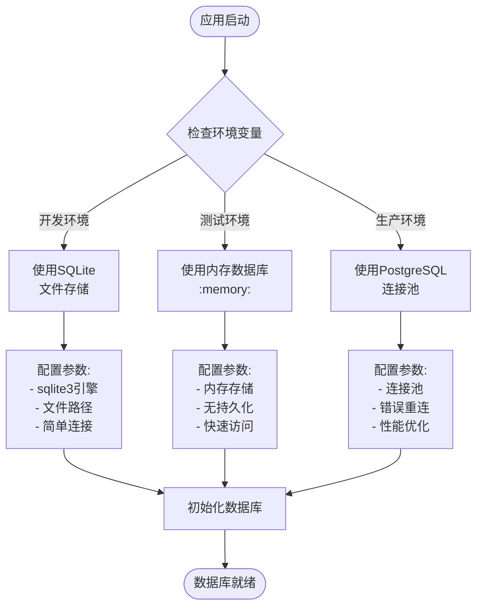
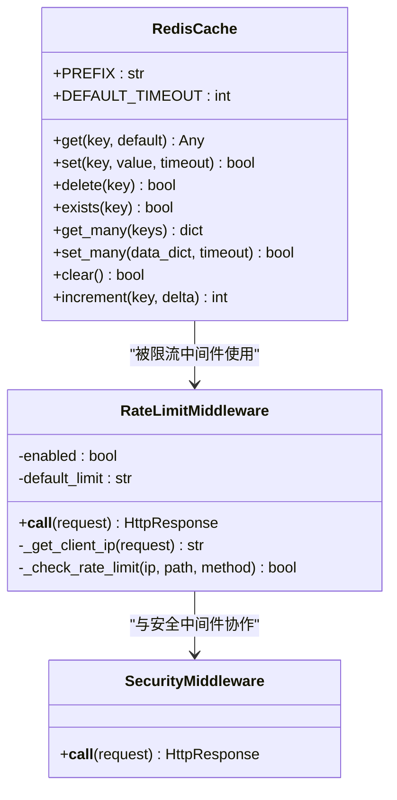
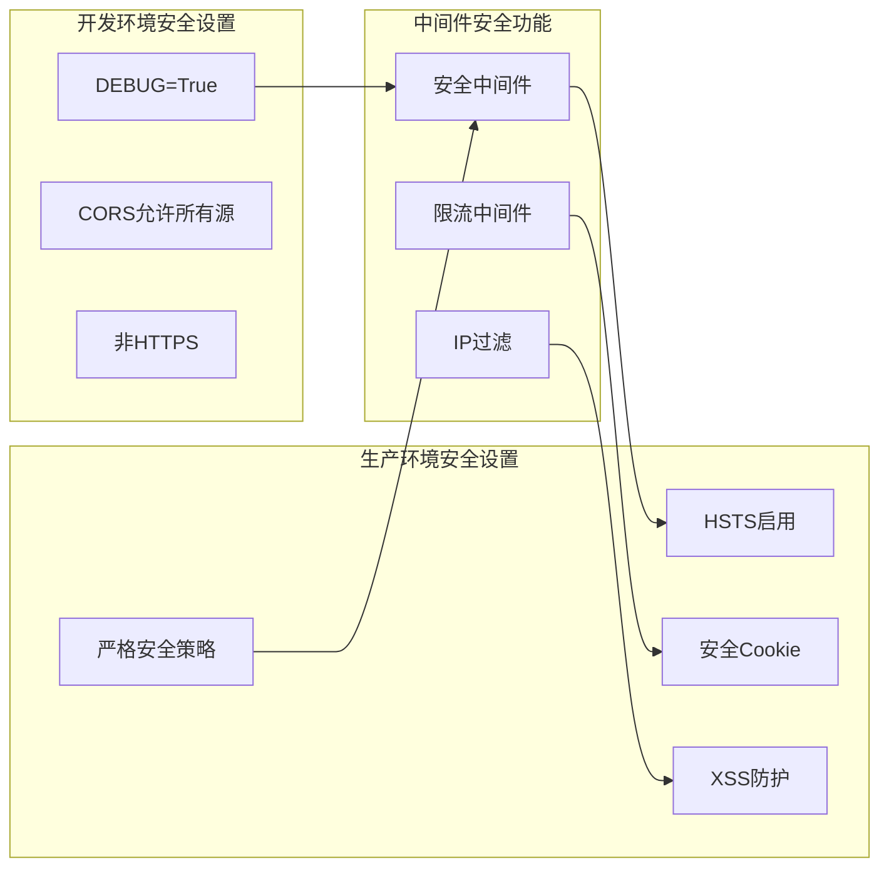
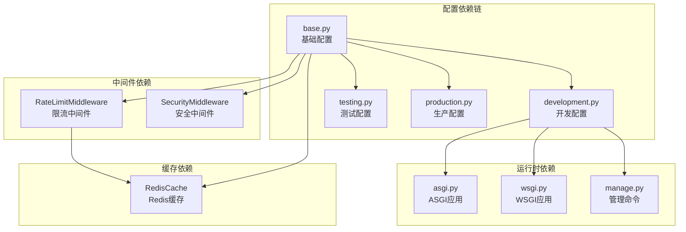

# 环境配置管理

<cite>
**本文档引用的文件**
- [config/settings/base.py](file://config/settings/base.py)
- [config/settings/development.py](file://config/settings/development.py)
- [config/settings/production.py](file://config/settings/production.py)
- [config/settings/testing.py](file://config/settings/testing.py)
- [config/asgi.py](file://config/asgi.py)
- [config/wsgi.py](file://config/wsgi.py)
- [config/urls.py](file://config/urls.py)
- [manage.py](file://manage.py)
- [docker/docker-compose.yml](file://docker/docker-compose.yml)
- [requirements.txt](file://requirements.txt)
- [src/core/middlewares/rate_limit_middleware.py](file://src/core/middlewares/rate_limit_middleware.py)
- [src/core/middlewares/security_middleware.py](file://src/core/middlewares/security_middleware.py)
- [src/infrastructure/cache/redis_cache.py](file://src/infrastructure/cache/redis_cache.py)
</cite>

## 目录
1. [简介](#简介)
2. [项目结构](#项目结构)
3. [核心组件](#核心组件)
4. [架构概览](#架构概览)
5. [详细组件分析](#详细组件分析)
6. [依赖分析](#依赖分析)
7. [性能考虑](#性能考虑)
8. [故障排除指南](#故障排除指南)
9. [结论](#结论)
10. [附录](#附录)

## 简介

本项目采用分层环境配置管理策略，通过基础配置文件和环境特定配置文件的组合，实现了开发、测试和生产环境的灵活切换。该配置管理系统提供了完整的环境隔离、安全保护和性能优化机制。

## 项目结构

项目采用模块化的配置架构，主要由以下层次组成：



**图表来源**
- [config/settings/base.py:1-235](file://config/settings/base.py#L1-L235)
- [config/settings/development.py:1-24](file://config/settings/development.py#L1-L24)
- [config/settings/production.py:1-39](file://config/settings/production.py#L1-L39)
- [config/settings/testing.py:1-32](file://config/settings/testing.py#L1-L32)

**章节来源**
- [config/settings/base.py:1-235](file://config/settings/base.py#L1-L235)
- [config/settings/development.py:1-24](file://config/settings/development.py#L1-L24)
- [config/settings/production.py:1-39](file://config/settings/production.py#L1-L39)
- [config/settings/testing.py:1-32](file://config/settings/testing.py#L1-L32)

## 核心组件

### 基础配置系统

基础配置文件定义了所有环境共享的核心设置，包括：

- **应用注册**：包含Django内置应用和第三方扩展
- **中间件配置**：安全、CORS、会话管理等
- **数据库配置**：支持多数据库引擎
- **国际化设置**：语言和时区配置
- **静态文件配置**：静态资源和媒体文件处理

### 环境特定配置

每个环境配置文件继承基础配置并覆盖特定设置：

- **开发环境**：SQLite数据库、详细日志、宽松的安全设置
- **测试环境**：内存数据库、禁用缓存、快速密码哈希
- **生产环境**：PostgreSQL数据库、严格安全设置、优化日志级别

**章节来源**
- [config/settings/base.py:22-116](file://config/settings/base.py#L22-L116)
- [config/settings/development.py:7-24](file://config/settings/development.py#L7-L24)
- [config/settings/production.py:9-39](file://config/settings/production.py#L9-L39)
- [config/settings/testing.py:7-32](file://config/settings/testing.py#L7-L32)

## 架构概览

系统采用"基础配置 + 环境覆盖"的设计模式，确保配置的一致性和可维护性：



**图表来源**
- [config/settings/base.py:1-235](file://config/settings/base.py#L1-L235)
- [config/settings/development.py:5](file://config/settings/development.py#L5)
- [config/settings/production.py:7](file://config/settings/production.py#L7)
- [config/settings/testing.py:5](file://config/settings/testing.py#L5)

## 详细组件分析

### 数据库配置管理

数据库配置采用环境变量驱动的方式，支持多种数据库引擎：



**图表来源**
- [config/settings/base.py:78-88](file://config/settings/base.py#L78-L88)
- [config/settings/development.py:11-16](file://config/settings/development.py#L11-L16)
- [config/settings/testing.py:11-16](file://config/settings/testing.py#L11-L16)
- [config/settings/production.py:13-23](file://config/settings/production.py#L13-L23)

#### 数据库配置最佳实践

- **开发环境**：使用SQLite文件数据库，便于本地开发和测试
- **测试环境**：使用内存数据库，提高测试执行速度
- **生产环境**：使用PostgreSQL，支持高并发和数据持久化

**章节来源**
- [config/settings/base.py:78-88](file://config/settings/base.py#L78-L88)
- [config/settings/development.py:11-16](file://config/settings/development.py#L11-L16)
- [config/settings/testing.py:11-16](file://config/settings/testing.py#L11-L16)
- [config/settings/production.py:13-23](file://config/settings/production.py#L13-L23)

### 缓存配置体系

系统采用Redis作为主要缓存存储，支持多种缓存策略：



**图表来源**
- [src/infrastructure/cache/redis_cache.py:15-169](file://src/infrastructure/cache/redis_cache.py#L15-L169)
- [src/core/middlewares/rate_limit_middleware.py:15-112](file://src/core/middlewares/rate_limit_middleware.py#L15-L112)
- [src/core/middlewares/security_middleware.py:14-54](file://src/core/middlewares/security_middleware.py#L14-L54)

#### 缓存配置特点

- **统一前缀管理**：所有缓存键带有项目前缀，避免命名冲突
- **自动序列化**：支持复杂对象的JSON序列化存储
- **批量操作支持**：提供批量获取和设置功能
- **异常安全处理**：缓存操作失败时优雅降级

**章节来源**
- [src/infrastructure/cache/redis_cache.py:15-169](file://src/infrastructure/cache/redis_cache.py#L15-L169)
- [config/settings/base.py:153-163](file://config/settings/base.py#L153-L163)

### 安全配置策略

安全配置根据环境级别进行差异化设置：



**图表来源**
- [config/settings/development.py:7-24](file://config/settings/development.py#L7-L24)
- [config/settings/production.py:29-39](file://config/settings/production.py#L29-L39)
- [src/core/middlewares/security_middleware.py:14-54](file://src/core/middlewares/security_middleware.py#L14-L54)
- [src/core/middlewares/rate_limit_middleware.py:15-112](file://src/core/middlewares/rate_limit_middleware.py#L15-L112)

#### 安全配置要点

- **开发环境**：注重开发便利性，CORS设置较为宽松
- **生产环境**：启用严格的安全头部和加密传输
- **中间件协作**：多个安全中间件协同工作，提供多层次防护

**章节来源**
- [config/settings/development.py:7-24](file://config/settings/development.py#L7-L24)
- [config/settings/production.py:29-39](file://config/settings/production.py#L29-L39)
- [src/core/middlewares/security_middleware.py:14-54](file://src/core/middlewares/security_middleware.py#L14-L54)

### 环境变量管理

系统通过环境变量实现配置的动态管理：

| 环境变量 | 基础配置 | 开发配置 | 测试配置 | 生产配置 | 说明 |
|---------|----------|----------|----------|----------|------|
| SECRET_KEY | 必需 | 可选 | 可选 | 推荐 | Django密钥 |
| DEBUG | 字符串比较 | True | True | False | 调试模式 |
| ALLOWED_HOSTS | 逗号分隔 | "*" | "*" | 环境变量 | 域名白名单 |
| DB_ENGINE | sqlite3 | sqlite3 | sqlite3 | postgresql | 数据库引擎 |
| DB_NAME | db.sqlite3 | hello_db | :memory: | 环境变量 | 数据库名称 |
| DB_USER | 空 | 空 | 空 | 环境变量 | 数据库用户 |
| DB_PASSWORD | 空 | 空 | 空 | 环境变量 | 数据库密码 |
| DB_HOST | localhost | localhost | localhost | 环境变量 | 数据库主机 |
| DB_PORT | 5432 | 5432 | 5432 | 环境变量 | 数据库端口 |
| REDIS_HOST | localhost | localhost | localhost | 环境变量 | Redis主机 |
| REDIS_PORT | 6379 | 6379 | 6379 | 环境变量 | Redis端口 |
| REDIS_DB | 0 | 0 | 0 | 环境变量 | Redis数据库 |

**章节来源**
- [config/settings/base.py:16-18](file://config/settings/base.py#L16-L18)
- [config/settings/base.py:78-88](file://config/settings/base.py#L78-L88)
- [config/settings/base.py:154-156](file://config/settings/base.py#L154-L156)
- [config/settings/production.py:10-23](file://config/settings/production.py#L10-L23)

## 依赖分析

系统配置依赖关系清晰，遵循单一职责原则：



**图表来源**
- [config/settings/base.py:5](file://config/settings/base.py#L5)
- [config/settings/development.py:5](file://config/settings/development.py#L5)
- [config/settings/testing.py:5](file://config/settings/testing.py#L5)
- [config/settings/production.py:7](file://config/settings/production.py#L7)
- [src/core/middlewares/rate_limit_middleware.py:8](file://src/core/middlewares/rate_limit_middleware.py#L8)
- [src/core/middlewares/security_middleware.py:8](file://src/core/middlewares/security_middleware.py#L8)
- [src/infrastructure/cache/redis_cache.py:10](file://src/infrastructure/cache/redis_cache.py#L10)

### 外部依赖关系

系统依赖的关键外部组件：

- **数据库驱动**：psycopg2-binary（PostgreSQL）
- **缓存支持**：django-redis、redis-py
- **安全组件**：django-cors-headers、django-defender
- **认证框架**：djangorestframework、djangorestframework-simplejwt

**章节来源**
- [requirements.txt:14-26](file://requirements.txt#L14-L26)

## 性能考虑

### 缓存性能优化

系统通过Redis实现高性能缓存：

- **连接池管理**：数据库连接最大生存时间配置
- **缓存键设计**：统一前缀和命名规范
- **序列化优化**：复杂对象的高效序列化
- **批量操作**：支持批量缓存操作提升性能

### 数据库性能调优

- **连接复用**：数据库连接池配置
- **索引优化**：根据查询模式设计索引
- **查询优化**：避免N+1查询问题
- **读写分离**：生产环境支持主从复制

## 故障排除指南

### 常见配置问题

#### 数据库连接失败
- 检查数据库服务是否启动
- 验证连接参数配置正确
- 确认网络连接和防火墙设置

#### 缓存连接异常
- 检查Redis服务状态
- 验证连接字符串格式
- 确认网络连通性

#### 安全配置冲突
- 开发环境CORS设置过于宽松
- 生产环境HTTPS配置错误
- Cookie安全属性设置不当

### 调试技巧

1. **启用详细日志**：设置DEBUG为True查看详细信息
2. **检查环境变量**：确认所有必需环境变量已设置
3. **验证配置加载**：通过Django shell检查配置值
4. **测试连接**：分别测试数据库和缓存连接

**章节来源**
- [config/settings/base.py:175-226](file://config/settings/base.py#L175-L226)
- [config/settings/development.py:18-20](file://config/settings/development.py#L18-L20)
- [config/settings/production.py:25-27](file://config/settings/production.py#L25-L27)

## 结论

本项目的环境配置管理采用了成熟的企业级架构，通过分层配置设计实现了：

- **环境隔离**：清晰的开发、测试、生产环境区分
- **配置灵活性**：基于环境变量的动态配置管理
- **安全性保障**：多层安全防护和严格的生产环境配置
- **性能优化**：缓存、连接池等性能优化措施
- **可维护性**：模块化的配置结构和清晰的依赖关系

该配置管理体系为项目的稳定运行和团队协作提供了坚实的基础。

## 附录

### 配置模板

#### 开发环境配置模板
```python
# config/settings/development.py
from .base import *

DEBUG = True
ALLOWED_HOSTS = ["*"]

DATABASES = {
    "default": {
        "ENGINE": "django.db.backends.sqlite3",
        "NAME": BASE_DIR / "db.sqlite3",
    }
}

LOGGING["root"]["level"] = "DEBUG"
LOGGING["loggers"]["src"]["level"] = "DEBUG"

CORS_ALLOW_ALL_ORIGINS = True
```

#### 生产环境配置模板
```python
# config/settings/production.py
import os
from .base import *

DEBUG = False
ALLOWED_HOSTS = os.environ.get("ALLOWED_HOSTS", "").split(",")

DATABASES = {
    "default": {
        "ENGINE": "django.db.backends.postgresql",
        "NAME": os.environ.get("DB_NAME", "hello_db"),
        "USER": os.environ.get("DB_USER", "postgres"),
        "PASSWORD": os.environ.get("DB_PASSWORD", ""),
        "HOST": os.environ.get("DB_HOST", "localhost"),
        "PORT": os.environ.get("DB_PORT", "5432"),
        "CONN_MAX_AGE": 600,
    }
}

LOGGING["root"]["level"] = "WARNING"
LOGGING["loggers"]["src"]["level"] = "INFO"

# 安全设置
SECURE_BROWSER_XSS_FILTER = True
SECURE_CONTENT_TYPE_NOSNIFF = True
X_FRAME_OPTIONS = "DENY"
SECURE_SSL_REDIRECT = True
SESSION_COOKIE_SECURE = True
CSRF_COOKIE_SECURE = True
SECURE_HSTS_SECONDS = 31536000
SECURE_HSTS_INCLUDE_SUBDOMAINS = True
SECURE_HSTS_PRELOAD = True
```

### 环境变量清单

#### 必需环境变量
- `SECRET_KEY`：Django密钥
- `DEBUG`：调试模式开关
- `ALLOWED_HOSTS`：域名白名单

#### 数据库相关
- `DB_ENGINE`：数据库引擎类型
- `DB_NAME`：数据库名称
- `DB_USER`：数据库用户名
- `DB_PASSWORD`：数据库密码
- `DB_HOST`：数据库主机
- `DB_PORT`：数据库端口

#### 缓存相关
- `REDIS_HOST`：Redis主机
- `REDIS_PORT`：Redis端口
- `REDIS_DB`：Redis数据库

#### JWT配置
- `JWT_ACCESS_TOKEN_LIFETIME`：访问令牌有效期（分钟）
- `JWT_REFRESH_TOKEN_LIFETIME`：刷新令牌有效期（分钟）

### Docker部署配置

```yaml
# docker/docker-compose.yml
version: '3.8'

services:
  web:
    build:
      context: ..
      dockerfile: docker/Dockerfile
    ports:
      - "8000:8000"
    environment:
      - DEBUG=True
      - DB_ENGINE=django.db.backends.postgresql
      - DB_NAME=hello_db
      - DB_USER=postgres
      - DB_PASSWORD=postgres
      - DB_HOST=db
      - DB_PORT=5432
      - REDIS_HOST=redis
      - REDIS_PORT=6379
    depends_on:
      - db
      - redis
```