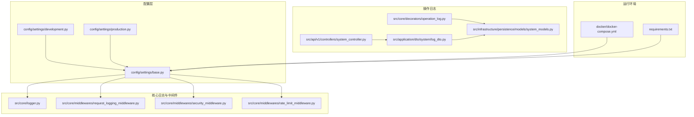
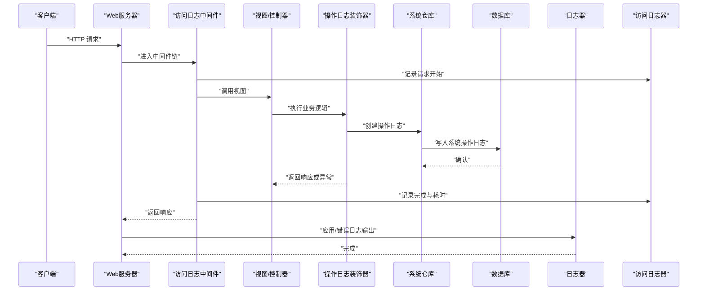
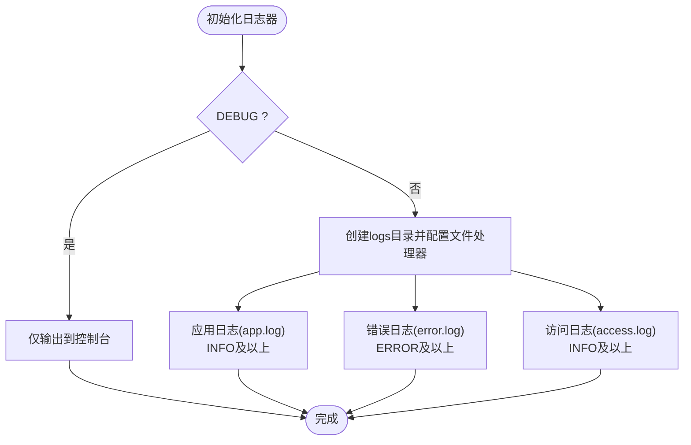
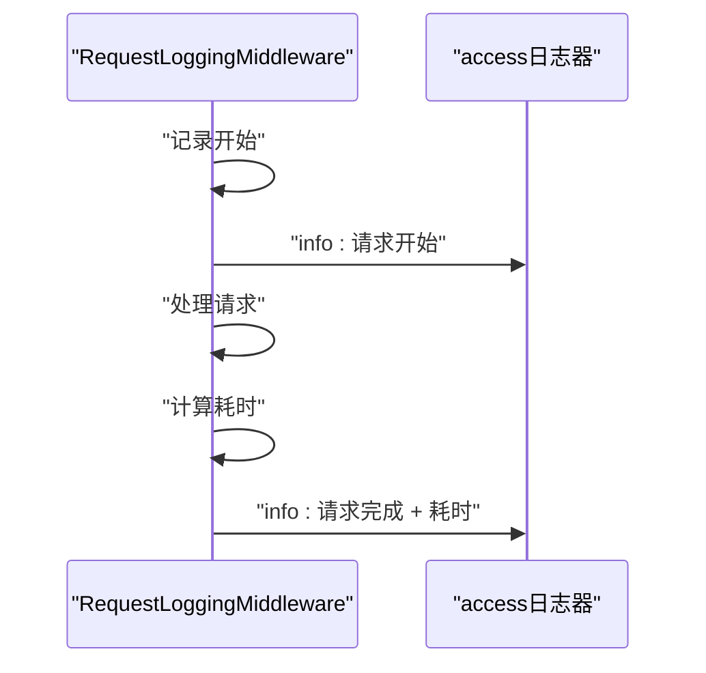
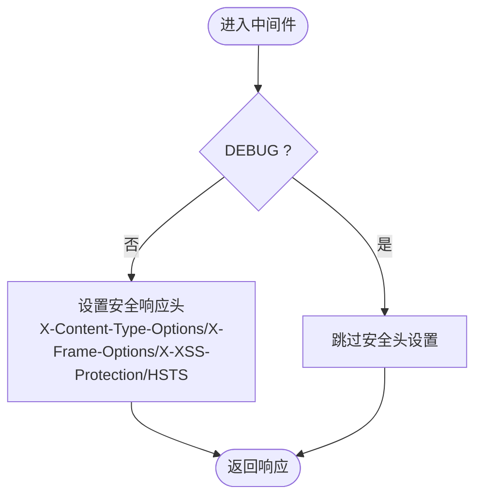
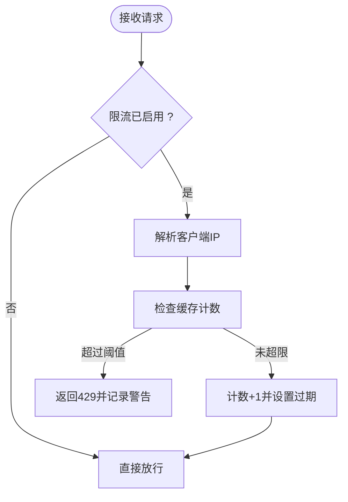
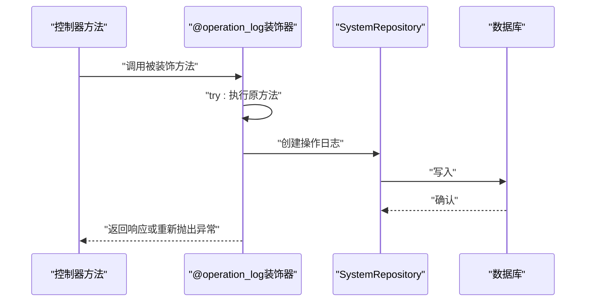
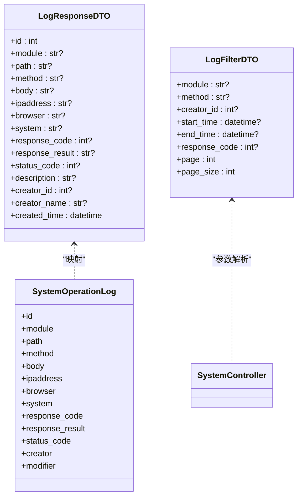
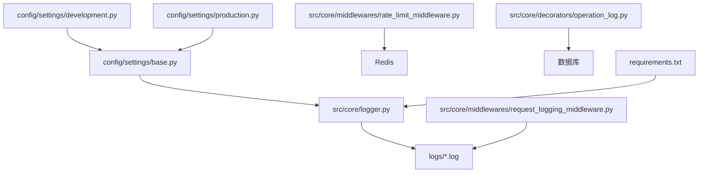

# 监控与日志

<cite>
**本文引用的文件**
- [logger.py](file://src/core/logger.py)
- [request_logging_middleware.py](file://src/core/middlewares/request_logging_middleware.py)
- [security_middleware.py](file://src/core/middlewares/security_middleware.py)
- [rate_limit_middleware.py](file://src/core/middlewares/rate_limit_middleware.py)
- [base.py](file://config/settings/base.py)
- [development.py](file://config/settings/development.py)
- [production.py](file://config/settings/production.py)
- [operation_log.py](file://src/core/decorators/operation_log.py)
- [log_dto.py](file://src/application/dto/system/log_dto.py)
- [system_models.py](file://src/infrastructure/persistence/models/system_models.py)
- [system_controller.py](file://src/api/v1/controllers/system_controller.py)
- [docker-compose.yml](file://docker/docker-compose.yml)
- [requirements.txt](file://requirements.txt)
</cite>

## 目录
1. [简介](#简介)
2. [项目结构](#项目结构)
3. [核心组件](#核心组件)
4. [架构总览](#架构总览)
5. [详细组件分析](#详细组件分析)
6. [依赖分析](#依赖分析)
7. [性能考虑](#性能考虑)
8. [故障排查指南](#故障排查指南)
9. [结论](#结论)
10. [附录](#附录)

## 简介
本文件系统化梳理本项目的监控与日志体系，覆盖应用日志配置、访问日志与错误日志采集策略、请求跟踪与性能指标、异常捕获、日志轮转与存储管理最佳实践，以及与第三方监控工具（Prometheus、Grafana、ELK Stack）的集成思路。同时提供告警规则配置建议、关键性能指标与阈值设定、日志分析与故障诊断方法，以及 APM 工具（New Relic、DataDog）的使用建议。

## 项目结构
围绕监控与日志的关键文件分布如下：
- 配置层：settings 基础配置、开发与生产环境差异化配置
- 核心日志与中间件：统一日志器、访问日志中间件、安全中间件、限流中间件
- 操作日志：装饰器自动记录操作日志，DTO 与模型支撑日志持久化
- API 层：系统管理控制器提供操作日志查询接口
- 运行环境：Docker Compose 与依赖清单

**图表来源**
- [base.py:174-226](file://config/settings/base.py#L174-L226)
- [development.py:18-24](file://config/settings/development.py#L18-L24)
- [production.py:25-39](file://config/settings/production.py#L25-L39)
- [logger.py:12-82](file://src/core/logger.py#L12-L82)
- [request_logging_middleware.py:14-68](file://src/core/middlewares/request_logging_middleware.py#L14-L68)
- [security_middleware.py:14-53](file://src/core/middlewares/security_middleware.py#L14-L53)
- [rate_limit_middleware.py:15-111](file://src/core/middlewares/rate_limit_middleware.py#L15-L111)
- [operation_log.py:15-72](file://src/core/decorators/operation_log.py#L15-L72)
- [log_dto.py:11-56](file://src/application/dto/system/log_dto.py#L11-L56)
- [system_models.py:219-271](file://src/infrastructure/persistence/models/system_models.py#L219-L271)
- [system_controller.py:661-707](file://src/api/v1/controllers/system_controller.py#L661-L707)
- [docker-compose.yml:1-47](file://docker/docker-compose.yml#L1-L47)
- [requirements.txt:33-35](file://requirements.txt#L33-L35)

**章节来源**
- [base.py:174-226](file://config/settings/base.py#L174-L226)
- [development.py:18-24](file://config/settings/development.py#L18-L24)
- [production.py:25-39](file://config/settings/production.py#L25-L39)
- [logger.py:12-82](file://src/core/logger.py#L12-L82)
- [request_logging_middleware.py:14-68](file://src/core/middlewares/request_logging_middleware.py#L14-L68)
- [security_middleware.py:14-53](file://src/core/middlewares/security_middleware.py#L14-L53)
- [rate_limit_middleware.py:15-111](file://src/core/middlewares/rate_limit_middleware.py#L15-L111)
- [operation_log.py:15-72](file://src/core/decorators/operation_log.py#L15-L72)
- [log_dto.py:11-56](file://src/application/dto/system/log_dto.py#L11-L56)
- [system_models.py:219-271](file://src/infrastructure/persistence/models/system_models.py#L219-L271)
- [system_controller.py:661-707](file://src/api/v1/controllers/system_controller.py#L661-L707)
- [docker-compose.yml:1-47](file://docker/docker-compose.yml#L1-L47)
- [requirements.txt:33-35](file://requirements.txt#L33-L35)

## 核心组件
- 统一日志器与日志格式：集中配置日志级别、格式、输出目标（控制台、文件），并按环境区分开发/生产输出策略
- 访问日志中间件：记录请求开始/完成、耗时、用户/IP 等信息
- 安全中间件：生产环境注入安全响应头，增强安全基线
- 限流中间件：基于 IP 的简单限流，超限返回 429 并记录警告日志
- 操作日志装饰器：自动采集请求上下文、响应状态、异常信息并持久化
- 操作日志模型与 DTO：支撑日志查询、过滤与分页
- 系统管理控制器：提供操作日志列表与详情查询接口

**章节来源**
- [logger.py:12-82](file://src/core/logger.py#L12-L82)
- [request_logging_middleware.py:14-68](file://src/core/middlewares/request_logging_middleware.py#L14-L68)
- [security_middleware.py:14-53](file://src/core/middlewares/security_middleware.py#L14-L53)
- [rate_limit_middleware.py:15-111](file://src/core/middlewares/rate_limit_middleware.py#L15-L111)
- [operation_log.py:15-72](file://src/core/decorators/operation_log.py#L15-L72)
- [log_dto.py:11-56](file://src/application/dto/system/log_dto.py#L11-L56)
- [system_models.py:219-271](file://src/infrastructure/persistence/models/system_models.py#L219-L271)
- [system_controller.py:661-707](file://src/api/v1/controllers/system_controller.py#L661-L707)

## 架构总览
下图展示从请求进入至日志落盘与查询的整体流程，涵盖访问日志、应用日志、错误日志与操作日志四条主线。

**图表来源**
- [request_logging_middleware.py:34-68](file://src/core/middlewares/request_logging_middleware.py#L34-L68)
- [operation_log.py:29-72](file://src/core/decorators/operation_log.py#L29-L72)
- [system_models.py:219-271](file://src/infrastructure/persistence/models/system_models.py#L219-L271)
- [logger.py:92-138](file://src/core/logger.py#L92-L138)

## 详细组件分析

### 日志配置与输出目标
- 日志级别
  - 开发环境：根日志器与 src 日志器均设为调试级别，便于本地排障
  - 生产环境：根日志器提升至警告级别，src 日志器 INFO 级别，降低噪音
- 日志格式
  - 采用统一格式，包含时间、模块、级别与消息；支持 JSON 格式化器
- 输出目标
  - 控制台：始终输出
  - 文件：仅生产环境输出，分别生成应用日志、错误日志与访问日志
  - 访问日志器独立配置，便于单独管理

**图表来源**
- [base.py:174-226](file://config/settings/base.py#L174-L226)
- [production.py:25-27](file://config/settings/production.py#L25-L27)
- [development.py:18-20](file://config/settings/development.py#L18-L20)
- [logger.py:12-82](file://src/core/logger.py#L12-L82)

**章节来源**
- [base.py:174-226](file://config/settings/base.py#L174-L226)
- [production.py:25-27](file://config/settings/production.py#L25-L27)
- [development.py:18-20](file://config/settings/development.py#L18-L20)
- [logger.py:12-82](file://src/core/logger.py#L12-L82)

### 访问日志中间件
- 记录请求开始与完成信息、耗时、用户与来源 IP
- 通过自定义访问日志器输出，便于与应用日志分离
- IP 解析支持代理场景（X-Forwarded-For）

**图表来源**
- [request_logging_middleware.py:34-68](file://src/core/middlewares/request_logging_middleware.py#L34-L68)
- [logger.py:67-81](file://src/core/logger.py#L67-L81)

**章节来源**
- [request_logging_middleware.py:14-68](file://src/core/middlewares/request_logging_middleware.py#L14-L68)
- [logger.py:67-81](file://src/core/logger.py#L67-L81)

### 安全中间件
- 在非调试环境下为响应添加安全头，强化 XSS、点击劫持、内容嗅探等防护
- 作为中间件链的一部分，确保全局生效

**图表来源**
- [security_middleware.py:33-53](file://src/core/middlewares/security_middleware.py#L33-L53)

**章节来源**
- [security_middleware.py:14-53](file://src/core/middlewares/security_middleware.py#L14-L53)

### 限流中间件
- 基于 IP 与路径/方法组合进行简单限流
- 使用缓存统计请求次数，超限返回 429 并记录警告日志
- 支持通过设置项启用/禁用与调整默认限流规则

**图表来源**
- [rate_limit_middleware.py:41-111](file://src/core/middlewares/rate_limit_middleware.py#L41-L111)

**章节来源**
- [rate_limit_middleware.py:15-111](file://src/core/middlewares/rate_limit_middleware.py#L15-L111)

### 操作日志装饰器与持久化
- 自动采集请求上下文（用户、路径、方法、请求体、IP、浏览器/系统）
- 捕获响应状态与异常，异步写入数据库
- 异常捕获不影响主流程，保证健壮性

**图表来源**
- [operation_log.py:29-72](file://src/core/decorators/operation_log.py#L29-L72)
- [system_models.py:219-271](file://src/infrastructure/persistence/models/system_models.py#L219-L271)

**章节来源**
- [operation_log.py:15-175](file://src/core/decorators/operation_log.py#L15-L175)
- [system_models.py:219-271](file://src/infrastructure/persistence/models/system_models.py#L219-L271)

### 操作日志查询接口
- 提供多条件过滤（模块、方法、操作人、时间范围、响应码）与分页
- 响应 DTO 明确字段含义，便于前端展示与分析

**图表来源**
- [log_dto.py:11-56](file://src/application/dto/system/log_dto.py#L11-L56)
- [system_models.py:219-271](file://src/infrastructure/persistence/models/system_models.py#L219-L271)
- [system_controller.py:669-707](file://src/api/v1/controllers/system_controller.py#L669-L707)

**章节来源**
- [log_dto.py:11-56](file://src/application/dto/system/log_dto.py#L11-L56)
- [system_models.py:219-271](file://src/infrastructure/persistence/models/system_models.py#L219-L271)
- [system_controller.py:661-707](file://src/api/v1/controllers/system_controller.py#L661-L707)

## 依赖分析
- 配置依赖
  - settings/base.py 定义日志结构、中间件与环境变量
  - development.py/production.py 覆盖不同环境下的日志级别与安全策略
- 运行时依赖
  - logger.py 依赖 Django settings 的 LOG_LEVEL 与 BASE_DIR
  - 访问日志中间件依赖 logging 模块
  - 限流中间件依赖缓存后端（Redis）
  - 操作日志装饰器依赖系统仓库与数据库
- 外部依赖
  - requirements.txt 包含 python-json-logger，便于结构化日志输出

**图表来源**
- [base.py:174-226](file://config/settings/base.py#L174-L226)
- [development.py:18-20](file://config/settings/development.py#L18-L20)
- [production.py:25-27](file://config/settings/production.py#L25-L27)
- [logger.py:12-82](file://src/core/logger.py#L12-L82)
- [request_logging_middleware.py:14-68](file://src/core/middlewares/request_logging_middleware.py#L14-L68)
- [rate_limit_middleware.py:15-111](file://src/core/middlewares/rate_limit_middleware.py#L15-L111)
- [operation_log.py:15-72](file://src/core/decorators/operation_log.py#L15-L72)
- [requirements.txt:33-35](file://requirements.txt#L33-L35)

**章节来源**
- [base.py:174-226](file://config/settings/base.py#L174-L226)
- [development.py:18-20](file://config/settings/development.py#L18-L20)
- [production.py:25-27](file://config/settings/production.py#L25-L27)
- [logger.py:12-82](file://src/core/logger.py#L12-L82)
- [request_logging_middleware.py:14-68](file://src/core/middlewares/request_logging_middleware.py#L14-L68)
- [rate_limit_middleware.py:15-111](file://src/core/middlewares/rate_limit_middleware.py#L15-L111)
- [operation_log.py:15-72](file://src/core/decorators/operation_log.py#L15-L72)
- [requirements.txt:33-35](file://requirements.txt#L33-L35)

## 性能考虑
- 日志级别与输出
  - 生产环境提升根日志器级别，减少低价值日志输出
  - 访问日志与应用/错误日志分离，避免相互干扰
- 日志轮转
  - 使用旋转文件处理器，限制单文件大小与备份数量，防止磁盘膨胀
- 限流策略
  - 限流中间件提供基础防护，建议结合更细粒度的规则与外部限流服务
- 缓存与数据库
  - 限流计数与操作日志写入数据库均依赖缓存与数据库，需关注其性能与容量

[本节为通用指导，不直接分析具体文件]

## 故障排查指南
- 访问日志缺失
  - 检查中间件顺序与 DEBUG 设置
  - 确认访问日志器已正确配置并输出
- 错误日志过多
  - 调整生产环境日志级别，聚焦 ERROR 以上
  - 检查异常捕获与重抛逻辑，避免重复记录
- 操作日志未入库
  - 确认装饰器已正确包裹业务方法
  - 检查数据库连接与系统仓库实现
- 限流误伤
  - 调整默认阈值或新增规则，结合真实流量画像
  - 关注代理场景下的 IP 解析准确性

**章节来源**
- [request_logging_middleware.py:14-68](file://src/core/middlewares/request_logging_middleware.py#L14-L68)
- [logger.py:12-82](file://src/core/logger.py#L12-L82)
- [operation_log.py:15-72](file://src/core/decorators/operation_log.py#L15-L72)
- [rate_limit_middleware.py:15-111](file://src/core/middlewares/rate_limit_middleware.py#L15-L111)

## 结论
本项目已建立完善的日志与监控基础：统一日志器、访问日志中间件、安全中间件、限流中间件与操作日志装饰器协同工作，配合数据库持久化的操作日志与查询接口，形成从请求观测到问题定位的闭环。建议在生产环境中进一步引入结构化日志、集中式日志平台与 APM 工具，完善告警与可视化能力。

[本节为总结性内容，不直接分析具体文件]

## 附录

### 日志级别与格式规范
- 日志级别
  - 开发：DEBUG
  - 生产：根日志器 WARNING，src 日志器 INFO
- 日志格式
  - 统一包含时间、模块、级别与消息；可选 JSON 格式化器

**章节来源**
- [development.py:18-20](file://config/settings/development.py#L18-L20)
- [production.py:25-27](file://config/settings/production.py#L25-L27)
- [base.py:178-189](file://config/settings/base.py#L178-L189)

### 日志轮转与存储管理最佳实践
- 单文件大小与备份数量
  - 建议按 10MB 分隔，保留 10 份备份
- 存储位置
  - 将 logs 目录置于持久卷，避免容器重建丢失
- 清理策略
  - 定期清理过期备份，监控磁盘使用率

**章节来源**
- [logger.py:46-75](file://src/core/logger.py#L46-L75)

### 第三方监控工具集成建议
- Prometheus/Grafana
  - 通过中间件与装饰器扩展埋点，导出自定义指标（QPS、错误率、响应时间）
  - Grafana 建立仪表盘，设置阈值告警
- ELK Stack
  - 使用结构化日志（JSON）接入 Logstash/Fluentd，集中检索与分析
- APM 工具（New Relic/DataDog）
  - 集成 SDK，采集应用性能、错误与事务追踪
  - 结合日志与指标建立统一告警面板

[本节为概念性建议，不直接分析具体文件]

### 告警规则与通知机制
- 告警规则示例
  - 错误率 > 1%（5 分钟窗口）
  - P95 响应时间 > 2 秒
  - QPS 突增/突降
  - 限流触发率 > 5%
- 通知渠道
  - 邮件、IM、电话分级通知
  - 与值班流程联动，设置升级策略

[本节为通用指导，不直接分析具体文件]

### 性能监控关键指标与阈值
- 指标
  - 吞吐量（QPS）、错误率、成功率、P50/P90/P95 响应时间
  - CPU/内存/磁盘/网络使用率
  - 缓存命中率、数据库连接池使用率
- 阈值
  - 响应时间：P95 > 2s；P99 > 5s
  - 错误率：> 1%
  - 限流触发：> 5%

[本节为通用指导，不直接分析具体文件]

### 日志分析与故障诊断方法
- 常用分析
  - 时间序列分析（错误率、响应时间）
  - 热点路径（高频接口、慢接口）
  - 异常聚合（堆栈去重、根因定位）
- 工具
  - Kibana/ELK、Grafana/Prometheus、APM 工具
  - 结合访问日志与操作日志进行请求追踪

[本节为通用指导，不直接分析具体文件]