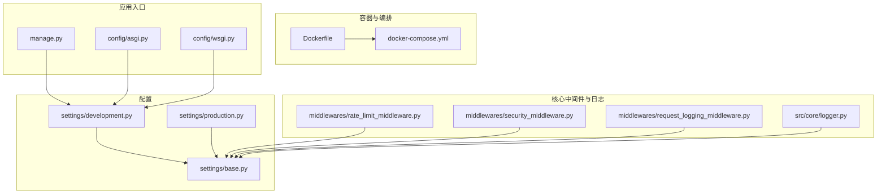
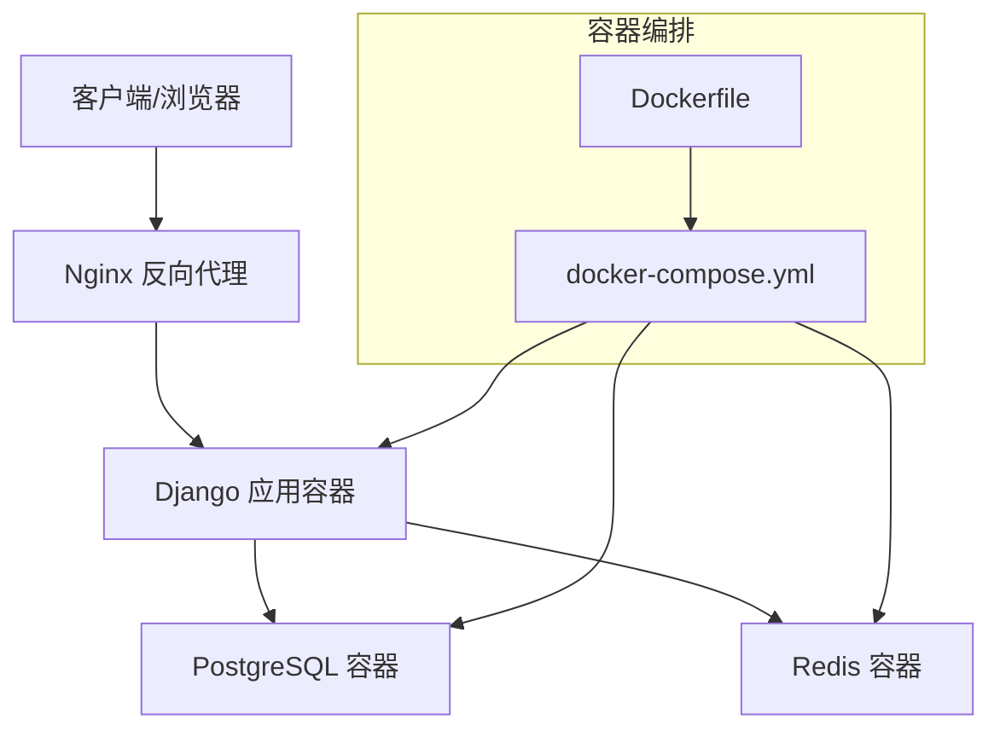
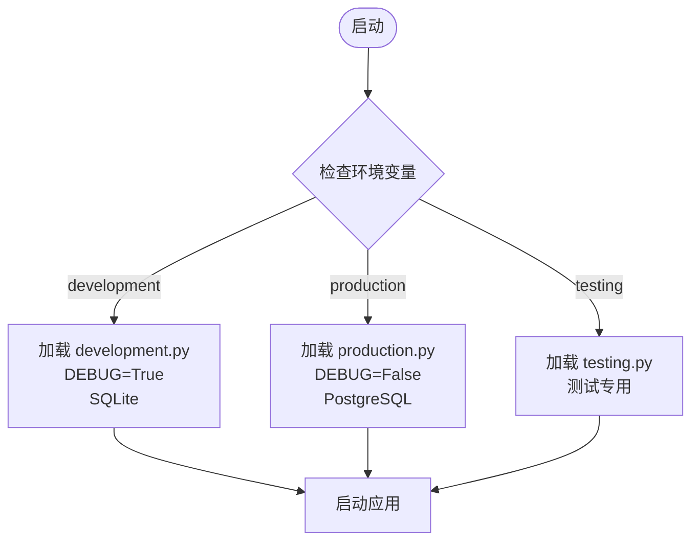
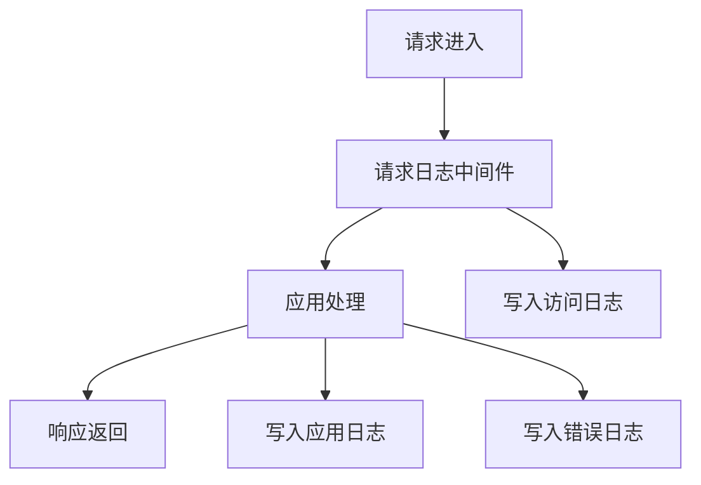
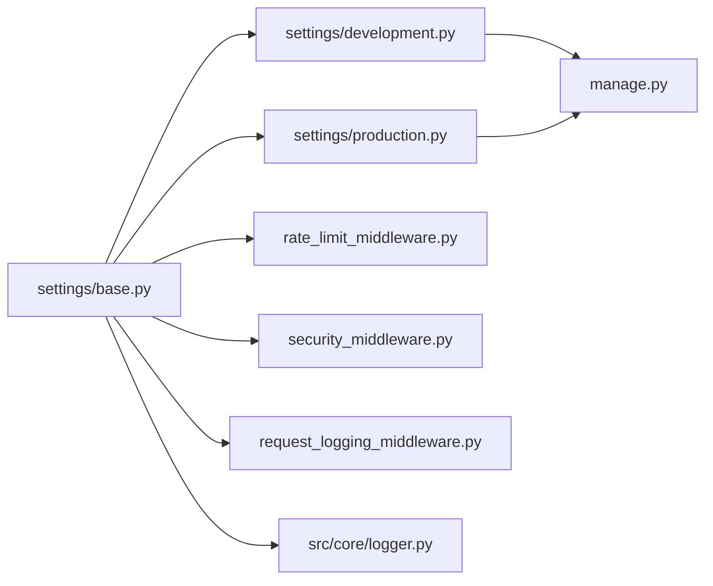

# 部署与运维

<cite>
**本文引用的文件**
- [Dockerfile](file://docker/Dockerfile)
- [docker-compose.yml](file://docker/docker-compose.yml)
- [requirements.txt](file://requirements.txt)
- [migrate.sh](file://scripts/migrate.sh)
- [init_admin.py](file://scripts/init_admin.py)
- [manage.py](file://manage.py)
- [asgi.py](file://config/asgi.py)
- [wsgi.py](file://config/wsgi.py)
- [base.py](file://config/settings/base.py)
- [development.py](file://config/settings/development.py)
- [production.py](file://config/settings/production.py)
- [logger.py](file://src/core/logger.py)
- [rate_limit_middleware.py](file://src/core/middlewares/rate_limit_middleware.py)
- [security_middleware.py](file://src/core/middlewares/security_middleware.py)
- [request_logging_middleware.py](file://src/core/middlewares/request_logging_middleware.py)
</cite>

## 目录
1. [简介](#简介)
2. [项目结构](#项目结构)
3. [核心组件](#核心组件)
4. [架构总览](#架构总览)
5. [详细组件分析](#详细组件分析)
6. [依赖分析](#依赖分析)
7. [性能考虑](#性能考虑)
8. [故障排除指南](#故障排除指南)
9. [结论](#结论)
10. [附录](#附录)

## 简介
本文件面向部署与运维工程师，提供从本地开发到生产上线的完整部署与运维指南。内容涵盖容器化打包与编排、多环境配置管理、生产环境优化（含 Nginx 反向代理与静态文件）、数据库部署与迁移备份、监控与日志体系、高可用与负载均衡、安全加固以及故障排除与性能容量规划。

## 项目结构
该仓库采用分层组织方式：
- config：Django 配置模块，按环境拆分 settings（base、development、production）
- docker：容器化构建与编排文件（Dockerfile、docker-compose.yml）
- scripts：部署与初始化脚本（迁移、初始化管理员）
- src：业务代码，包含 API、领域模型、基础设施、核心中间件与日志
- requirements.txt：Python 依赖清单

**图表来源**
- [Dockerfile:1-33](file://docker/Dockerfile#L1-L33)
- [docker-compose.yml:1-47](file://docker/docker-compose.yml#L1-L47)
- [base.py:1-235](file://config/settings/base.py#L1-L235)
- [development.py:1-24](file://config/settings/development.py#L1-L24)
- [production.py:1-39](file://config/settings/production.py#L1-L39)
- [manage.py:1-23](file://manage.py#L1-L23)
- [asgi.py:1-12](file://config/asgi.py#L1-L12)
- [wsgi.py:1-12](file://config/wsgi.py#L1-L12)
- [rate_limit_middleware.py:1-112](file://src/core/middlewares/rate_limit_middleware.py#L1-L112)
- [security_middleware.py:1-54](file://src/core/middlewares/security_middleware.py#L1-L54)
- [request_logging_middleware.py:1-86](file://src/core/middlewares/request_logging_middleware.py#L1-L86)
- [logger.py:1-138](file://src/core/logger.py#L1-L138)

**章节来源**
- [Dockerfile:1-33](file://docker/Dockerfile#L1-L33)
- [docker-compose.yml:1-47](file://docker/docker-compose.yml#L1-L47)
- [requirements.txt:1-38](file://requirements.txt#L1-L38)
- [base.py:1-235](file://config/settings/base.py#L1-L235)
- [development.py:1-24](file://config/settings/development.py#L1-L24)
- [production.py:1-39](file://config/settings/production.py#L1-L39)
- [manage.py:1-23](file://manage.py#L1-L23)
- [asgi.py:1-12](file://config/asgi.py#L1-L12)
- [wsgi.py:1-12](file://config/wsgi.py#L1-L12)
- [logger.py:1-138](file://src/core/logger.py#L1-L138)
- [rate_limit_middleware.py:1-112](file://src/core/middlewares/rate_limit_middleware.py#L1-L112)
- [security_middleware.py:1-54](file://src/core/middlewares/security_middleware.py#L1-L54)
- [request_logging_middleware.py:1-86](file://src/core/middlewares/request_logging_middleware.py#L1-L86)

## 核心组件
- 容器镜像构建：基于官方 Python slim 镜像，安装系统依赖与 Python 依赖，复制源码，暴露端口并以 Django 开发服务器启动。
- 编排服务：web（Django 应用）、db（PostgreSQL）、redis（缓存）三服务，通过卷持久化数据。
- 环境配置：通过环境变量覆盖基础配置，支持 SQLite（开发）与 PostgreSQL（生产）双轨数据库；CORS、Redis、JWT、限流、IP 黑白名单等均通过环境变量与配置文件协同。
- 中间件与日志：内置限流、安全响应头注入、请求日志记录；应用日志、错误日志、访问日志分级落盘与轮转。
- 初始化与迁移：提供 Bash 脚本与 Python 初始化脚本，自动执行迁移并创建初始管理员账户。

**章节来源**
- [Dockerfile:1-33](file://docker/Dockerfile#L1-L33)
- [docker-compose.yml:1-47](file://docker/docker-compose.yml#L1-L47)
- [base.py:1-235](file://config/settings/base.py#L1-L235)
- [development.py:1-24](file://config/settings/development.py#L1-L24)
- [production.py:1-39](file://config/settings/production.py#L1-L39)
- [logger.py:1-138](file://src/core/logger.py#L1-L138)
- [rate_limit_middleware.py:1-112](file://src/core/middlewares/rate_limit_middleware.py#L1-L112)
- [security_middleware.py:1-54](file://src/core/middlewares/security_middleware.py#L1-L54)
- [request_logging_middleware.py:1-86](file://src/core/middlewares/request_logging_middleware.py#L1-L86)
- [migrate.sh:1-12](file://scripts/migrate.sh#L1-L12)
- [init_admin.py:1-84](file://scripts/init_admin.py#L1-L84)

## 架构总览
下图展示容器化部署的端到端架构：前端或客户端经反向代理访问 Django 应用，应用连接 PostgreSQL 与 Redis，日志统一落盘并可接入集中式日志系统。

**图表来源**
- [docker-compose.yml:1-47](file://docker/docker-compose.yml#L1-L47)
- [Dockerfile:1-33](file://docker/Dockerfile#L1-L33)

## 详细组件分析

### 容器化构建与编排
- Dockerfile 关键点
  - 基于 Python 3.10 slim 镜像，设置若干环境变量提升容器稳定性与性能。
  - 安装系统依赖（编译器、PostgreSQL 客户端、libpq），安装 Python 依赖后复制源码。
  - 暴露 8000 端口，默认以 Django 开发服务器启动。
- docker-compose.yml 关键点
  - web 服务：构建上下文指向项目根目录，映射 8000:8000，注入数据库、Redis 等环境变量，依赖 db 与 redis，挂载源码实现热更新。
  - db 服务：PostgreSQL 15，持久化数据卷，暴露 5432。
  - redis 服务：Redis 7，持久化数据卷，暴露 6379。
- 运行建议
  - 开发：直接使用 compose 启动，便于调试。
  - 测试/生产：建议替换为生产 WSGI 服务器（如 Gunicorn）与 Nginx 反代，禁用 DEBUG 并使用生产配置。

**章节来源**
- [Dockerfile:1-33](file://docker/Dockerfile#L1-L33)
- [docker-compose.yml:1-47](file://docker/docker-compose.yml#L1-L47)

### 多环境配置管理
- 环境选择
  - 开发：默认加载 development.py，使用 SQLite，DEBUG=True，CORS 允许跨域。
  - 生产：通过环境变量覆盖基础配置，使用 PostgreSQL，关闭 DEBUG，强化安全头与 HTTPS。
  - 测试：通过 testing.py（位于 settings 目录）加载，用于单元测试。
- 关键差异
  - 数据库：开发用 sqlite3，生产用 postgresql。
  - 安全：生产启用 HSTS、安全 Cookie、X-Frame-Options 等。
  - 日志：生产默认 WARNING 级别，减少冗余日志。
  - CORS：开发允许全部来源，生产由 ALLOWED_HOSTS 控制。
- 切换机制
  - manage.py 默认加载 development；可通过设置 DJANGO_SETTINGS_MODULE 切换至 production 或 testing。
  - ASGI/WSGI 默认加载 development，需在生产中显式切换。

**图表来源**
- [development.py:1-24](file://config/settings/development.py#L1-L24)
- [production.py:1-39](file://config/settings/production.py#L1-L39)
- [base.py:1-235](file://config/settings/base.py#L1-L235)
- [manage.py:1-23](file://manage.py#L1-L23)
- [asgi.py:1-12](file://config/asgi.py#L1-L12)
- [wsgi.py:1-12](file://config/wsgi.py#L1-L12)

**章节来源**
- [development.py:1-24](file://config/settings/development.py#L1-L24)
- [production.py:1-39](file://config/settings/production.py#L1-L39)
- [base.py:1-235](file://config/settings/base.py#L1-L235)
- [manage.py:1-23](file://manage.py#L1-L23)
- [asgi.py:1-12](file://config/asgi.py#L1-L12)
- [wsgi.py:1-12](file://config/wsgi.py#L1-L12)

### 生产环境优化（Gunicorn + Nginx）
- WSGI 服务器
  - 使用 Gunicorn 替代开发服务器，配置多个 worker、绑定地址与端口、日志输出等。
- Nginx 反向代理
  - 将静态文件（STATIC_ROOT）交由 Nginx 直接提供，减少应用压力。
  - 将动态请求转发至 Gunicorn，配置超时、缓冲区、压缩等。
- 静态文件处理
  - 在生产中先执行收集静态文件命令，确保 STATIC_ROOT 存在。
- SSL/TLS
  - 在 Nginx 层启用 HTTPS，配置证书与密钥，强制重定向。
- 安全加固
  - 生产配置已启用安全响应头；Nginx 层可进一步配置安全头与速率限制。

说明：以上为通用生产优化建议，具体配置文件未在仓库中提供，需在部署环境中补充。

**章节来源**
- [production.py:1-39](file://config/settings/production.py#L1-L39)
- [base.py:107-114](file://config/settings/base.py#L107-L114)

### 数据库部署与备份策略
- PostgreSQL 部署
  - compose 中使用官方镜像，持久化数据卷，暴露端口。
  - 生产环境使用环境变量配置连接参数。
- 迁移与初始化
  - 迁移脚本：自动执行 makemigrations 与 migrate，创建超级用户。
  - 初始化脚本：先迁移，再通过 Django shell 创建初始管理员账户。
- 备份与恢复
  - 建议使用 pg_dump/pg_restore 进行逻辑备份与恢复。
  - 结合定时任务与对象存储实现自动化备份归档。

**章节来源**
- [docker-compose.yml:26-42](file://docker/docker-compose.yml#L26-L42)
- [production.py:12-23](file://config/settings/production.py#L12-L23)
- [migrate.sh:1-12](file://scripts/migrate.sh#L1-L12)
- [init_admin.py:1-84](file://scripts/init_admin.py#L1-L84)

### 监控与日志系统
- 应用日志
  - 基础配置提供多种格式化器与处理器，开发环境输出到控制台，生产环境输出到 rotating 文件。
  - 提供预定义日志器（src、src.auth、src.security、src.api）与辅助函数记录请求、认证、安全事件。
- 访问日志
  - 通过独立 access logger 输出访问日志，便于与应用日志分离。
- 错误日志
  - 错误日志单独落盘，便于快速定位异常。
- 建议
  - 生产环境建议接入集中式日志系统（如 ELK/Fluentd/Loki），采集容器标准输出与日志文件。

**图表来源**
- [request_logging_middleware.py:1-86](file://src/core/middlewares/request_logging_middleware.py#L1-L86)
- [logger.py:1-138](file://src/core/logger.py#L1-L138)
- [base.py:174-226](file://config/settings/base.py#L174-L226)

**章节来源**
- [base.py:174-226](file://config/settings/base.py#L174-L226)
- [logger.py:1-138](file://src/core/logger.py#L1-L138)
- [request_logging_middleware.py:1-86](file://src/core/middlewares/request_logging_middleware.py#L1-L86)

### 负载均衡与高可用
- 负载均衡
  - 使用 Nginx/HAProxy/云厂商 LB 将流量分发至多个 Django 实例。
- 高可用
  - 多实例部署，共享数据库与缓存；使用只读副本或读写分离降低压力。
  - Redis 使用哨兵或集群模式提升缓存可用性。
- 会话与状态
  - 使用 Redis 作为会话存储，避免粘性会话带来的扩展瓶颈。

说明：上述为通用高可用方案，具体配置需结合部署环境。

### 安全加固
- 防火墙与网络
  - 仅开放必要端口（Nginx 80/443、PostgreSQL 5432、Redis 6379），内部网络隔离。
- SSL 证书
  - Nginx 层配置证书与私钥，启用 TLS1.3，禁用弱加密套件。
- 安全响应头
  - 生产配置已启用多项安全头；可在 Nginx 层补充 HSTS、CSP、X-Permitted-Cross-Domain-Policies 等。
- 安全扫描
  - 定期对镜像进行漏洞扫描，对依赖进行 SCA 扫描。

说明：以上为通用安全实践，具体配置需在部署环境中实施。

### 故障排除与应急响应
- 常见问题
  - 数据库连接失败：检查环境变量与网络连通性。
  - 静态文件 404：确认静态文件收集与 Nginx 配置。
  - 权限不足：检查卷权限与进程 UID/GID。
- 应急流程
  - 快速回滚：切换到上一稳定版本镜像。
  - 降级：关闭非关键功能（如限流、审计日志）。
  - 诊断：查看容器日志、应用日志、数据库慢查询日志。
- 工具
  - docker logs、journalctl、pg_stat_statements、Redis INFO/STATS。

**章节来源**
- [docker-compose.yml:1-47](file://docker/docker-compose.yml#L1-L47)
- [base.py:165-173](file://config/settings/base.py#L165-L173)

### 性能监控与容量规划
- 指标采集
  - 应用：QPS、响应时间、错误率、并发连接数。
  - 数据库：连接数、锁等待、慢查询、表膨胀。
  - 缓存：命中率、内存使用、连接数。
- 告警阈值
  - 基于历史基线设定阈值，区分预警与严重级别。
- 容量规划
  - 评估峰值 QPS 与资源占用，预留 30%~50% 缓冲，结合水平扩展与垂直扩容。

说明：本节为通用指导，具体指标与阈值需结合业务实际。

## 依赖分析
- 组件耦合
  - settings 通过继承组合不同环境配置，耦合度低，易于扩展。
  - 中间件与日志模块与配置解耦，通过环境变量与配置项生效。
- 外部依赖
  - PostgreSQL、Redis 通过 compose 管理；应用依赖通过 requirements.txt 管理。
- 潜在风险
  - 开发默认 DEBUG=True，生产需严格校验环境变量。
  - 限流与安全中间件依赖 Redis 缓存，需保证缓存可用性。

**图表来源**
- [base.py:1-235](file://config/settings/base.py#L1-L235)
- [development.py:1-24](file://config/settings/development.py#L1-L24)
- [production.py:1-39](file://config/settings/production.py#L1-L39)
- [manage.py:1-23](file://manage.py#L1-L23)
- [rate_limit_middleware.py:1-112](file://src/core/middlewares/rate_limit_middleware.py#L1-L112)
- [security_middleware.py:1-54](file://src/core/middlewares/security_middleware.py#L1-L54)
- [request_logging_middleware.py:1-86](file://src/core/middlewares/request_logging_middleware.py#L1-L86)
- [logger.py:1-138](file://src/core/logger.py#L1-L138)

**章节来源**
- [requirements.txt:1-38](file://requirements.txt#L1-L38)
- [base.py:1-235](file://config/settings/base.py#L1-L235)

## 性能考虑
- 数据库连接池与长连接
  - 基础配置已设置连接复用时长，生产中建议配合连接池参数调优。
- 缓存策略
  - 使用 Redis 缓存热点数据与会话，合理设置过期时间。
- 静态文件与媒体文件
  - 生产中由 Nginx 提供静态文件，应用仅处理动态请求。
- 中间件开销
  - 限流与安全中间件在高并发场景需关注 Redis 延迟与 CPU 占用。

**章节来源**
- [base.py:86-88](file://config/settings/base.py#L86-L88)
- [base.py:153-163](file://config/settings/base.py#L153-L163)
- [rate_limit_middleware.py:1-112](file://src/core/middlewares/rate_limit_middleware.py#L1-L112)
- [security_middleware.py:1-54](file://src/core/middlewares/security_middleware.py#L1-L54)

## 故障排除指南
- 启动失败
  - 检查环境变量是否正确注入（数据库、Redis、ALLOWED_HOSTS）。
  - 查看容器日志与应用日志，定位 ImportError 或配置错误。
- 数据库无法连接
  - 确认网络连通性与凭据；检查迁移脚本是否成功执行。
- 静态文件缺失
  - 确认已执行静态文件收集命令并在 Nginx 中正确配置路径。
- 限流误伤
  - 检查 Redis 连接与键空间，调整限流阈值或规则。

**章节来源**
- [docker-compose.yml:10-24](file://docker/docker-compose.yml#L10-L24)
- [migrate.sh:1-12](file://scripts/migrate.sh#L1-L12)
- [logger.py:1-138](file://src/core/logger.py#L1-L138)

## 结论
本项目提供了完善的开发与容器化基础，结合生产环境的配置与中间件能力，可快速落地标准化部署。建议在生产中补充 Gunicorn+Nginx、集中式日志、数据库备份与监控告警体系，并持续进行安全扫描与容量规划，以保障系统稳定性与安全性。

## 附录
- 常用命令
  - 启动：docker compose up -d
  - 进入容器：docker compose exec web bash
  - 查看日志：docker compose logs -f web
  - 运行迁移：./scripts/migrate.sh
  - 初始化管理员：python scripts/init_admin.py
- 环境变量参考
  - SECRET_KEY、DEBUG、ALLOWED_HOSTS、DB_*、REDIS_*、JWT_*、RATE_LIMIT_*、IP_* 等

**章节来源**
- [docker-compose.yml:10-24](file://docker/docker-compose.yml#L10-L24)
- [base.py:16-235](file://config/settings/base.py#L16-L235)
- [migrate.sh:1-12](file://scripts/migrate.sh#L1-L12)
- [init_admin.py:21-24](file://scripts/init_admin.py#L21-L24)