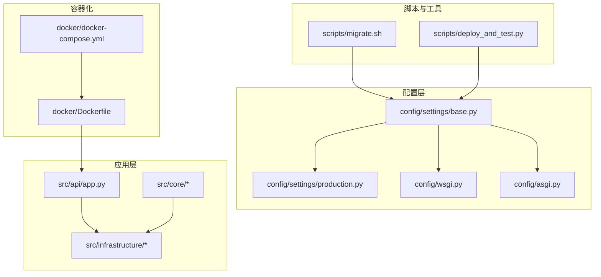
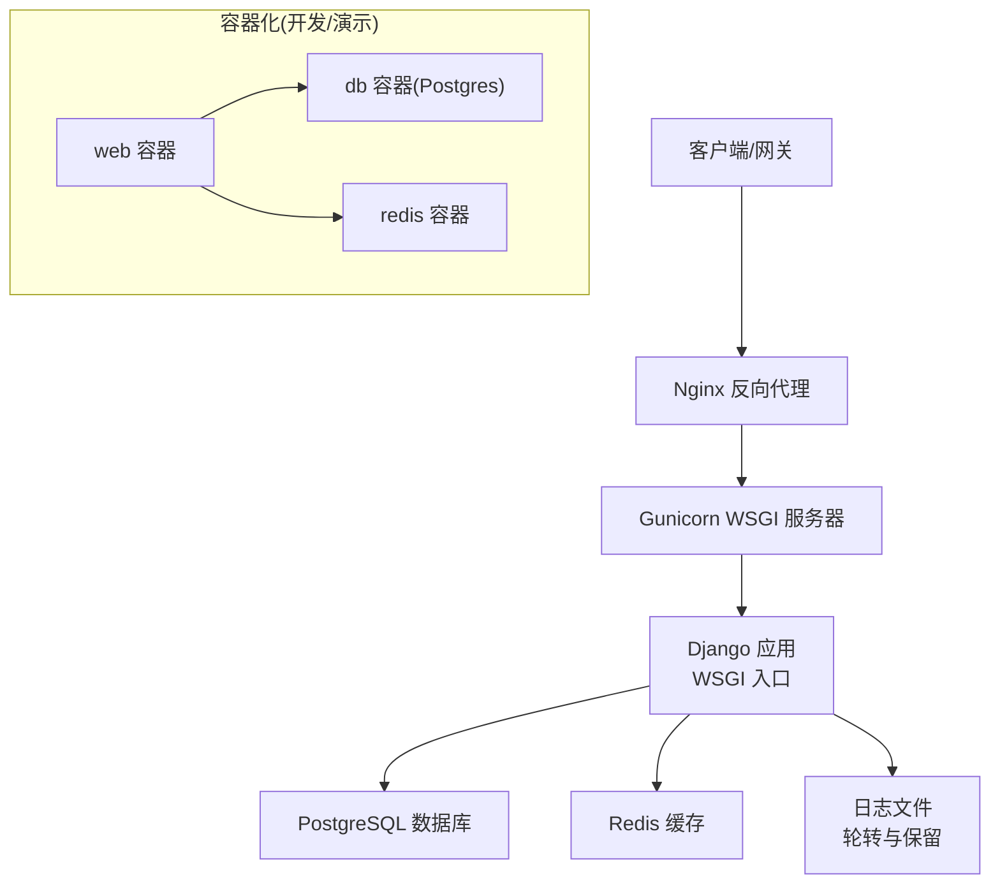
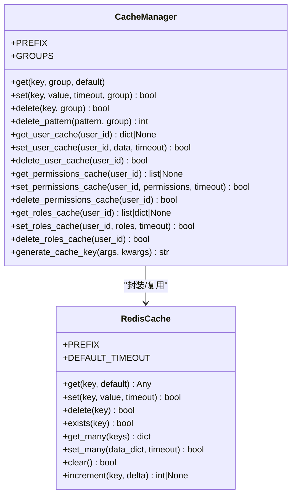
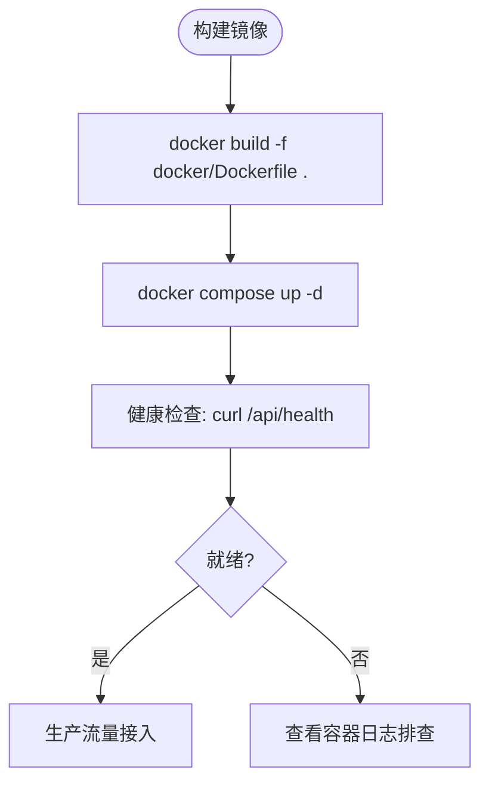
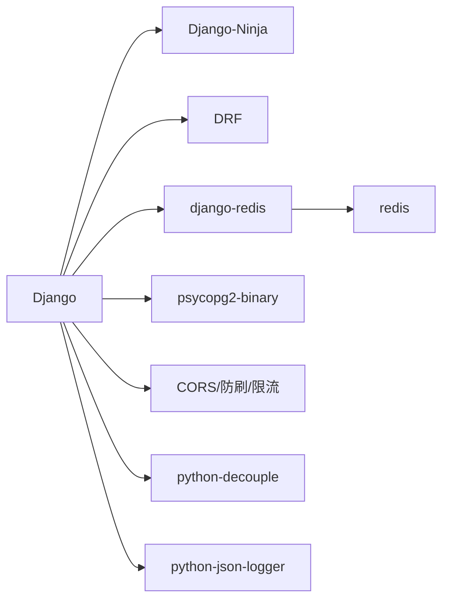

# 部署和运维

<cite>
**本文引用的文件**
- [Dockerfile](file://docker/Dockerfile)
- [docker-compose.yml](file://docker/docker-compose.yml)
- [production.py](file://config/settings/production.py)
- [base.py](file://config/settings/base.py)
- [wsgi.py](file://config/wsgi.py)
- [asgi.py](file://config/asgi.py)
- [requirements.txt](file://requirements.txt)
- [pyproject.toml](file://pyproject.toml)
- [cache_manager.py](file://src/infrastructure/cache/cache_manager.py)
- [redis_cache.py](file://src/infrastructure/cache/redis_cache.py)
- [logger.py](file://src/core/logger.py)
- [migrate.sh](file://scripts/migrate.sh)
- [deploy_and_test.py](file://scripts/deploy_and_test.py)
</cite>

## 目录
1. [简介](#简介)
2. [项目结构](#项目结构)
3. [核心组件](#核心组件)
4. [架构总览](#架构总览)
5. [详细组件分析](#详细组件分析)
6. [依赖关系分析](#依赖关系分析)
7. [性能考虑](#性能考虑)
8. [故障排除指南](#故障排除指南)
9. [结论](#结论)
10. [附录](#附录)

## 简介
本指南面向 Hello-Django-Ninja-Api 项目的生产部署与运维，覆盖容器化部署、反向代理与 WSGI 服务器配置、环境变量与数据库/缓存连接、监控与日志管理、备份与灾难恢复、高可用性、CI/CD 自动化、性能监控与错误追踪、以及故障排除与应急响应流程。文档同时提供可操作的配置要点与最佳实践，帮助团队在不同规模的环境中稳定运行系统。

## 项目结构
项目采用分层与特性混合的组织方式：
- 配置层：settings（开发/生产/测试）、WSGI/ASGI 入口
- 应用层：API 层、应用服务层、领域层、基础设施层
- 脚本与工具：迁移、部署与测试脚本
- 容器化：Dockerfile 与 docker-compose

图表来源
- [base.py:1-235](file://config/settings/base.py#L1-L235)
- [production.py:1-39](file://config/settings/production.py#L1-L39)
- [wsgi.py:1-12](file://config/wsgi.py#L1-L12)
- [asgi.py:1-12](file://config/asgi.py#L1-L12)
- [Dockerfile:1-33](file://docker/Dockerfile#L1-L33)
- [docker-compose.yml:1-47](file://docker/docker-compose.yml#L1-L47)
- [migrate.sh:1-12](file://scripts/migrate.sh#L1-L12)
- [deploy_and_test.py:1-110](file://scripts/deploy_and_test.py#L1-L110)

章节来源
- [base.py:1-235](file://config/settings/base.py#L1-L235)
- [production.py:1-39](file://config/settings/production.py#L1-L39)
- [Dockerfile:1-33](file://docker/Dockerfile#L1-L33)
- [docker-compose.yml:1-47](file://docker/docker-compose.yml#L1-L47)

## 核心组件
- 配置体系：基础配置、生产配置、WSGI/ASGI 入口
- 缓存：基于 Redis 的 Django 缓存配置与封装
- 日志：结构化日志与访问日志分离
- 容器化：单容器镜像与本地编排（含数据库与缓存）
- 部署脚本：迁移、初始化与健康检查

章节来源
- [base.py:153-163](file://config/settings/base.py#L153-L163)
- [production.py:1-39](file://config/settings/production.py#L1-L39)
- [wsgi.py:1-12](file://config/wsgi.py#L1-L12)
- [asgi.py:1-12](file://config/asgi.py#L1-L12)
- [cache_manager.py:1-149](file://src/infrastructure/cache/cache_manager.py#L1-L149)
- [redis_cache.py:1-169](file://src/infrastructure/cache/redis_cache.py#L1-L169)
- [logger.py:1-138](file://src/core/logger.py#L1-L138)
- [Dockerfile:1-33](file://docker/Dockerfile#L1-L33)
- [docker-compose.yml:1-47](file://docker/docker-compose.yml#L1-L47)
- [migrate.sh:1-12](file://scripts/migrate.sh#L1-L12)
- [deploy_and_test.py:1-110](file://scripts/deploy_and_test.py#L1-L110)

## 架构总览
下图展示生产环境的关键组件与交互：应用通过 WSGI 运行，使用 PostgreSQL 作为默认数据库，Redis 作为缓存；日志写入本地文件并按大小轮转；容器化部署时，Web 服务依赖数据库与缓存服务。

图表来源
- [production.py:12-23](file://config/settings/production.py#L12-L23)
- [base.py:153-163](file://config/settings/base.py#L153-L163)
- [logger.py:42-82](file://src/core/logger.py#L42-L82)
- [docker-compose.yml:26-42](file://docker/docker-compose.yml#L26-L42)
- [Dockerfile:25-32](file://docker/Dockerfile#L25-L32)

## 详细组件分析

### 配置与环境变量
- 基础配置（base.py）
  - 安全密钥、调试开关、允许主机、应用注册、中间件、模板、静态/媒体、国际化、CORS、REST Framework、JWT、Redis 缓存、安全头、日志、限流与 IP 黑白名单等均通过环境变量控制。
  - 数据库默认使用 SQLite，生产环境建议使用 PostgreSQL 并通过环境变量注入连接参数。
- 生产配置（production.py）
  - 关闭调试、从环境变量读取数据库连接、设置更严格的 HTTPS 安全头、调整日志级别。
- WSGI/ASGI 入口
  - 当前入口指向开发配置；生产环境需切换至相应设置模块。

章节来源
- [base.py:10-19](file://config/settings/base.py#L10-L19)
- [base.py:77-88](file://config/settings/base.py#L77-L88)
- [base.py:153-163](file://config/settings/base.py#L153-L163)
- [base.py:174-226](file://config/settings/base.py#L174-L226)
- [production.py:9-23](file://config/settings/production.py#L9-L23)
- [production.py:25-39](file://config/settings/production.py#L25-L39)
- [wsgi.py:9-11](file://config/wsgi.py#L9-L11)
- [asgi.py:9-11](file://config/asgi.py#L9-L11)

### 数据库与缓存
- 数据库
  - 支持多数据库，默认使用环境变量驱动；生产环境使用 PostgreSQL，连接参数来自环境变量。
- 缓存
  - 使用 Redis 作为默认缓存后端，键空间带统一前缀，提供分组与通用键生成能力。
  - 提供 CacheManager 与 RedisCache 两种封装，便于统一与灵活使用。

图表来源
- [cache_manager.py:16-149](file://src/infrastructure/cache/cache_manager.py#L16-L149)
- [redis_cache.py:15-169](file://src/infrastructure/cache/redis_cache.py#L15-L169)

章节来源
- [base.py:77-88](file://config/settings/base.py#L77-L88)
- [base.py:153-163](file://config/settings/base.py#L153-L163)
- [cache_manager.py:1-149](file://src/infrastructure/cache/cache_manager.py#L1-L149)
- [redis_cache.py:1-169](file://src/infrastructure/cache/redis_cache.py#L1-L169)

### 日志与监控
- 日志
  - 生产环境启用文件处理器，按大小轮转，区分应用日志、错误日志与访问日志。
  - 提供结构化日志格式与便捷日志器，便于审计与问题定位。
- 监控
  - 建议结合外部监控平台采集应用指标与日志；对 Nginx/Gunicorn/Postgres/Redis 做健康检查与告警。

章节来源
- [base.py:174-226](file://config/settings/base.py#L174-L226)
- [logger.py:12-82](file://src/core/logger.py#L12-L82)

### 容器化与编排
- Dockerfile
  - 基于 Python slim 镜像，安装系统依赖，复制依赖与源码，暴露 8000 端口，使用 Django 开发服务器启动。
- docker-compose
  - 启动 web、db（Postgres）、redis 服务，挂载数据卷，暴露必要端口，并通过环境变量注入数据库与缓存连接信息。

图表来源
- [Dockerfile:1-33](file://docker/Dockerfile#L1-L33)
- [docker-compose.yml:1-47](file://docker/docker-compose.yml#L1-L47)
- [deploy_and_test.py:76-86](file://scripts/deploy_and_test.py#L76-L86)

章节来源
- [Dockerfile:1-33](file://docker/Dockerfile#L1-L33)
- [docker-compose.yml:1-47](file://docker/docker-compose.yml#L1-L47)

### 部署与运维脚本
- 迁移脚本
  - 自动生成迁移、执行迁移、创建超级用户。
- 部署测试脚本
  - 自动迁移、初始化管理员、后台启动服务、健康检查、API 功能测试与单元测试。

章节来源
- [migrate.sh:1-12](file://scripts/migrate.sh#L1-L12)
- [deploy_and_test.py:1-110](file://scripts/deploy_and_test.py#L1-L110)

## 依赖关系分析
- 运行时依赖
  - Web 框架：Django、Django-Ninja、Django REST Framework
  - 认证与安全：SimpleJWT、CORS、防刷与速率限制
  - 数据库与缓存：psycopg2-binary、django-redis、redis
  - 工具与日志：python-decouple、python-json-logger
- 构建与开发依赖
  - pytest、ruff、mypy、django-stubs 等

图表来源
- [requirements.txt:1-38](file://requirements.txt#L1-L38)
- [pyproject.toml:11-24](file://pyproject.toml#L11-L24)

章节来源
- [requirements.txt:1-38](file://requirements.txt#L1-L38)
- [pyproject.toml:11-24](file://pyproject.toml#L11-L24)

## 性能考虑
- 数据库连接池与长连接
  - 基础配置中设置了连接复用时间，生产环境建议配合连接池或连接数上限进行调优。
- 缓存策略
  - 对热点数据设置合理 TTL，利用分组键避免冲突；批量读写时优先使用 set_many/get_many。
- 日志与 I/O
  - 生产日志采用轮转，避免磁盘打满；建议将日志输出到标准输出以便容器平台收集。
- 反向代理与 WSGI
  - 使用 Nginx 作为反向代理，Gunicorn 作为 WSGI 服务器，合理设置 worker 数与并发参数。

章节来源
- [base.py:86-87](file://config/settings/base.py#L86-L87)
- [cache_manager.py:61-71](file://src/infrastructure/cache/cache_manager.py#L61-L71)
- [redis_cache.py:107-118](file://src/infrastructure/cache/redis_cache.py#L107-L118)
- [logger.py:46-82](file://src/core/logger.py#L46-L82)

## 故障排除指南
- 健康检查失败
  - 使用脚本中的健康检查逻辑验证服务状态；若失败，检查容器日志与数据库/缓存连通性。
- 数据库迁移失败
  - 确认数据库连接参数与网络可达；使用迁移脚本重新执行。
- 缓存不可用
  - 检查 Redis 服务状态与网络；确认缓存键前缀与分组一致。
- 日志异常
  - 检查日志目录权限与磁盘空间；确认轮转配置未被覆盖。

章节来源
- [deploy_and_test.py:76-86](file://scripts/deploy_and_test.py#L76-L86)
- [migrate.sh:4-6](file://scripts/migrate.sh#L4-L6)
- [docker-compose.yml:26-42](file://docker/docker-compose.yml#L26-L42)
- [logger.py:46-82](file://src/core/logger.py#L46-L82)

## 结论
本指南提供了从配置、容器化到部署与运维的完整路径。生产环境应重点强化安全头、数据库与缓存连接、日志轮转与监控告警，并结合 Nginx/Gunicorn 实现高可用与弹性伸缩。建议逐步引入 CI/CD 自动化与灾备演练，持续优化性能与稳定性。

## 附录

### 生产环境部署清单
- 环境变量
  - SECRET_KEY、DEBUG、ALLOWED_HOSTS、DB_*、REDIS_*、JWT_*、LOG_LEVEL
- 数据库
  - 使用 PostgreSQL，确保网络连通与连接池配置
- 缓存
  - Redis 集群/哨兵模式（高可用），合理设置超时与键空间
- 反向代理与 WSGI
  - Nginx + Gunicorn，健康检查与自动重启
- 日志与监控
  - 标准输出 + 轮转文件，接入集中式日志与指标平台
- 备份与灾备
  - 数据库定时快照、持久卷备份、恢复演练
- CI/CD
  - 自动化构建、测试、部署与回滚

### 健康检查与可观测性
- 健康检查端点：/api/health（参考部署脚本中的检查逻辑）
- 指标采集：应用指标、数据库/缓存指标、容器资源指标
- 告警策略：CPU/内存/磁盘/连接数/错误率阈值