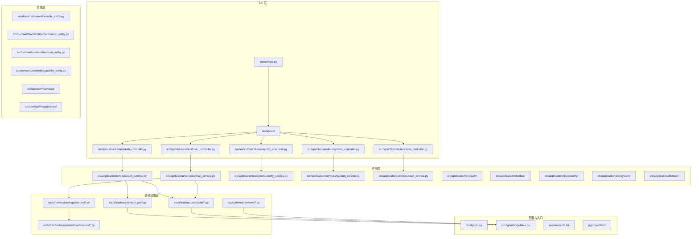
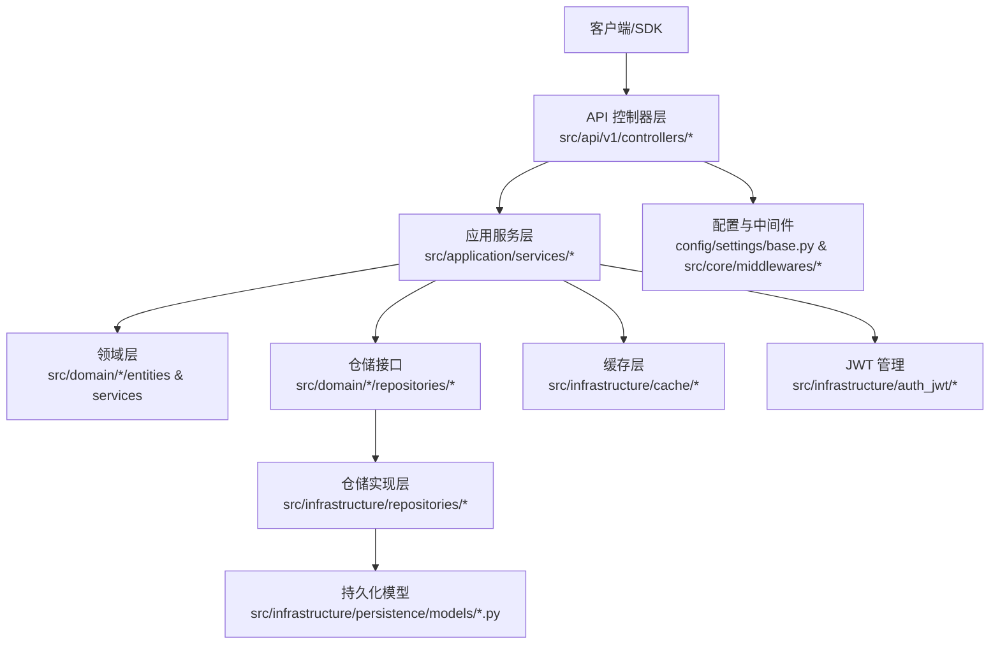
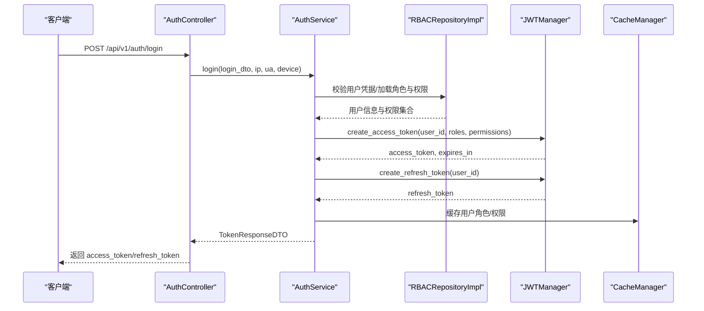
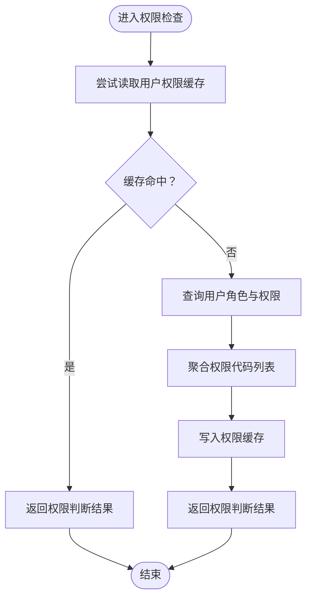
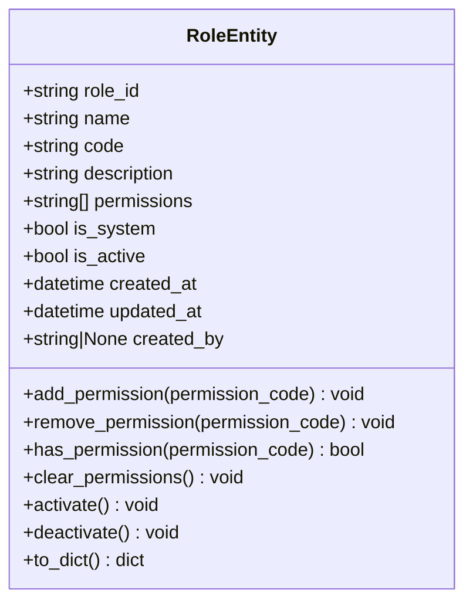
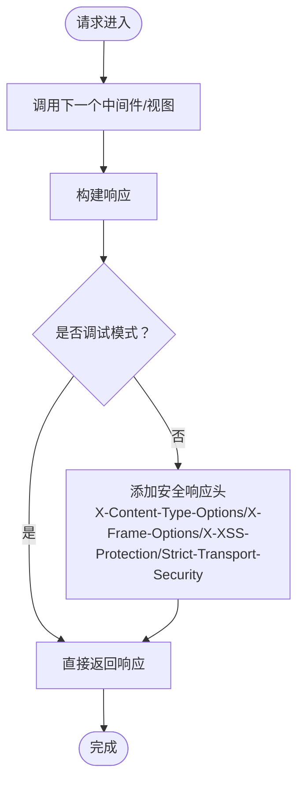
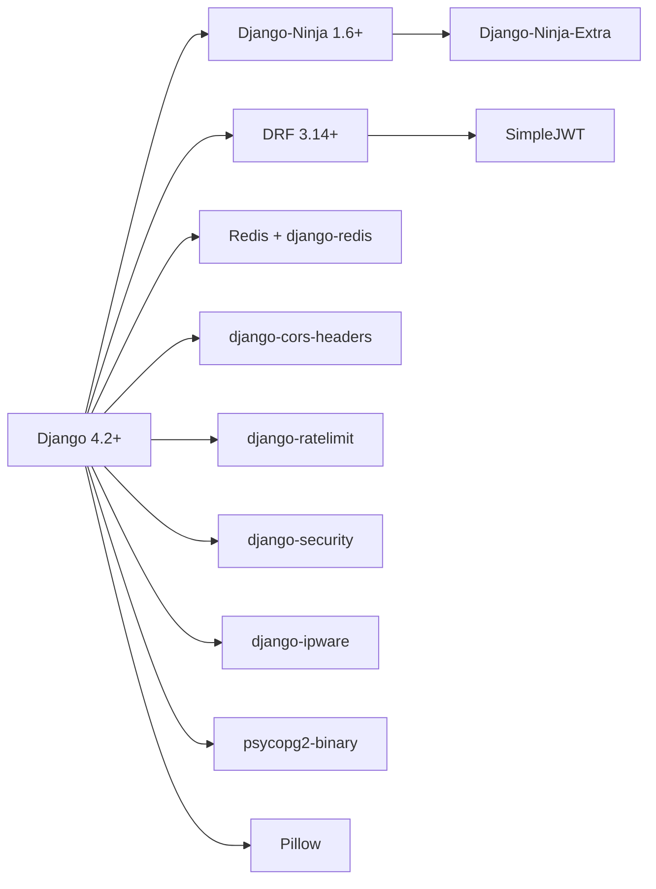

# 项目概述

<cite>
**本文档引用的文件**
- [config/settings/base.py](file://config/settings/base.py)
- [config/urls.py](file://config/urls.py)
- [src/api/app.py](file://src/api/app.py)
- [requirements.txt](file://requirements.txt)
- [pyproject.toml](file://pyproject.toml)
- [src/domain/rbac/entities/role_entity.py](file://src/domain/rbac/entities/role_entity.py)
- [src/application/services/rbac_service.py](file://src/application/services/rbac_service.py)
- [src/infrastructure/repositories/rbac_repo_impl.py](file://src/infrastructure/repositories/rbac_repo_impl.py)
- [src/core/middlewares/security_middleware.py](file://src/core/middlewares/security_middleware.py)
- [src/infrastructure/auth_jwt/jwt_manager.py](file://src/infrastructure/auth_jwt/jwt_manager.py)
- [src/api/v1/controllers/auth_controller.py](file://src/api/v1/controllers/auth_controller.py)
- [src/application/dto/auth/token_response_dto.py](file://src/application/dto/auth/token_response_dto.py)
- [src/infrastructure/cache/cache_manager.py](file://src/infrastructure/cache/cache_manager.py)
- [src/infrastructure/persistence/models/user_models.py](file://src/infrastructure/persistence/models/user_models.py)
</cite>

## 目录
1. [引言](#引言)
2. [项目结构](#项目结构)
3. [核心组件](#核心组件)
4. [架构总览](#架构总览)
5. [详细组件分析](#详细组件分析)
6. [依赖分析](#依赖分析)
7. [性能考虑](#性能考虑)
8. [故障排除指南](#故障排除指南)
9. [结论](#结论)
10. [附录](#附录)

## 引言
Hello-Django-Ninja-Api 是一个基于 Django 与 Django-Ninja 的现代化 REST API 系统，采用领域驱动设计（DDD）分层架构，集成 JWT 认证与 RBAC 权限管理，并提供完善的日志、缓存与安全中间件。项目旨在为中大型后端服务提供清晰的分层职责、可维护的业务逻辑与高性能的访问控制能力。

- 设计理念：以 DDD 为核心，分离应用层、领域层、基础设施层与 API 层，确保业务规则内聚、技术细节可替换。
- 技术选型：Django 4.2+、Django-Ninja 1.6+、Pydantic 2.5+、Redis 缓存、PostgreSQL/SQLite 数据库、JWT/SimpleJWT、CORS、日志与限流中间件等。
- 关键特性：JWT 认证、RBAC 权限管理、用户与角色管理、IP 黑白名单与速率限制、请求日志与安全响应头、缓存优化与异步 ORM 支持。

## 项目结构
项目采用按“层”组织的结构，结合按“功能域”分组的模块化布局，便于扩展与维护。

图表来源
- [src/api/app.py:1-48](file://src/api/app.py#L1-L48)
- [src/api/v1/controllers/auth_controller.py:1-133](file://src/api/v1/controllers/auth_controller.py#L1-L133)
- [src/application/services/rbac_service.py:1-319](file://src/application/services/rbac_service.py#L1-L319)
- [src/infrastructure/repositories/rbac_repo_impl.py:1-251](file://src/infrastructure/repositories/rbac_repo_impl.py#L1-L251)
- [src/infrastructure/auth_jwt/jwt_manager.py:1-147](file://src/infrastructure/auth_jwt/jwt_manager.py#L1-L147)
- [src/infrastructure/cache/cache_manager.py:1-149](file://src/infrastructure/cache/cache_manager.py#L1-L149)
- [config/urls.py:1-22](file://config/urls.py#L1-L22)
- [config/settings/base.py:1-235](file://config/settings/base.py#L1-L235)
- [requirements.txt:1-38](file://requirements.txt#L1-L38)
- [pyproject.toml:1-131](file://pyproject.toml#L1-L131)

章节来源
- [config/urls.py:1-22](file://config/urls.py#L1-L22)
- [config/settings/base.py:1-235](file://config/settings/base.py#L1-L235)
- [src/api/app.py:1-48](file://src/api/app.py#L1-L48)

## 核心组件
- API 应用与路由注册：通过 Django-Ninja Extra 创建 API 实例并注册控制器，提供健康检查与根路径文档提示。
- 认证与授权：JWT 管理器负责令牌生成与校验；认证控制器处理登录、刷新与登出；RBAC 服务与仓储实现角色、权限与用户关联的业务逻辑。
- 安全中间件：在生产环境自动添加安全响应头，增强 XSS、点击劫持等防护。
- 缓存与性能：统一缓存管理器封装 Redis 缓存键空间与 TTL，显著降低权限查询开销。
- 数据模型：用户模型扩展 Django 内置用户，支持部门与档案扩展字段，配合多对多角色与权限关联。

章节来源
- [src/api/app.py:1-48](file://src/api/app.py#L1-L48)
- [src/api/v1/controllers/auth_controller.py:1-133](file://src/api/v1/controllers/auth_controller.py#L1-L133)
- [src/application/services/rbac_service.py:1-319](file://src/application/services/rbac_service.py#L1-L319)
- [src/infrastructure/repositories/rbac_repo_impl.py:1-251](file://src/infrastructure/repositories/rbac_repo_impl.py#L1-L251)
- [src/core/middlewares/security_middleware.py:1-54](file://src/core/middlewares/security_middleware.py#L1-L54)
- [src/infrastructure/cache/cache_manager.py:1-149](file://src/infrastructure/cache/cache_manager.py#L1-L149)
- [src/infrastructure/persistence/models/user_models.py:1-147](file://src/infrastructure/persistence/models/user_models.py#L1-L147)

## 架构总览
系统遵循 DDD 分层与六边形架构思想，API 控制器仅负责请求编排，应用服务承载业务规则，仓储接口隔离数据源，领域实体封装不变量，基础设施层提供缓存、JWT、ORM 等支撑。

图表来源
- [src/api/v1/controllers/auth_controller.py:1-133](file://src/api/v1/controllers/auth_controller.py#L1-L133)
- [src/application/services/rbac_service.py:1-319](file://src/application/services/rbac_service.py#L1-L319)
- [src/infrastructure/repositories/rbac_repo_impl.py:1-251](file://src/infrastructure/repositories/rbac_repo_impl.py#L1-L251)
- [src/infrastructure/cache/cache_manager.py:1-149](file://src/infrastructure/cache/cache_manager.py#L1-L149)
- [src/infrastructure/auth_jwt/jwt_manager.py:1-147](file://src/infrastructure/auth_jwt/jwt_manager.py#L1-L147)
- [config/settings/base.py:1-235](file://config/settings/base.py#L1-L235)

## 详细组件分析

### 认证与授权流程（登录）
该流程展示从控制器到应用服务、仓储与 JWT 的调用链路，体现依赖倒置与单一职责。

图表来源
- [src/api/v1/controllers/auth_controller.py:1-133](file://src/api/v1/controllers/auth_controller.py#L1-L133)
- [src/application/services/rbac_service.py:1-319](file://src/application/services/rbac_service.py#L1-L319)
- [src/infrastructure/repositories/rbac_repo_impl.py:1-251](file://src/infrastructure/repositories/rbac_repo_impl.py#L1-L251)
- [src/infrastructure/auth_jwt/jwt_manager.py:1-147](file://src/infrastructure/auth_jwt/jwt_manager.py#L1-L147)
- [src/infrastructure/cache/cache_manager.py:1-149](file://src/infrastructure/cache/cache_manager.py#L1-L149)

章节来源
- [src/api/v1/controllers/auth_controller.py:1-133](file://src/api/v1/controllers/auth_controller.py#L1-L133)
- [src/application/dto/auth/token_response_dto.py:1-32](file://src/application/dto/auth/token_response_dto.py#L1-L32)

### RBAC 权限检查算法
权限检查优先使用缓存，未命中则回源数据库聚合用户角色与权限，再写回缓存，保证高并发下的低延迟。

图表来源
- [src/application/services/rbac_service.py:233-251](file://src/application/services/rbac_service.py#L233-L251)
- [src/infrastructure/cache/cache_manager.py:108-122](file://src/infrastructure/cache/cache_manager.py#L108-L122)
- [src/infrastructure/repositories/rbac_repo_impl.py:206-246](file://src/infrastructure/repositories/rbac_repo_impl.py#L206-L246)

章节来源
- [src/application/services/rbac_service.py:1-319](file://src/application/services/rbac_service.py#L1-L319)
- [src/infrastructure/repositories/rbac_repo_impl.py:1-251](file://src/infrastructure/repositories/rbac_repo_impl.py#L1-L251)
- [src/infrastructure/cache/cache_manager.py:1-149](file://src/infrastructure/cache/cache_manager.py#L1-L149)

### 角色实体与不变量
角色实体包含角色 ID、编码、权限列表、系统标识与状态等字段，并在构造后进行基本校验，确保角色名称与编码非空。

图表来源
- [src/domain/rbac/entities/role_entity.py:1-80](file://src/domain/rbac/entities/role_entity.py#L1-L80)

章节来源
- [src/domain/rbac/entities/role_entity.py:1-80](file://src/domain/rbac/entities/role_entity.py#L1-L80)

### 安全中间件与响应头
安全中间件在生产环境为每个响应添加安全相关头部，提升安全性与合规性。

图表来源
- [src/core/middlewares/security_middleware.py:1-54](file://src/core/middlewares/security_middleware.py#L1-L54)
- [config/settings/base.py:165-173](file://config/settings/base.py#L165-L173)

章节来源
- [src/core/middlewares/security_middleware.py:1-54](file://src/core/middlewares/security_middleware.py#L1-L54)
- [config/settings/base.py:1-235](file://config/settings/base.py#L1-L235)

## 依赖分析
- 框架与工具：Django 4.2+、Django-Ninja 1.6+、DRF 3.14+、Pydantic 2.5+、Redis 与 django-redis。
- 安全与防护：SimpleJWT、CORS、django-ratelimit、django-security、django-ipware。
- 数据库：PostgreSQL（psycopg2-binary）或 SQLite（默认）。
- 开发与测试：pytest、ruff、mypy、django-stubs、faker。

图表来源
- [requirements.txt:1-38](file://requirements.txt#L1-L38)
- [pyproject.toml:11-24](file://pyproject.toml#L11-L24)

章节来源
- [requirements.txt:1-38](file://requirements.txt#L1-L38)
- [pyproject.toml:1-131](file://pyproject.toml#L1-L131)

## 性能考虑
- 缓存策略：RBAC 权限与角色结果缓存，TTL 合理设置，避免频繁数据库查询。
- 异步 ORM：应用服务广泛使用 aget/asave/adelete 等异步方法，提升 I/O 并发吞吐。
- 数据库索引：用户模型对 username/email/phone 建立索引，加速登录与检索。
- 限流与防护：全局速率限制开关与 IP 黑白名单可配置，默认开启限流保护。
- 日志与监控：统一日志格式与输出位置，便于问题定位与性能分析。

## 故障排除指南
- 认证失败：检查 JWT 配置（密钥、算法、过期时间）、用户状态与密码校验。
- 权限不足：确认用户角色与权限是否正确分配，缓存是否过期，必要时清理用户权限缓存键。
- 速率限制：调整 RATE_LIMIT_DEFAULT 或关闭 RATE_LIMIT_ENABLED 进行排查。
- 安全头缺失：确认非调试模式下中间件已生效。
- 数据库连接：检查 DATABASES 配置与连接池参数（CONN_MAX_AGE）。

章节来源
- [config/settings/base.py:137-151](file://config/settings/base.py#L137-L151)
- [src/infrastructure/cache/cache_manager.py:108-122](file://src/infrastructure/cache/cache_manager.py#L108-L122)
- [src/core/middlewares/security_middleware.py:47-51](file://src/core/middlewares/security_middleware.py#L47-L51)

## 结论
本项目以 DDD 为骨架，结合 Django-Ninja 的高效 API 能力与 Pydantic 的强类型校验，构建了具备 JWT 认证、RBAC 权限管理、安全防护与缓存优化的现代化后端系统。通过清晰的分层与职责划分，既满足初学者的学习曲线，也为资深开发者提供了可扩展、可维护的工程实践范式。

## 附录
- 项目入口与路由：API 根路径为 /api/，健康检查 /api/health，文档位于 /api/docs 与 /api/redoc。
- 环境变量：通过环境变量控制数据库、Redis、JWT、限流与安全策略，便于多环境部署。
- 开发工具：Ruff、Mypy、pytest、django-stubs 提供代码质量与类型检查保障。

章节来源
- [config/urls.py:13-16](file://config/urls.py#L13-L16)
- [src/api/app.py:33-47](file://src/api/app.py#L33-L47)
- [config/settings/base.py:153-163](file://config/settings/base.py#L153-L163)
- [config/settings/base.py:228-235](file://config/settings/base.py#L228-L235)