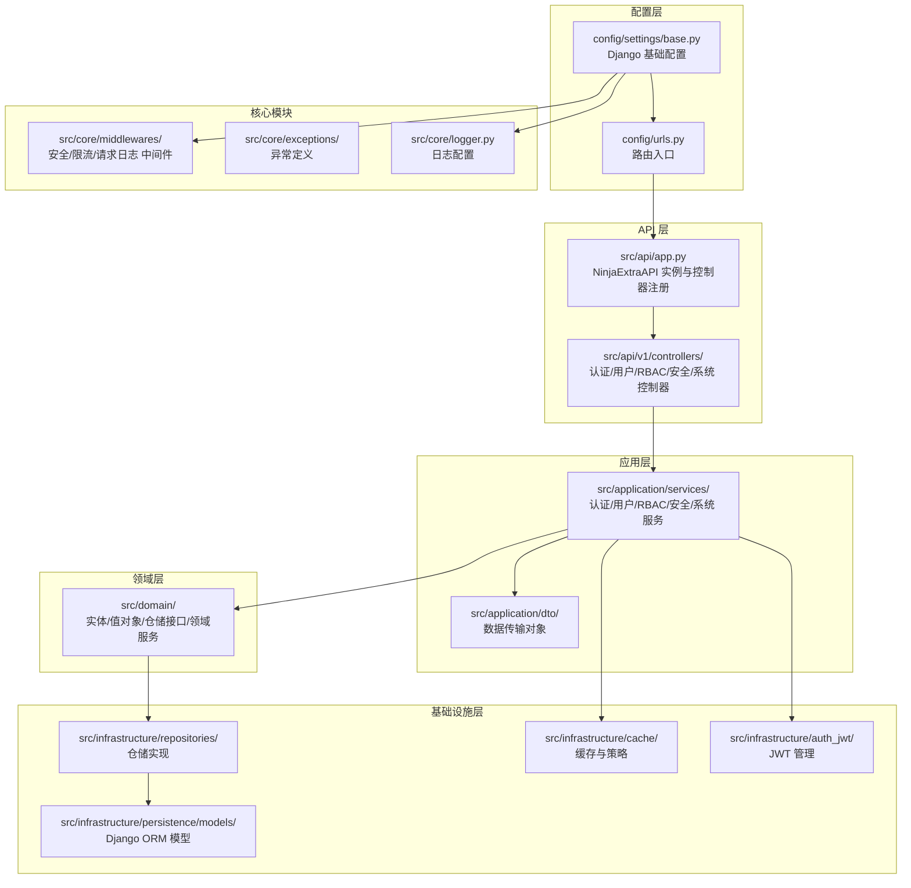
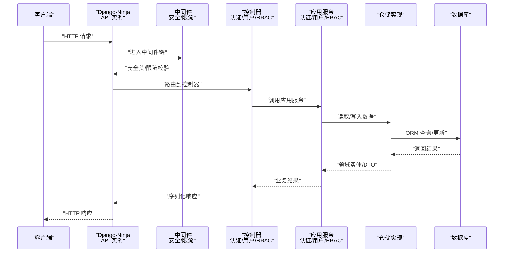
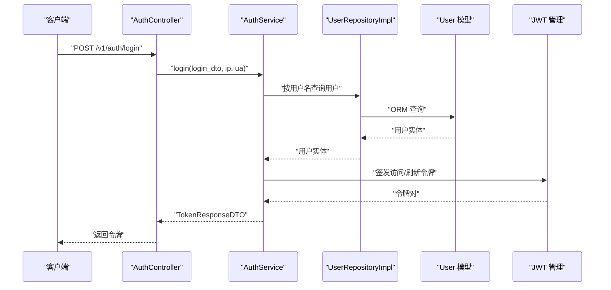
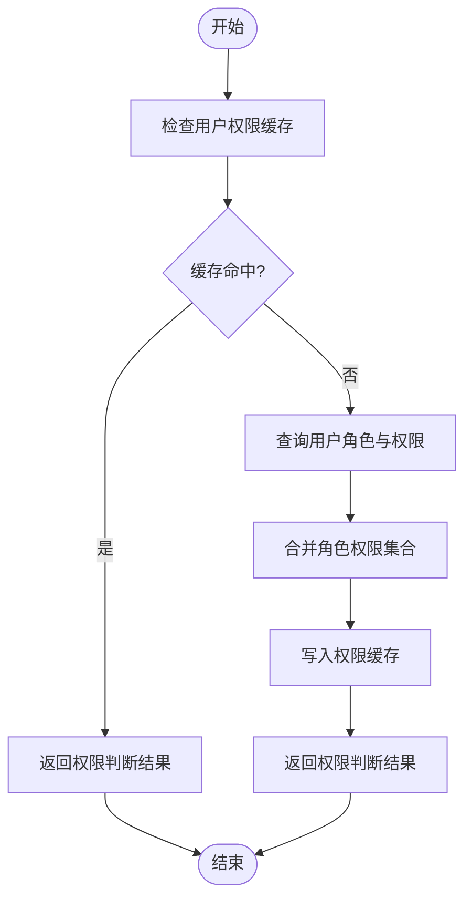
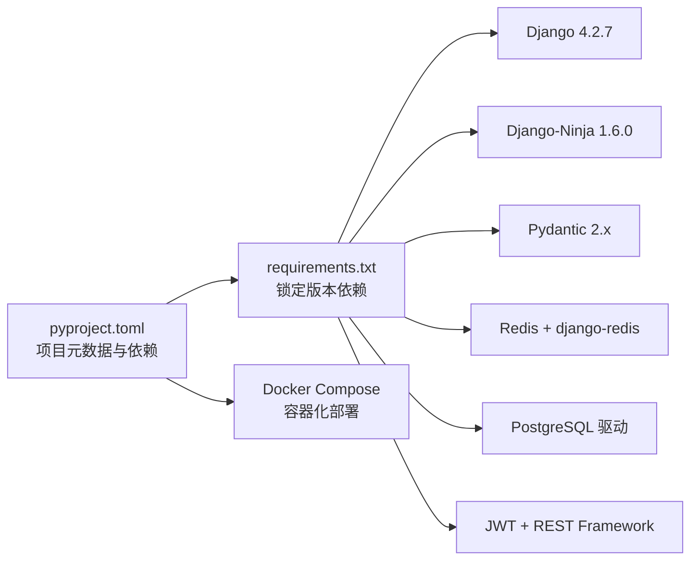

# 项目概述

<cite>
**本文引用的文件**
- [pyproject.toml](file://pyproject.toml)
- [requirements.txt](file://requirements.txt)
- [config/settings/base.py](file://config/settings/base.py)
- [config/urls.py](file://config/urls.py)
- [src/api/app.py](file://src/api/app.py)
- [src/api/v1/controllers/auth_controller.py](file://src/api/v1/controllers/auth_controller.py)
- [src/application/services/rbac_service.py](file://src/application/services/rbac_service.py)
- [src/domain/rbac/entities/role_entity.py](file://src/domain/rbac/entities/role_entity.py)
- [src/infrastructure/repositories/user_repo_impl.py](file://src/infrastructure/repositories/user_repo_impl.py)
- [src/infrastructure/persistence/models/user_models.py](file://src/infrastructure/persistence/models/user_models.py)
- [src/core/middlewares/security_middleware.py](file://src/core/middlewares/security_middleware.py)
- [docker/docker-compose.yml](file://docker/docker-compose.yml)
- [docs/DEVELOPMENT.md](file://docs/DEVELOPMENT.md)
- [scripts/setup_dev.sh](file://scripts/setup_dev.sh)
</cite>

## 目录
1. [引言](#引言)
2. [项目结构](#项目结构)
3. [核心组件](#核心组件)
4. [架构总览](#架构总览)
5. [详细组件分析](#详细组件分析)
6. [依赖分析](#依赖分析)
7. [性能考虑](#性能考虑)
8. [故障排除指南](#故障排除指南)
9. [结论](#结论)
10. [附录](#附录)

## 引言
Hello-Django-Ninja-Api 是一个基于 Django 与 Django-Ninja 的现代化 Web API 项目，采用领域驱动设计（DDD）分层架构，集成 JWT 认证与 RBAC 权限控制，并提供完善的中间件安全防护、缓存与限流能力。项目旨在为需要快速构建高安全性、可扩展性与可维护性的企业级 API 提供参考实现。

- 目标与价值
  - 提供开箱即用的认证授权与权限体系，降低企业级 API 开发门槛
  - 以 DDD 分层解耦业务逻辑，提升代码可维护性与测试友好度
  - 内置安全中间件、Redis 缓存、限流与日志配置，便于生产部署
  - 提供 Docker 化部署方案与自动化开发脚本，加速团队协作

- 技术栈概览
  - Python 3.10+
  - Django 4.2.7
  - Django-Ninja 1.6.0
  - Pydantic 2.x
  - Redis + django-redis
  - PostgreSQL（推荐）
  - REST Framework + SimpleJWT
  - Ruff、MyPy、Pytest 等开发工具链

- 适用场景与目标用户
  - 企业后台管理系统、中台服务、微服务网关前置 API
  - 需要细粒度权限控制与审计日志的业务系统
  - 希望快速落地 DDD 思想与现代开发流程的团队

## 项目结构
项目采用 DDD 分层组织代码，按“API 层 → 应用层 → 领域层 → 基础设施层 → 核心模块”的层次划分，配合配置与脚本目录，形成清晰的职责边界与可演进的架构。

图表来源
- [config/settings/base.py:1-235](file://config/settings/base.py#L1-L235)
- [config/urls.py:1-22](file://config/urls.py#L1-L22)
- [src/api/app.py:1-102](file://src/api/app.py#L1-L102)
- [src/api/v1/controllers/auth_controller.py:1-133](file://src/api/v1/controllers/auth_controller.py#L1-L133)
- [src/application/services/rbac_service.py:1-286](file://src/application/services/rbac_service.py#L1-L286)
- [src/infrastructure/repositories/user_repo_impl.py:1-138](file://src/infrastructure/repositories/user_repo_impl.py#L1-L138)
- [src/infrastructure/persistence/models/user_models.py:1-147](file://src/infrastructure/persistence/models/user_models.py#L1-L147)
- [src/core/middlewares/security_middleware.py:1-54](file://src/core/middlewares/security_middleware.py#L1-L54)

章节来源
- [config/settings/base.py:1-235](file://config/settings/base.py#L1-L235)
- [config/urls.py:1-22](file://config/urls.py#L1-L22)
- [src/api/app.py:1-102](file://src/api/app.py#L1-L102)
- [docs/DEVELOPMENT.md:115-163](file://docs/DEVELOPMENT.md#L115-L163)

## 核心组件
- API 层（Django-Ninja）
  - 通过 NinjaExtraAPI 创建统一 API 实例，集中注册控制器，提供健康检查与根路径文档引导
  - 控制器遵循单一职责，使用装饰器声明路由与权限，依赖注入应用服务

- 应用层（业务编排）
  - 以服务类封装业务流程，DTO 负责跨层数据契约，仓储接口隔离数据源
  - 示例：RBAC 服务负责角色、权限与用户角色关系的业务逻辑；认证服务负责登录、刷新与登出

- 领域层（核心模型）
  - 使用实体与值对象表达业务概念，如角色实体、用户实体、权限实体等
  - 领域服务封装复杂规则，仓储接口定义数据访问契约

- 基础设施层（数据与外部能力）
  - ORM 模型映射数据库表，仓储实现具体数据访问
  - 缓存（Redis）、JWT 管理、限流与 IP 管理等横切能力下沉

- 核心模块（横切关注点）
  - 安全中间件在生产环境强制安全响应头，限流与请求日志中间件保障稳定性与可观测性

章节来源
- [src/api/app.py:60-102](file://src/api/app.py#L60-L102)
- [src/api/v1/controllers/auth_controller.py:16-133](file://src/api/v1/controllers/auth_controller.py#L16-L133)
- [src/application/services/rbac_service.py:22-286](file://src/application/services/rbac_service.py#L22-L286)
- [src/domain/rbac/entities/role_entity.py:11-80](file://src/domain/rbac/entities/role_entity.py#L11-L80)
- [src/infrastructure/repositories/user_repo_impl.py:13-138](file://src/infrastructure/repositories/user_repo_impl.py#L13-L138)
- [src/core/middlewares/security_middleware.py:14-54](file://src/core/middlewares/security_middleware.py#L14-L54)

## 架构总览
下图展示从客户端到数据库的典型调用链路，体现 DDD 分层与中间件的安全防护：

图表来源
- [src/api/app.py:70-84](file://src/api/app.py#L70-L84)
- [src/api/v1/controllers/auth_controller.py:36-78](file://src/api/v1/controllers/auth_controller.py#L36-L78)
- [src/application/services/rbac_service.py:33-56](file://src/application/services/rbac_service.py#L33-L56)
- [src/infrastructure/repositories/user_repo_impl.py:72-106](file://src/infrastructure/repositories/user_repo_impl.py#L72-L106)
- [config/settings/base.py:39-52](file://config/settings/base.py#L39-L52)

## 详细组件分析

### 认证与授权（JWT + RBAC）
- 控制器职责
  - 登录：接收用户名/密码与设备信息，返回访问令牌与刷新令牌
  - 刷新：使用刷新令牌换取新的访问令牌
  - 登出：撤销当前访问令牌
- 应用服务
  - 统一封装认证流程，结合 JWT 管理与登录日志记录
- 领域与仓储
  - 用户实体与模型映射，仓储实现提供按 ID/用户名/邮箱查询与保存
- 安全中间件
  - 生产环境自动添加安全响应头，增强 XSS、点击劫持等防护

图表来源
- [src/api/v1/controllers/auth_controller.py:36-78](file://src/api/v1/controllers/auth_controller.py#L36-L78)
- [src/application/services/rbac_service.py:72-94](file://src/application/services/rbac_service.py#L72-L94)
- [src/infrastructure/repositories/user_repo_impl.py:72-94](file://src/infrastructure/repositories/user_repo_impl.py#L72-L94)
- [src/infrastructure/persistence/models/user_models.py:12-84](file://src/infrastructure/persistence/models/user_models.py#L12-L84)
- [src/core/middlewares/security_middleware.py:46-52](file://src/core/middlewares/security_middleware.py#L46-L52)

章节来源
- [src/api/v1/controllers/auth_controller.py:16-133](file://src/api/v1/controllers/auth_controller.py#L16-L133)
- [src/infrastructure/repositories/user_repo_impl.py:13-138](file://src/infrastructure/repositories/user_repo_impl.py#L13-L138)
- [src/infrastructure/persistence/models/user_models.py:12-147](file://src/infrastructure/persistence/models/user_models.py#L12-L147)
- [src/core/middlewares/security_middleware.py:14-54](file://src/core/middlewares/security_middleware.py#L14-L54)

### RBAC 权限管理
- 角色与权限
  - 角色实体包含名称、编码、权限集合、系统标识与状态
  - 权限以资源:动作编码表示，支持初始化系统权限
- 用户角色关系
  - 提供分配/移除角色、查询用户角色与权限、权限缓存与校验
- 缓存策略
  - 用户权限与角色变更后清理缓存，减少数据库压力

图表来源
- [src/application/services/rbac_service.py:233-251](file://src/application/services/rbac_service.py#L233-L251)
- [src/domain/rbac/entities/role_entity.py:35-49](file://src/domain/rbac/entities/role_entity.py#L35-L49)

章节来源
- [src/application/services/rbac_service.py:22-286](file://src/application/services/rbac_service.py#L22-L286)
- [src/domain/rbac/entities/role_entity.py:11-80](file://src/domain/rbac/entities/role_entity.py#L11-L80)

### 安全中间件与防护
- 安全响应头
  - 在非调试环境下自动设置 X-Content-Type-Options、X-Frame-Options、Strict-Transport-Security 等
- 限流与请求日志
  - 通过中间件实现请求限流与统一日志输出，便于审计与监控

章节来源
- [src/core/middlewares/security_middleware.py:14-54](file://src/core/middlewares/security_middleware.py#L14-L54)
- [config/settings/base.py:228-235](file://config/settings/base.py#L228-L235)

## 依赖分析
- 运行时依赖
  - Django 4.2.7、Django-Ninja 1.6.0、Pydantic 2.x、Redis 与 django-redis、PostgreSQL 驱动、JWT 与 REST Framework
- 开发依赖
  - Ruff、MyPy、Pytest、faker、django-stubs 等，保证代码质量与类型安全
- Docker 与部署
  - 提供 docker-compose 编排 Postgres 与 Redis，简化本地与 CI 环境搭建

图表来源
- [pyproject.toml:11-24](file://pyproject.toml#L11-L24)
- [requirements.txt:1-38](file://requirements.txt#L1-38)
- [docker/docker-compose.yml:1-47](file://docker/docker-compose.yml#L1-L47)

章节来源
- [pyproject.toml:1-131](file://pyproject.toml#L1-L131)
- [requirements.txt:1-38](file://requirements.txt#L1-L38)
- [docker/docker-compose.yml:1-47](file://docker/docker-compose.yml#L1-L47)

## 性能考虑
- 缓存优化
  - 用户权限与角色结果缓存，降低频繁查询数据库的压力
- 数据库访问
  - 仓储实现提供异步 ORM 能力，结合索引与分页，提升查询效率
- 中间件与限流
  - 通过限流中间件保护后端，避免突发流量冲击
- 日志与可观测性
  - 多格式日志输出与错误日志分离，便于定位性能瓶颈

## 故障排除指南
- 数据库迁移失败
  - 清理迁移文件并重新生成迁移，确保模型与迁移一致
- Redis 连接失败
  - 确认 Redis 服务运行状态，检查连接配置
- 端口被占用
  - 更改本地运行端口或释放占用端口
- 开发环境初始化
  - 使用提供的脚本一键创建虚拟环境、安装依赖、格式化与类型检查、初始化管理员账号并运行测试

章节来源
- [docs/DEVELOPMENT.md:188-227](file://docs/DEVELOPMENT.md#L188-L227)
- [scripts/setup_dev.sh:1-47](file://scripts/setup_dev.sh#L1-L47)

## 结论
Hello-Django-Ninja-Api 以 DDD 为核心思想，结合 Django-Ninja 的高性能 API 能力与完善的中间件生态，提供了从认证授权到权限控制、从缓存限流到安全防护的一体化解决方案。项目结构清晰、依赖明确、工具链完备，适合在企业级场景中作为参考模板或基线工程进行二次开发与扩展。

## 附录

### 快速开始
- 环境准备
  - Python >= 3.10.11，建议使用虚拟环境
  - 可选：Docker、Redis
- 安装依赖
  - 使用 pip 或 uv 安装开发依赖
- 配置环境变量
  - 复制并编辑 .env 示例文件
- 数据库迁移与初始化
  - 生成并执行迁移，创建超级用户
- 启动服务
  - 运行 Django 开发服务器，访问 /api/docs 或 /api/redoc 查看文档

章节来源
- [docs/DEVELOPMENT.md:9-67](file://docs/DEVELOPMENT.md#L9-L67)
- [config/urls.py:13-22](file://config/urls.py#L13-L22)
- [src/api/app.py:87-102](file://src/api/app.py#L87-L102)